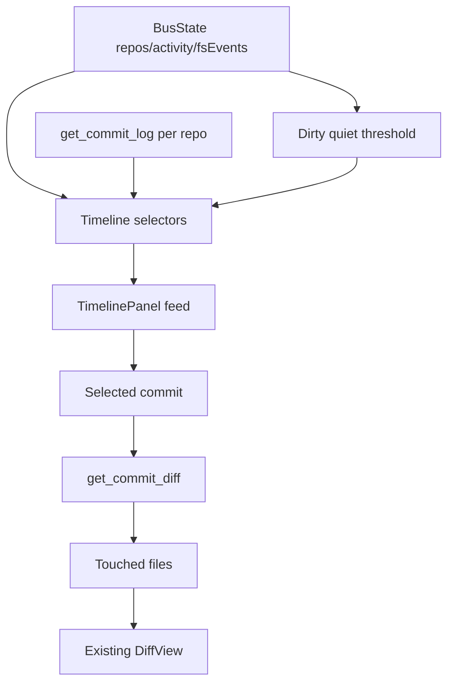

# feat: Add Timeline and Commit History Panel

## Summary

Add a dockable Timeline panel that renders recent cross-repo activity, loads commit history and commit diffs through the existing backend contract, and flags dirty repos that have stayed quiet past a frontend threshold. The implementation stays read-only and does not add historical persistence.

---

## Problem Frame

The current UI is strong at present-state inspection: Dashboard summarizes repos, RepoPanel shows per-repo status and commits, DiffPanel shows working-tree diffs, and WatchedFilesSection shows Plane 2 events. It still lacks a workbench-level time surface where a supervisor can see recent activity across all repos and inspect commit diffs without using a terminal.

---

## Requirements

**Timeline feed**

- R1. Render a newest-first workbench feed spanning all repos in the active workbench.
- R2. Distinguish current working-tree activity, Plane 2 file events, commits, degraded/error states, and orphaned dirty repos.
- R3. Use display names for readability and canonical paths for identity.
- R4. Show degraded watcher state honestly.

**Commit history**

- R5. Load recent commits per repo with paginated `get_commit_log` reads.
- R6. Selecting a commit loads its diff and touched files.
- R7. Selecting a file inside a commit renders that file's structured commit diff.
- R8. Preserve read-only behavior; no git write operation is introduced.

**Orphans and boundaries**

- R9. Flag dirty repos that have stayed quiet longer than the orphan threshold.
- R10. Make orphan detection deterministic in tests.
- R11. Keep timeline history frontend-session-only.
- R12. Exclude RDM-011 signals and RDM-012 filters/notifications.

---

## Key Technical Decisions

- **KTD1. Timeline is a registered dockview panel:** add `PANEL_TIMELINE`, an opener action, and a TopBar entry point so Timeline behaves like existing app surfaces.
- **KTD2. Build feed entries in frontend selectors:** derive working-tree activity, Plane 2 events, and orphan candidates from `BusState`; do not ask the backend for a new timeline aggregate.
- **KTD3. Keep commit history local to the Timeline panel:** each repo's recent commits are loaded on panel mount or refresh using the existing `get_commit_log` command.
- **KTD4. Reuse `DiffView` for commit diffs:** a selected commit loads `get_commit_diff`, lists file diffs, and passes the selected `FileDiff` to `DiffView`.
- **KTD5. Use a frontend orphan threshold constant:** start with a 30-minute quiet threshold and expose it as a named constant for tests and future preference wiring.
- **KTD6. Add TS wrappers only for existing commands:** add `getCommitDiff` and `getBlob` wrappers if needed; do not change Rust unless wrapper tests expose a real argument mismatch.

---

## High-Level Technical Design

The panel owns history loading and commit-diff selection state. Store-level additions should stay limited to pure selectors or constants; the canonical live repo state remains the bus store's source of truth.

---

## Scope Boundaries

- No SQLite or durable event database.
- No filters/search or date-range controls.
- No notifications, tray/glance mode, passive severity signals, metrics, or secret detection.
- No natural-language summary of commits, diffs, or repo activity.
- No git writes.

---

## Implementation Units

### U1. Add timeline model selectors

- **Goal:** Build deterministic feed inputs from current bus state.
- **Requirements:** R1, R2, R3, R9, R10, R11.
- **Dependencies:** None.
- **Files:** `src/panels/timeline/model.ts`, `src/panels/timeline/model.test.ts`, optionally `src/bus/store.ts`.
- **Approach:** Create pure functions that accept `BusState`, `BusStore`, and `nowMs`, then return sorted timeline entries for repo activity, Plane 2 events, errors/degraded state, and orphan candidates. Keep the orphan threshold exported as a named constant.
- **Patterns to follow:** `sortedRepoPaths`, `getFsEvents`, and store tests in `src/bus/store.test.ts`.
- **Test scenarios:** Covers AE1 with two repos sorted newest-first. Covers AE2 with Plane 2 events rendered as file-event entries. Covers AE5 and AE6 with old/new dirty timestamps. Covers AE7 with an empty workbench.
- **Verification:** The model tests prove ordering, classification, display labels, and threshold behavior without React.

### U2. Add commit history client support

- **Goal:** Expose missing frontend wrappers for existing history commands.
- **Requirements:** R5, R6, R8.
- **Dependencies:** None.
- **Files:** `src/bus/client.ts`, `src/bus/contract.test.ts`.
- **Approach:** Add `getCommitDiff(repo, commitId)` and `getBlob(repo, commitId, path)` wrappers only if the implementation needs blob reads. Use Tauri camelCase argument keys for `commit_id` (`commitId`) and assert exact invoke payloads.
- **Patterns to follow:** Existing wrapper tests for `get_worktree_diff`, `get_file_content`, and `update_repo`.
- **Test scenarios:** Wrapper calls `get_commit_diff` with `{ repo, commitId }`. Wrapper calls `get_blob` with `{ repo, commitId, path }` if used.
- **Verification:** Contract tests pin command names and argument shapes.

### U3. Build TimelinePanel

- **Goal:** Render the feed, history loading states, commit selection, touched-file list, and commit diff body.
- **Requirements:** R1, R2, R4, R5, R6, R7, R8.
- **Dependencies:** U1, U2.
- **Files:** `src/panels/timeline/TimelinePanel.tsx`, `src/panels/timeline/TimelinePanel.test.tsx`, `src/App.css`.
- **Approach:** Use `useBusState` for live/session entries and load recent commits for repos in the active workbench. Selecting a commit loads its diffs; selecting a file renders `DiffView`. Provide loading, empty, degraded, and retryable error states.
- **Patterns to follow:** `RepoPanel` for commit-log loading, `DiffPanel` for command error handling, `WatchedFilesSection` for inert Plane 2 rows.
- **Test scenarios:** Covers AE3 by selecting a commit and file and seeing `DiffView` content. Covers AE4 by mocking `getCommitDiff` failure and retry. Covers AE8 by rendering degraded watcher messaging. Empty state renders when no repos exist.
- **Verification:** React tests cover feed rendering, commit interaction, diff rendering, loading/error/empty states, and no diff opening for Plane 2 events.

### U4. Register and open the Timeline panel

- **Goal:** Make Timeline accessible from the app shell and restorable by dockview.
- **Requirements:** R1.
- **Dependencies:** U3.
- **Files:** `src/workspace/panels.ts`, `src/workspace/openTimeline.ts`, `src/workspace/actions.tsx`, `src/workbench/TopBar.tsx`, `src/App.tsx`, `src/App.test.tsx`, `src/workspace/openTimeline.test.ts`.
- **Approach:** Add `PANEL_TIMELINE`, an opener that deduplicates/focuses the panel, a workspace action, and a TopBar button. Register the panel in App's component map.
- **Patterns to follow:** `openRepoPanel`, `openDiffPanel`, and App component registration tests.
- **Test scenarios:** Opening Timeline twice focuses the existing panel. App registers the timeline component. TopBar button invokes the action.
- **Verification:** Workspace and App tests prove the panel is available without relying on real dockview rendering.

### U5. Integrate closeout and verification

- **Goal:** Verify the full slice and record delivery state.
- **Requirements:** R1-R12.
- **Dependencies:** U1-U4.
- **Files:** `docs/orchestration/compound-master-state.md`, `docs/work-packages/RDM-010-timeline-history/2026-06-15-001-timeline-history-work-package.md`.
- **Approach:** Run focused tests for timeline/model/client/App/TopBar, then full frontend and Rust/Tauri gates because this package is a UI integration slice. Update the work package with actual verification and review results.
- **Test scenarios:** Full Vitest should include all new tests and existing dashboard/diff/watched-files regressions.
- **Verification:** `npm test`, `npm run lint`, `npm run format:check`, `npm run build`, Rust fmt/clippy/test/build, and `npm run tauri build` pass before release handoff.

---

## Risks & Dependencies

- **Commit log fan-out:** loading logs for every repo can become expensive in large workbenches. Keep an initial per-repo limit and avoid polling loops.
- **Timeline completeness:** without SQLite, events before frontend session start are represented only by git commit history and current state. The UI should not imply a complete historical audit log.
- **Timestamp units:** `CommitInfo.timestamp` is seconds while activity and Plane 2 timestamps are milliseconds. Tests must pin conversions.
- **Commit diff errors:** missing commits, rewritten history, or repo removal must render retryable errors instead of breaking the panel.

---

## System-Wide Impact

This package adds a new frontend panel and TS wrappers over existing backend commands. It does not change the frozen backend contract, Tauri capabilities, repo writes, workbench persistence, or watcher semantics.

---

## Sources & Research

- `docs/brainstorms/2026-06-15-rdm-010-timeline-history-requirements.md`
- `docs/contracts/bus-contract.md`
- `src/bus/client.ts`
- `src/panels/diff/DiffView.tsx`
- `src/panels/RepoPanel.tsx`
- `src/workspace/panels.ts`
