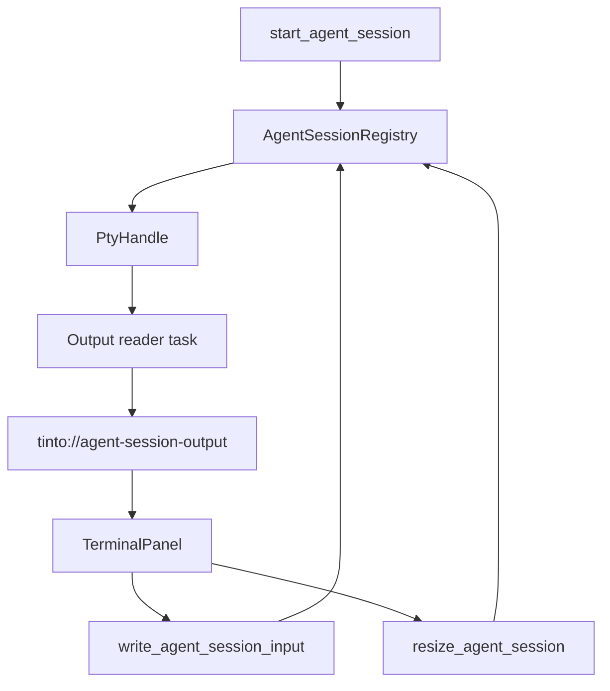

# feat: Add agent terminal streaming

## Summary

Bridge ACI-001 PTY sessions into a dockable terminal experience. The plan adds backend output events and input/resize commands, then renders attached sessions with an xterm panel that can be opened and restored by stable session id.

---

## Problem Frame

Tinto can launch and stop allowlisted agent sessions, but those sessions are invisible and non-interactive. ACI-002 makes the session useful without taking on later launch, checkpoint, revert, orchestration, or limit behavior.

---

## Requirements

**Backend stream contract**

- R1. The backend emits `AgentSessionOutput` chunks by session id using base64 payloads.
- R2. The backend accepts input bytes for running sessions and reports missing or exited sessions with structured errors.
- R3. The backend accepts resize commands with positive cols and rows and rejects invalid dimensions.

**Frontend terminal**

- R4. A terminal panel subscribes to session output events and writes decoded chunks into xterm.
- R5. Terminal input forwards bytes to `write_agent_session_input`.
- R6. Terminal fit/resize emits debounced backend resize calls.

**Workspace integration**

- R7. Terminal panel ids are stable per session and repeated opens focus the existing panel.
- R8. Closing or detaching a panel does not stop the backend session.
- R9. Existing dashboard, project, file, and timeline layouts remain compatible.

---

## Key Technical Decisions

- **Base64 output contract:** Preserve PTY bytes and ANSI escape sequences without assuming UTF-8 boundaries. The frontend decodes bytes before writing to xterm.
- **Event-first stream bridge:** Use Tauri `emit` events for live chunks because sessions are local and ephemeral. Historical replay is deferred until persistent session history exists.
- **Registry remains lifecycle owner:** The backend registry keeps process handles and exposes write/resize methods. UI attach/detach only changes frontend listeners.
- **Terminal dependency:** Use xterm packages for terminal rendering and fit behavior rather than hand-rolling terminal emulation.
- **Stable panel identity:** Use a session-derived dockview id so open/reopen behavior is deterministic.

---

## High-Level Technical Design

The backend emits live chunks from the PTY reader task. The frontend terminal panel is an attachment point: it listens to events for one session id, writes bytes to xterm, and sends input/resize commands back to the registry.

---

## Implementation Units

### U1. Backend stream contract and registry I/O

- **Goal:** Add output event types plus write/resize commands for running sessions.
- **Requirements:** R1, R2, R3, R8
- **Dependencies:** ACI-001 delivered on `develop`.
- **Files:** `src-tauri/src/bus/contract.rs`, `src-tauri/src/agent_console/pty.rs`, `src-tauri/src/agent_console/session.rs`, `src-tauri/src/agent_console/mod.rs`, `src-tauri/src/agent_console/commands.rs`, `src-tauri/src/lib.rs`
- **Approach:** Extend the process trait with write/resize behavior, add registry methods for input and resize, and add a stream sink that emits `AgentSessionOutput` events from the PTY reader loop. Keep output history out of scope.
- **Patterns to follow:** Existing `CommandError` shape in `src-tauri/src/agent_console/commands.rs`; existing Tauri event emission in `src-tauri/src/lib.rs`.
- **Test scenarios:** Starting a fake session and writing input routes bytes to the fake process; invalid resize dimensions return a structured error; missing session input and resize return `session_not_found`; output event serialization keeps base64 payload and session id stable.
- **Verification:** Rust unit tests cover registry I/O and contract serialization; `cargo test agent_console` passes.

### U2. TypeScript contract and client stream wrappers

- **Goal:** Mirror the stream event and input/resize commands in the frontend bus contract.
- **Requirements:** R1, R2, R3, R4, R5, R6
- **Dependencies:** U1
- **Files:** `src/bus/contract.ts`, `src/bus/client.ts`, `src/bus/contract.test.ts`, `docs/contracts/bus-contract.md`
- **Approach:** Add `AgentSessionOutput`, event name constant, `onAgentSessionOutput`, `writeAgentSessionInput`, and `resizeAgentSession`. Keep command argument keys aligned with Tauri camelCase mapping.
- **Patterns to follow:** Existing event listener wrappers in `src/bus/client.ts`; existing contract shape tests in `src/bus/contract.test.ts`.
- **Test scenarios:** Client wrapper invokes exact command names; event listener subscribes to the exact event string; contract test accepts base64 output payload.
- **Verification:** `npm test -- contract.test.ts` passes.

### U3. Terminal panel surface

- **Goal:** Render a session-attached xterm panel and bridge output/input/resize.
- **Requirements:** R4, R5, R6, R8
- **Dependencies:** U2
- **Files:** `package.json`, `package-lock.json`, `src/panels/terminal/TerminalPanel.tsx`, `src/panels/terminal/TerminalPanel.test.tsx`, `src/App.css`
- **Approach:** Add xterm dependencies, mount an xterm instance inside a React panel, subscribe to output events filtered by session id, forward terminal data to the backend, and debounce fit-addon resize events.
- **Patterns to follow:** React effect cleanup style in `src/bus/connection.ts`; jsdom mocking style in `src/panels/file/MediaView.test.tsx`.
- **Test scenarios:** Output for the matching session writes to the terminal; output for other sessions is ignored; terminal data calls `writeAgentSessionInput`; unmount removes listeners and disposes terminal; resize debounce calls `resizeAgentSession`.
- **Verification:** Terminal panel tests pass and frontend lint remains green.

### U4. Dock workspace integration

- **Goal:** Register and open stable terminal panels without disturbing existing layouts.
- **Requirements:** R7, R8, R9
- **Dependencies:** U3
- **Files:** `src/workspace/panels.ts`, `src/workspace/openAgentTerminal.ts`, `src/workspace/openAgentTerminal.test.ts`, `src/App.tsx`, `src/workspace/DockWorkspace.test.tsx`
- **Approach:** Add `PANEL_AGENT_TERMINAL`, derive panel ids from session ids, register `TerminalPanel` in the top-level dock components, and add an opener helper that focuses an existing panel before creating one.
- **Patterns to follow:** `src/workspace/openTimeline.ts`, `src/workspace/openRepo.ts`, and stable panel id helpers in `src/workspace/panels.ts`.
- **Test scenarios:** Opening a new session creates one panel; reopening the same session focuses the existing panel; component registry includes the terminal panel; default workspace layout remains unchanged.
- **Verification:** Workspace tests and full frontend test suite pass.

---

## Scope Boundaries

- Repo-card launch UI and binary availability remain in ACI-003.
- Checkpoint, audit, and revert remain in ACI-004.
- Multi-agent auto-split placement remains in ACI-005.
- Resource limits and telemetry remain in ACI-006.
- Historical output replay is deferred until persistent session history exists.

---

## System-Wide Impact

This work changes the backend/frontend bus contract, Tauri command registration, event emission, frontend dependencies, and dockview panel registry. It does not introduce remote execution, network APIs, auth, persistence migrations, or checkpoint mutations.

---

## Risks & Dependencies

- PTY reader ownership must not block input/resize access to the process handle.
- xterm and fit-addon need jsdom-friendly mocks so tests do not depend on browser layout APIs.
- Binary-safe output requires careful frontend decoding to avoid corrupting ANSI or partial multibyte sequences.
- `cargo build` may remain blocked locally while `target/debug/tinto.exe` is open; `cargo check`, `cargo test`, and frontend CI-equivalent commands should still cover the review units.

---

## Sources & Research

- `docs/roadmaps/2026-06-19-002-agent-console-integration.md` defines ACI-002 scope and dependencies.
- `docs/work-packages/ACI-001-agent-console-backend/2026-06-19-001-agent-console-backend-work-package.md` records the delivered ACI-001 backend runtime.
- `src-tauri/src/agent_console/pty.rs` contains the PTY handle and process trait that U1 extends.
- `src/bus/client.ts` and `src/bus/contract.ts` define the current frontend bus wrapper pattern.
- `src/workspace/openTimeline.ts` and `src/workspace/panels.ts` define the current top-level dock panel registration pattern.
