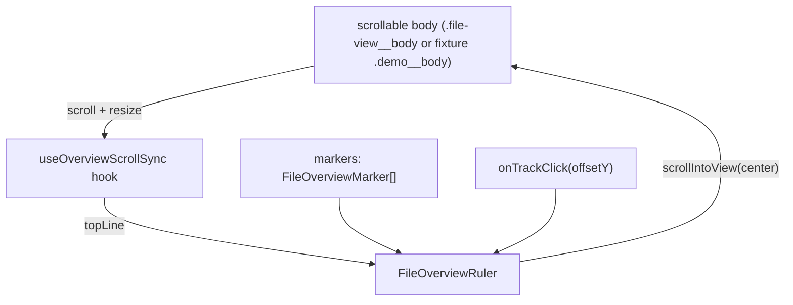

# feat: Add file overview ruler VS Code parity (foundation + hunk markers)

## Summary

Convert the right-side file overview ruler from an alert-only chip rail into a true whole-file navigation/follow surface synced to the full document. The plan covers the always-visible track, the scroll-synced caret indicator, click-to-jump on the full track, configurable width/density, active-marker highlight with scroll-past clear, keyboard nav, a11y, and a `source` discriminator on `FileOverviewMarker`. RU2 will add diff-hunk markers in the rail. RU3 (search markers) is a deferred placeholder blocked on a search feature. A dev-only browser fixture (`/demo.html`) is included so the user can review the rail in a normal Chrome/Firefox DevTools session without going through the Tauri window.

---

## Problem Frame

The current `FileOverviewRuler` renders only when alert markers exist, has no track, no scroll-synced caret, no full-file click navigation, and no diff-hunk markers. The Tauri webview does not expose DevTools to the user, so the previous RU1 review attempt could not be completed in-app. This plan adds a browser fixture as the primary review surface for this iteration.

---

## Requirements (R1–R18, N1–N4) — see the brainstorm for the full list.

The work is split into two review units:

- **RU1 (foundation):** always-visible track, scroll-synced caret, click-to-jump, configurable width/density, active-marker highlight with scroll-past clear, keyboard nav, a11y, and the `source` discriminator on `FileOverviewMarker`. Plus the dev fixture for review.
- **RU2 (hunk markers):** `DiffView` derives one info marker per hunk and passes them to the rail. Adds the `source: "hunk"` style.
- **RU3 (search markers, deferred placeholder):** reserved; no code in this plan.

---

## Key Technical Decisions

- **Scroll-sync via a single ref + passive scroll listener + `ResizeObserver` + `requestAnimationFrame`.** The hook lives in `useOverviewScrollSync.ts`; the rail consumes `topLine` as a prop.
- **Reuse the existing `data-line` / `data-new-line` DOM contract.** No new DOM attributes.
- **Marker `source` discriminator on `FileOverviewMarker`** (additive, optional, default `"alert"`).
- **CSS custom properties for width and density:** `--file-overview-ruler-width` and `--file-overview-ruler-density`.
- **Click-to-jump line math:** `line = round(ratio * (totalLines - 1)) + 1`, clamped to `[1, totalLines]`.
- **No backend changes.** RUL-001 is frontend-only.
- **Dev fixture for review.** Vite multi-page entry (`demo.html`) that mounts the rail against a mock file. Reached only at `/demo.html`, never in the Tauri app.

---

## High-Level Technical Design

---

## Implementation Units

### U1. Overview ruler foundation (RU1) + dev fixture

- **Goal:** Add the always-visible track, scroll-synced caret, click-to-jump, configurable width/density, active-marker highlight with scroll-past clear, keyboard nav, a11y, and the `source` discriminator on `FileOverviewMarker`. Cover with focused unit tests. Add a dev-only browser fixture for review.
- **Requirements:** R1–R10, R13, R15–R18; review path V5.
- **Dependencies:** none inside this initiative.
- **Files:**
  - `src/panels/file/FileOverviewRuler.tsx` (rewrite)
  - `src/panels/file/useOverviewScrollSync.ts` (new)
  - `src/panels/file/FileOverviewRuler.test.tsx` (new)
  - `src/panels/file/useOverviewScrollSync.test.tsx` (new)
  - `src/panels/diff/DiffView.tsx`
  - `src/panels/diff/FullFileView.tsx`
  - `src/panels/file/FileView.tsx`
  - `src/App.css`
  - `demo.html` (new, Vite multi-page entry)
  - `src/demo/main.tsx` (new)
  - `src/demo/demo.css` (new)
  - `src/panels/diff/FullFileView.test.tsx`, `src/panels/diff/DiffView.test.tsx`, `src/panels/file/FileView.test.tsx` (test id format update)
- **Verification:** see work package "What to test (user review checklist)" and the verification gate.

### U2. Diff-hunk markers in the rail (RU2)

- **Goal:** Extend `DiffView` to compute one info marker per hunk and pass them to the rail alongside alert markers. Add the `source: "hunk"` rendering style.
- **Requirements:** R11, R12; deferred from RU1.
- **Dependencies:** U1.
- **Files:** `src/panels/diff/DiffView.tsx`, `src/panels/diff/DiffView.test.tsx`, `src/panels/file/FileOverviewRuler.test.tsx` (extend), `src/App.css` (hunk-marker style).
- **Verification:** `npm test -- FileOverviewRuler.test.tsx DiffView.test.tsx`; full `npm test`; `npm run lint`; `npm run build`.

### U3. Search-result markers (deferred placeholder, blocked)

- **Goal:** Reserved for a future review unit. No code is added in this plan. The work package carries RU3 as a placeholder only.
- **Requirements:** R14.
- **Dependencies:** blocked on a separate file-content search feature.

---

## Files and Tests

- Backend: none.
- Frontend: see the per-unit file lists above.
- Dev fixture: `demo.html`, `src/demo/main.tsx`, `src/demo/demo.css`.
- Orchestration: `docs/orchestration/compound-master-state.md`, this work package, the roadmap, the brainstorm, and the plan.

---

## Production Posture

- Posture: `prototype`. Local-only verification on `develop`. No compatibility guarantees beyond current desktop behavior.

---

## Delivery Strategy

- Two review units, executed serially on `develop`. RU1 lands first; RU2 lands after RU1 is verified and merged. No stacked PRs (standing workflow preference is local fast-forward merge + push, no PR).
- Jira policy: `optional` with the existing `jira-env-not-configured` fallback. No Jira lookup; record the omission in the release closeout.
- **Review path for this iteration:** dev-only browser fixture at `http://127.0.0.1:1420/demo.html`. Tauri app review is not used for RU1.
