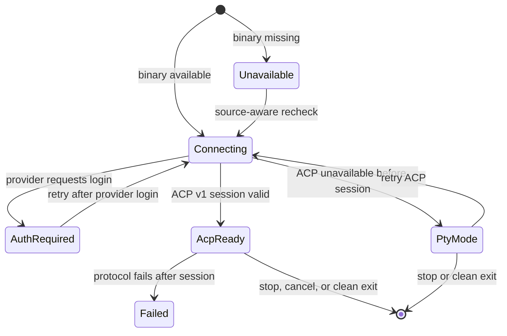
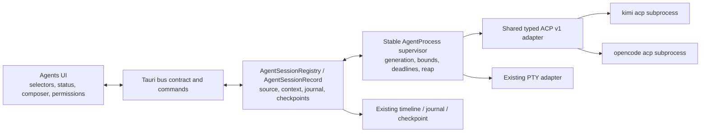
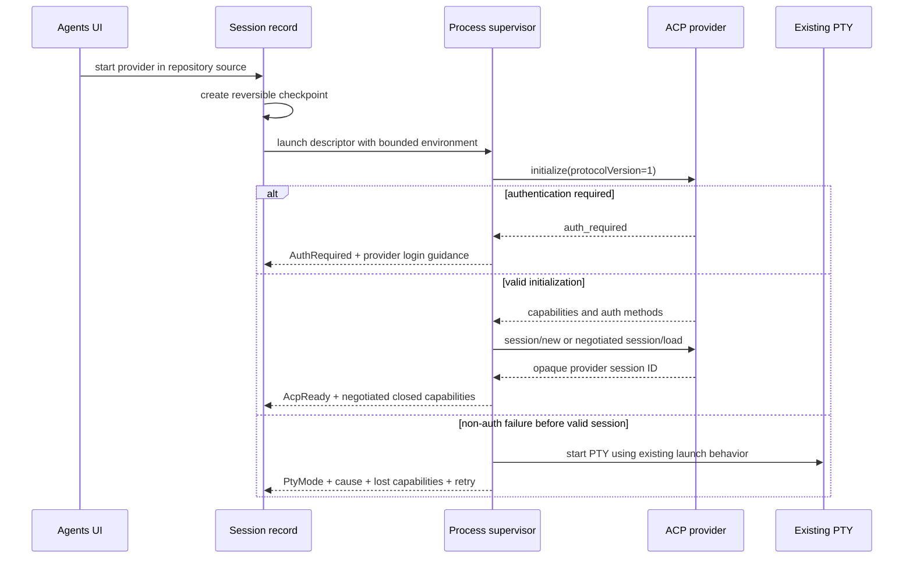
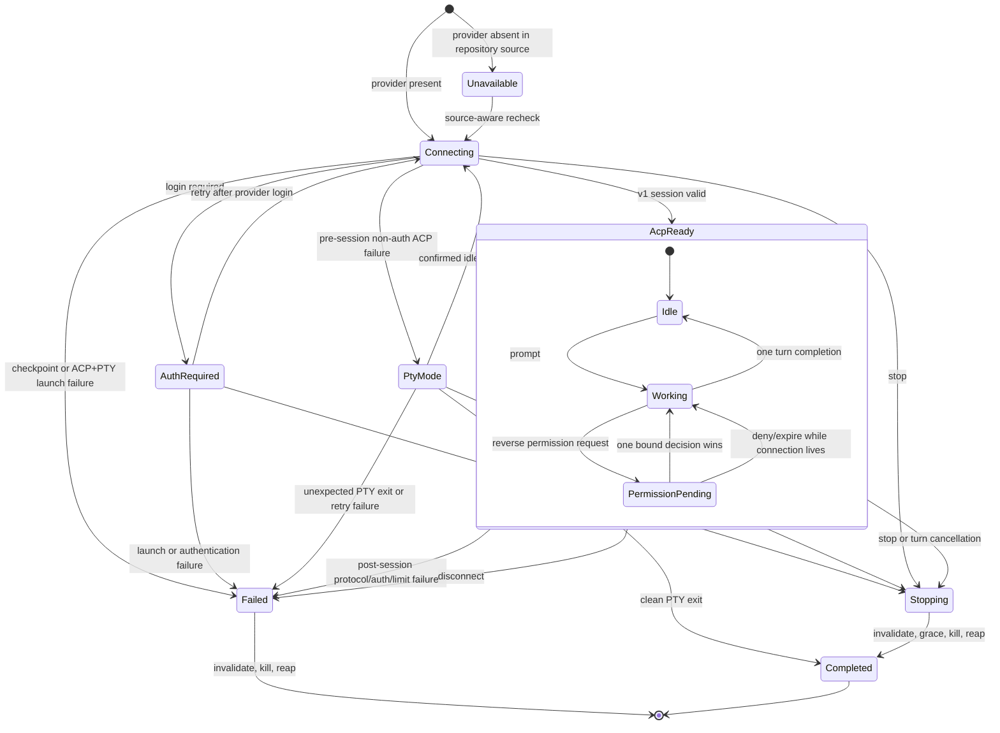

# Kimi Code and OpenCode Agent Support - Plan

## Goal Capsule

- **Objective:** Make current Kimi Code and OpenCode first-class Tinto agents through a structured ACP conversation when the installed CLI supports it, while preserving a visible PTY compatibility path.
- **Authority hierarchy:** The user-confirmed acceptance criteria and restrictions; the Product Contract below; repository `AGENTS.md`; then the existing provider-neutral Agent Console contract and code patterns.
- **Execution profile:** Local implementation and validation through Compound Master review units. Work serially where units share the Agent Console contract or process lifecycle; parallelize only independent review or research.
- **Stop conditions:** Stop when R1-R23 and AE1-AE11 are explicitly evidenced, relevant checks pass, every support-matrix cell has a passing smoke or named limitation, and abandoned implementation attempts are absent from the diff. A contradiction with a settled product decision is a blocker, not permission to reinterpret it.
- **Tail ownership:** Compound Master owns planning, work-package execution, review, security review, impact reconciliation, and local validation. Commit, push, PR, Jira mutation, and release are outside this invocation and remain Release Marshal work only if separately requested.
- **Open blockers:** None. On 2026-07-18 the user explicitly approved KTD10's narrow contained-loopback exception for the provider-internal listener used by current OpenCode.

---

> The Product Contract is preserved from the reviewed requirements-only artifact except for the explicit 2026-07-18 user approval of KTD10's narrow OpenCode provider-internal loopback exception. Planning details below may explain protocol mechanics but may not otherwise weaken or expand it.

## Product Contract

### Summary

Tinto will launch Kimi Code and OpenCode from Agents, prefer their ACP v1 subprocess interface, and preserve the current PTY path as a visible compatibility mode. The structured path will expose the lifecycle, permissions, capabilities, journal, and checkpoint behavior already expected from a native Tinto agent session.

### Problem Frame

OpenCode is selectable today but only produces terminal bytes, while Kimi is rejected by the backend allowlist and absent from the selector. Codex already proves that Agent Console can translate a provider protocol into a provider-neutral conversation without making the UI understand provider-specific concepts. Kimi Code and OpenCode now expose the same stable protocol family, so separate proprietary integrations would add carrying cost without improving the requested behavior.

### Key Decisions

- **Structured support is the product baseline.** (session-settled: user-approved — chosen over PTY-only launch support: the requested integration must provide native lifecycle and permissions when ACP is available.) PTY remains a compatibility mode, not the definition of completion.
- **Kimi is the first value slice.** (session-settled: user-approved — chosen over upgrading OpenCode first: Kimi is the provider that Tinto cannot launch today.) A bounded probe must still exercise both providers before the common behavior is frozen.
- **Capabilities are negotiated.** (session-settled: user-approved — chosen over provider-name assumptions: ACP installations and platforms can expose different optional behavior.) Controls appear only when the active session advertises and passes the corresponding capability.
- **Provider-owned authentication stays outside Tinto.** (session-settled: user-approved — chosen over credential capture: provider CLIs already own login and configuration.) Tinto may explain that authentication is required and retry the connection, but it does not collect or persist provider secrets.
- **ACP uses a local subprocess.** (session-settled: user-approved — chosen over Tinto-managed provider HTTP servers: Tinto communicates only through stdio and owns no listener lifecycle.) Tinto introduces no server process, listener, or port of its own. The user-approved KTD10 exception permits only the current OpenCode ACP subprocess's unavoidable same-process loopback implementation under explicit containment and fail-closed checks.

### Actors

- A1. **Developer:** selects an agent for a local or WSL repository, sends turns, responds to permission requests, and needs to understand any degraded mode.
- A2. **Provider CLI:** the installed `kimi` or `opencode` executable that exposes ACP, authentication status, negotiated capabilities, session updates, and permission requests.
- A3. **Tinto Agent Console:** owns process lifetime, repository authority, the provider-neutral session contract, journal, checkpoints, and user-facing recovery.

### Requirements

**Provider discovery and readiness**

- R1. Tinto must recognize `kimi` and `opencode` as allowlisted agents in the backend and every existing Agents selection, label, and source-aware availability surface.
- R2. A session must expose one of these observable readiness states: unavailable, authentication required, connecting to ACP, ACP ready, PTY compatibility mode, or failed.
- R3. Structured Kimi support targets an installation that completes an ACP v1 handshake; a same-named legacy installation may run through PTY but must not be reported as ACP ready.
- R4. Readiness must be resolved in the repository execution source, so a host miss cannot override an available WSL CLI and a binary presence check cannot be reported as ACP capability.
- R19. An unavailable state must identify the missing provider in the active repository execution source, provide source-appropriate prerequisite guidance, and offer a source-aware recheck action.

**Structured conversation**

- R5. When ACP initializes successfully, Tinto must create a structured provider session and map prompts, updates, lifecycle completion, cancellation, and the opaque provider session ID into the existing provider-neutral Agent Console contract.
- R6. The ACP baseline must support prompts, incremental updates, permission requests, cancellation, and turn completion; the closed optional set for this delivery is session load, attachments, models, and modes, enabled only when negotiated.
- R7. If ACP fails for a reason other than authentication-required before a provider session becomes valid, Tinto must enter PTY compatibility mode with the cause, lost structured capabilities, and a retry action visible to the developer.
- R8. If ACP fails after a provider session becomes valid, Tinto must fail that structured session visibly without replaying the turn through PTY.
- R9. A stopped, cancelled, disconnected, or protocol-limited structured session must terminate and reap its provider process tree after a bounded grace period without leaving a pending turn or permission request.
- R20. Retry ACP from PTY compatibility mode must be available only while the PTY turn is idle and must require confirmation before stopping PTY, preserving its transcript and checkpoint, and creating a fresh structured session without replaying content.

**Permissions, authentication, and data boundaries**

- R10. Every permission response must match the active provider, Tinto session, turn, and ACP request, and stale or mismatched responses must be rejected.
- R11. Pending permission requests must be announced accessibly and offer keyboard-operable allow, deny, and cancel actions; deny is the safe outcome for timeout, disconnect, expired request, or absence of a responding view.
- R22. A bound permission request must remain authoritative despite later tool-status updates until it is answered, cancelled, denied, expired, or invalidated, after which its controls become non-actionable and announce the outcome.
- R12. An authentication-required result must direct the developer to the provider-owned login flow and allow retry without Tinto receiving or storing credentials.
- R13. ACP stdout, stderr, and reverse requests must be treated as untrusted input with schema validation, bounded messages and queues, backpressure, and safe termination when a limit is exceeded.
- R14. File reads and writes mediated by the Tinto ACP client must use the existing repository containment rules, including canonical path checks and rejection of `.git` or paths outside the authorized repository.
- R15. An ACP subprocess must receive only environment data required to launch and authenticate that provider, and authentication material must not be persisted in events, errors, the journal, or checkpoints.
- R23. Every inbound ACP response, notification, update, and reverse request must match its active connection, provider session, Tinto session, turn, request identifier, method, and lifecycle state; duplicate, unknown, mismatched, or stale messages must be rejected.

**Compatibility and evidence**

- R16. Structured sessions must preserve Tinto-owned journal, checkpoint, turn-checkpoint, host-context, and resume behavior without changing Codex, Claude, or existing PTY behavior.
- R17. The implementation must provide deterministic ACP fixtures and conformance tests for the shared baseline plus provider-specific startup and capability differences.
- R18. Support evidence must cover Kimi and OpenCode on Windows native, Linux native, and Ubuntu WSL by recording ACP readiness, PTY compatibility, official prerequisites, and either a passing smoke or an explicit limitation for every cell.
- R21. A bounded probe of both current provider CLIs must record startup, handshake, capabilities, updates, permissions, and cancellation before the shared ACP behavior and provider fixtures are finalized.

### Session State Flow

### Key Flows

- F1. Start a structured session
  - **Trigger:** A1 selects Kimi or OpenCode for a repository whose source contains the provider binary.
  - **Actors:** A1, A2, A3
  - **Steps:** A3 creates the existing reversible checkpoint, starts ACP in the repository source, negotiates capabilities, creates the provider session, and publishes ACP-ready state.
  - **Outcome:** A1 can send a turn through the native conversation surface.
  - **Covered by:** R1-R6, R16
- F2. Recover before a valid ACP session
  - **Trigger:** ACP is unavailable, incompatible, or unauthenticated before session creation finishes.
  - **Actors:** A1, A2, A3
  - **Steps:** A3 distinguishes unavailability, authentication, and protocol failure; it offers source-aware recovery where applicable and otherwise enters visible PTY compatibility mode without losing the checkpoint.
  - **Outcome:** A1 can recheck availability, retry authentication, or explicitly switch an idle PTY session to a fresh ACP session with an understood capability loss.
  - **Covered by:** R2-R4, R7, R12, R19-R20
- F3. Resolve a permission request
  - **Trigger:** A2 sends a permission request during an active turn.
  - **Actors:** A1, A2, A3
  - **Steps:** A3 binds and publishes the request, keeps it authoritative over later tool-status updates, A1 chooses allow, deny, or cancel, and A3 responds only while the binding is current.
  - **Outcome:** The turn continues or stops without implicit approval.
  - **Covered by:** R9-R11, R22-R23
- F4. Contain provider data access
  - **Trigger:** A2 emits protocol data or asks A3 to read or write a file.
  - **Actors:** A2, A3
  - **Steps:** A3 validates and bounds the message, applies repository containment, and returns a safe protocol result or terminates the invalid session.
  - **Outcome:** File operations mediated by Tinto cannot escape the authorized repository, and bounded protocol handling prevents exhaustion of the Agent Console channel.
  - **Covered by:** R13-R15

### Acceptance Examples

- AE1. **Covers R2, R4-R6, R16.** Given an authenticated current Kimi Code installation in the repository source, when the developer starts Kimi, then the session reaches ACP ready, a prompt produces structured timeline updates, and Tinto retains its checkpoint and journal.
- AE2. **Covers R2, R7, R12.** Given a provider that reports authentication is required before session creation, when startup runs, then Tinto shows provider-owned login guidance and retry without recording a credential or silently falling back as though authentication were a protocol incompatibility.
- AE3. **Covers R2, R3, R7.** Given a `kimi` executable that cannot complete ACP v1 initialization, when startup fails before a provider session exists, then Tinto identifies PTY compatibility mode, explains the structured capability loss, and can retry ACP.
- AE4. **Covers R8, R9.** Given an ACP-ready session with an active turn, when the provider connection becomes invalid, then Tinto fails the session, clears pending requests, terminates and reaps the process tree, and does not replay the submitted turn through PTY.
- AE5. **Covers R10, R11, R22-R23.** Given a pending permission request, when its turn ends, its session disconnects, a later status update arrives, or a response references another request, then the pending decision remains visible until invalidated, becomes non-actionable with an announced deny or expiry reason, and never sends an approval to the provider.
- AE6. **Covers R6.** Given an ACP session that does not advertise load, attachments, models, or modes, when Agents renders that session, then those controls are absent while prompt, updates, permissions, cancellation, and completion still work.
- AE7. **Covers R13-R15.** Given an oversized, malformed, out-of-root, or `.git` provider request, when Tinto handles it, then the request is rejected or the session terminates safely and no sensitive payload is persisted.
- AE8. **Covers R1, R17, R18.** Given the support matrix and deterministic fixtures, when verification runs, then both provider descriptors pass the shared conformance baseline and every platform cell has passing evidence or a named limitation.
- AE9. **Covers R2, R4, R19.** Given that the selected provider is absent from the repository execution source, when Agents reports unavailable, then it names that source, shows the matching prerequisite guidance, and a recheck reaches connecting after the provider becomes available there.
- AE10. **Covers R17, R21.** Given observations from bounded probes of both current CLIs, when provider fixtures and the shared behavior are finalized, then each observed difference is represented by capability negotiation or a provider startup descriptor rather than a provider-specific transport fork.
- AE11. **Covers R16.** Given every stable Tinto host-context field has a value, when each structured provider receives a turn, then the outgoing prompt contains the existing bounded host-context block unchanged and requires no RDM-018 memory field.

### Scope Boundaries

- Agent memory from RDM-018 is excluded; this feature uses only the existing visible host-context fields.
- Claude structured support remains under RDM-019 and is not added to this delivery.
- Provider HTTP transports or listeners managed, exposed, or consumed by Tinto remain excluded. The only network-listener exception is KTD10's user-approved, same-process OpenCode loopback implementation; non-loopback binding, mDNS, unauthenticated access, and Tinto HTTP use remain excluded. Tinto-owned credential storage, implicit auto-approval, ANSI semantic parsing, and removal of PTY are excluded.
- Checkpoint and revert semantics are preserved rather than redesigned.
- Capabilities not advertised by the active ACP session are not emulated or promised.
- Advertised capabilities beyond session load, attachments, models, and modes are recorded but excluded until a new requirement adds them.
- The installed provider CLI is trusted local code with the user's ambient operating-system authority; Tinto containment applies only to operations mediated through its ACP client.

### Dependencies and Assumptions

- The current provider-neutral process, session, timeline, journal, checkpoint, and host-context boundaries remain authoritative.
- The current host context is sufficient because ACP consumes the same visible prompt context already sent to Codex and PTY sessions; no memory field is required.
- Each Tinto structured session owns one dedicated ACP process and connection; multiplexing providers or Tinto sessions is excluded.
- The RDM-017 WSL implementation exists, but its current smoke evidence must be reconciled during verification.
- Provider credentials may be unavailable in automated environments, so deterministic conformance is mandatory and authenticated smoke evidence may record a manual limitation.

### Sources and Research

- `docs/roadmaps/2026-07-18-009-kimi-opencode-agent-support-roadmap.md`
- `docs/contracts/bus-contract.md`
- `src-tauri/src/agent_console/validation.rs`
- `src-tauri/src/agent_console/pty.rs`
- `src-tauri/src/agent_console/session.rs`
- `src-tauri/src/bus/contract.rs`
- `src/panels/RepoCard.tsx`
- `src/panels/terminal/TerminalPanel.tsx`
- [Kimi Code ACP](https://www.kimi.com/code/docs/en/kimi-code-cli/reference/kimi-acp.html)
- [OpenCode ACP](https://dev.opencode.ai/docs/acp/)
- [Agent Client Protocol v1](https://agentclientprotocol.com/protocol/v1/overview)

---

## Planning Contract

### Key Technical Decisions

- **KTD1 — One shared ACP v1 adapter beneath the existing session seam.** (session-settled) Kimi and OpenCode use one typed JSON-RPC/stdio implementation. Provider-specific behavior is limited to a startup descriptor and observed capabilities; no provider-specific transport fork is permitted. This realizes R5, R17, and AE10 while keeping `AgentSessionRecord` authoritative for host context, checkpoints, journal, and timeline.
- **KTD2 — Use the official schema crate, not its runtime.** (planning-resolved) Pin `agent-client-protocol-schema` to `=1.4.0` behind one local translation module so inbound ACP v1 data is validated against the official types required by R13/R17/R23. Keep transport, correlation, bounds, environment, fallback, and process ownership in Tinto. The full `agent-client-protocol` runtime is rejected because its generic unbounded channels, child ownership, and unknown-response handling do not satisfy Tinto's lifecycle and trust-boundary criteria; hand-written protocol types are rejected because duplicating the current v1 surface is larger and less reliable than the schema-only dependency.
- **KTD3 — Keep one stable supervising process object per Tinto session.** (repo-grounded) Reserve the starting session under the registry lock, then run the cancellable ACP handshake on a worker outside that lock so connecting, list, stop, and recheck remain responsive. The supervisor owns a stable bounded receiver; generation-tagged child pumps feed it from the active ACP or PTY child. A pre-session ACP failure may atomically replace the child with PTY; a post-session failure cannot. PTY-to-ACP retry swaps and closes pumps only after an idle and confirmation recheck, so the Tinto session, transcript, checkpoint, and one output-reader registration remain stable while late generations are dropped.
- **KTD4 — Correlate every inbound message by the identifiers its ACP message class carries.** (planning-resolved) Responses and reverse requests bind connection generation, JSON-RPC request ID, method, provider session, Tinto session, and active turn. Notifications additionally require the active connection/session/turn and their schema-defined message or tool-call identifier when present; a pending prompt request supplies their turn correlation because JSON-RPC notifications do not carry request IDs. Unknown, duplicate, late-generation, wrong-method, wrong-session, and wrong-lifecycle messages fail closed. This is the protocol-valid interpretation used to verify R23 without weakening it.
- **KTD5 — Backend state is authoritative for readiness, capabilities, and permissions.** (agent-native) React renders session snapshots and sends bound decisions, but never infers ACP readiness or authorization from provider names or optimistic local state. Capability checks are repeated in backend commands so stale controls cannot invoke an unnegotiated operation. Multiple views may observe a permission, but an atomic backend transition accepts at most one response.
- **KTD6 — Map only the negotiated closed optional set.** (session-settled) Baseline text prompts, updates, permissions, cancellation, and completion are always required after a valid handshake. Session load, current attachment support, model selection, and mode selection appear only when advertised and validated. Other advertised capabilities may be recorded for diagnostics but are neither exposed nor invoked in this delivery.
- **KTD7 — Do not advertise ACP filesystem or terminal client capabilities.** (scope-derived) They are outside R6's closed optional set. Any reverse filesystem or terminal request is rejected as unnegotiated before touching disk or spawning work; path-shaped requests, including out-of-root and `.git` paths, therefore produce no file change. Existing provider-owned tools retain their ambient local-process authority exactly as stated in the Product Contract.
- **KTD8 — Reuse existing persistence without a database migration.** (repo-grounded) Runtime transitions and terminal permission outcomes are recorded as existing lifecycle timeline/journal entries; the existing opaque provider session ID remains the native-resume key. Pending permissions are memory-only and never resurrected. During ACP `session/load`, replayed provider history is suppressed from the Tinto timeline and journal, which remain the single visible transcript.
- **KTD9 — Launch ACP with a provider-specific environment allowlist and persist normalized diagnostics only.** (security-derived) Preserve only the platform variables needed to execute the resolved binary, locate its user configuration, create temporary files, and read the provider's officially supported authentication variables. PTY launch behavior stays unchanged. Raw stderr and provider `error.data` remain bounded and ephemeral; only Tinto-owned error codes and normalized messages may enter events, timeline, journal, or checkpoints, because Tinto cannot redact credentials loaded privately from provider config.
- **KTD10 — Contain OpenCode's unavoidable same-process loopback implementation.** (user-approved: 2026-07-18) Tinto still speaks only ACP over stdio and does not add, discover, manage, or consume an HTTP provider transport. Current `opencode acp` starts a loopback HTTP listener in the same CLI process, so its descriptor must force `127.0.0.1`, port `0`, and mDNS off, inject an ephemeral random server password, and verify those effective settings before ACP-ready. Any containment failure produces visible PTY compatibility instead. No separate server process, non-loopback binding, discovery, unauthenticated listener, or Tinto HTTP client is allowed.

### Assumptions

- ACP protocol version `1` and newline-delimited UTF-8 JSON-RPC over stdio are the compatibility target for this delivery.
- The implementation uses named, test-injectable bounds: 30 seconds for handshake/session setup, 60 seconds for a permission response, 2 seconds for graceful cancellation before forced tree termination, 1 MiB per ACP stdout frame, 64 KiB per stderr line with a 256 KiB ephemeral diagnostic tail, 256 queued protocol events, 64 pending JSON-RPC requests per connection, 16 pending permissions, 512 structured updates per turn, and 8 MiB of normalized update text per turn. Boundary tests cover below, at, and above each applicable limit, including slow accumulation while consumers drain the queue.
- A local permission timeout is a non-approval. If the connection is still writable, Tinto selects an advertised reject option or returns ACP `cancelled`; after disconnect it records the denied/expired outcome locally and sends nothing.
- An ACP load failure that leaves a valid connection may create a fresh ACP session and use the existing context-bridge behavior. PTY fallback is reserved for a non-authentication ACP failure before any provider session becomes valid.
- Current provider binaries are absent from the initial host probe. R21 is therefore executed with official non-global package/installer entry points where available, and R18 may name authentication or unavailable-platform limitations instead of fabricating a passing smoke.

### Implementation Constraints

- Preserve the Product Contract, all current Codex app-server behavior, Claude behavior, generic PTY behavior, checkpoint semantics, and repository session exclusivity.
- Add one focused ACP module, the schema-only ACP dependency, and deterministic provider fixtures. Do not introduce the ACP runtime crate, an ACP service layer, separate transcript store, database migration, frontend provider registry refactor, network listener, or credential UI.
- Reuse `AgentSessionRecord::write_turn`, `turn_context_input`, `plan_mode_input`, existing WSL path conversion, timeline frames, journal writes, checkpoint completion, and process-tree helpers rather than duplicating those rules.
- A checkpoint creation failure prevents provider launch. Authentication expiry after ACP readiness is a visible structured-session failure with login guidance, never a PTY replay.
- Output from a replaced process generation, queued input from a prior runtime, and late completion after stop are ignored; exactly one terminal turn/checkpoint outcome is recorded.
- Cancellation has three non-interchangeable meanings: cancelling a permission sends ACP `cancelled` for that reverse request only; stopping/cancelling the active turn uses the existing session-stop action, sends `session/cancel` when writable, then terminates and reaps the structured process per R9; dismissing an ACP-retry confirmation changes no backend state.
- An ACP process in WSL may reach ready only when Tinto has captured a distro-side PID/process group and can apply bounded TERM/KILL plus host-wrapper reaping. A platform cell that cannot prove this remains explicitly unsupported for structured mode; an R18 limitation never substitutes for R9.

### High-Level Technical Design

The diagrams are boundary and lifecycle guides, not exact type or function prescriptions.

### Sequencing

1. Probe both current provider CLIs and lock only observed startup/capability differences into fixtures and descriptors.
2. Add provider/source readiness and selection parity so both agents can reach the existing launch boundary.
3. Complete a usable Kimi vertical through the shared adapter, lifecycle, fallback, permissions, and UI before enabling OpenCode.
4. Add OpenCode only through its startup descriptor and negotiated capabilities, including the loopback containment gate, without a transport fork.
5. Run cross-provider conformance, regression gates, security review, and complete every platform evidence cell.

### System-Wide Impact

- **Bus contract:** `AgentSession` gains provider-neutral readiness, runtime mode, negotiated closed capabilities, fallback detail, and pending permission projections. A structured readiness result replaces the boolean availability query, and one permission-response plus one confirmed ACP-retry command are added. Rust, generated TypeScript, curated `src/bus/contract.ts`, and the contract parity tests stay synchronized.
- **Process lifecycle:** Local and WSL factories receive explicit provider identity. ACP owns piped stdio/stderr and a dedicated child tree; PTY and Codex paths remain unchanged. A connection-generation token prevents output from a replaced child mutating the live session.
- **Session and data lifecycle:** Existing timeline, journal, checkpoints, turn checkpoints, provider session ID, context summary, and host-context injection remain authoritative. Runtime state does not require a new store or schema migration; pending permissions are never journaled as actionable state.
- **Frontend:** Existing selectors and labels add Kimi without a new asset. `TerminalPanel` renders readiness/fallback/auth/permission state and uses negotiated capabilities instead of provider-name gates only for the closed optional ACP controls; existing Codex controls preserve their current catalog behavior.
- **Security:** ACP frames, stderr, reverse requests, queues, correlation, environment, timeouts, and process cleanup become explicit trust boundaries. Tinto advertises no filesystem/terminal client capability and persists no auth material.
- **Failure propagation:** Pre-session non-auth ACP failure degrades visibly to PTY; auth does not. Post-session failure, limit breach, cancellation, or disconnect invalidates requests, produces one terminal outcome, and reaps the provider tree without replay.

### Risks and Dependencies

- **Provider CLI drift:** Current Kimi and OpenCode releases may differ from docs or each other. Mitigation: bounded R21 probes, captured versions, deterministic fixtures, and descriptor/capability differences only.
- **Cross-platform child cleanup:** Killing `wsl.exe` alone may leave a Linux descendant. Mitigation: require distro-side PID/process-group TERM/KILL followed by host-wrapper reaping before WSL structured mode may report ready; otherwise mark that structured cell unsupported rather than waive R9.
- **Permission races:** Multiple views, multiple pending requests, status updates, and timeouts can race. Mitigation: backend collection keyed by full binding, atomic first-winner transition, tombstoned terminal outcomes, and deterministic fake-clock/concurrency tests.
- **Replay duplication:** `session/load` may emit prior history into an already restored Tinto transcript. Mitigation: explicit load-replay suppression and tests that compare timeline and journal counts before/after load.
- **Secret exposure:** Provider errors or stderr may echo auth material unknown to Tinto. Mitigation: raw diagnostics stay bounded and memory-only; persistence uses a Tinto-owned code/message allowlist, environment values are excluded, and config-only secret canaries prove no leak.
- **OpenCode internal listener:** The current official ACP command creates a same-process HTTP listener even though Tinto uses stdio. Mitigation: forced loopback/ephemeral/no-mDNS arguments, an ephemeral random password, effective-setting probes, and PTY-only readiness if any containment assertion fails.
- **No authenticated provider account in automation:** Deterministic protocol conformance remains the automated gate; R18 records authenticated smoke evidence or an explicit credential/platform limitation per cell.

### Planning Sources

- [ACP schema crate 1.4.0](https://crates.io/crates/agent-client-protocol-schema/1.4.0) and [ACP versioning](https://github.com/agentclientprotocol/agent-client-protocol#versioning)
- [Kimi Code 0.27.0 release](https://github.com/MoonshotAI/kimi-code/releases/tag/%40moonshot-ai/kimi-code%400.27.0) and [Kimi ACP reference](https://www.kimi.com/code/docs/en/kimi-code-cli/reference/kimi-acp)
- [OpenCode 1.18.3 release](https://github.com/anomalyco/opencode/releases/tag/v1.18.3), [OpenCode ACP command](https://github.com/anomalyco/opencode/blob/dev/packages/opencode/src/cli/cmd/acp.ts), and [network option resolution](https://github.com/anomalyco/opencode/blob/dev/packages/opencode/src/cli/network.ts)

### Resolved Decision

- **Evidence:** The official current OpenCode ACP command calls its internal `Server.listen` before wiring ACP stdio, even with default loopback settings.
- **Settlement:** On 2026-07-18 the user selected Option A and approved KTD10's provider-internal loopback exception. Tinto still uses stdio only; launch is forced to authenticated loopback with mDNS disabled and fails closed to PTY when containment cannot be proven.
- **Scope effect:** Only this explicit boundary changes. Every R1-R23 and AE1-AE11 criterion remains required.

---

## Implementation Units

### U1. Probe provider behavior and add source-aware discovery

- **Goal:** Establish the current Kimi/OpenCode startup facts required by R21, then make both providers selectable and accurately discoverable in the repository execution source.
- **Requirements:** R1-R4, R19, R21; F1-F2; AE3, AE9-AE10.
- **Dependencies:** None.
- **Files:** `src-tauri/src/agent_console/validation.rs`, `src-tauri/src/agent_console/commands.rs`, `src-tauri/src/bus/contract.rs`, `scripts/generate-bus-contract.mjs`, `src/bus/contract.generated.ts`, `src/bus/contract.ts`, `src/bus/contract.test.ts`, `src/bus/client.ts`, `src/panels/agentAvailability.ts`, `src/panels/RepoCard.tsx`, `src/panels/RepoCard.test.tsx`, `src/workspace/consoleDock.ts`, `src/workspace/consoleDock.test.ts`, `src/panels/terminal/ConsoleDockPanel.tsx`, `src/panels/terminal/ConsoleDockPanel.test.tsx`, `docs/manual-smoke/2026-07-18-kimi-opencode-agent-support.md`.
- **Approach:** Verify official package identity, resolved version, and registry integrity, then run current CLI entry points in a minimal temporary profile against an empty non-sensitive temporary repository—`@moonshot-ai/kimi-code@0.27.0` via `kimi acp` and `opencode-ai@1.18.3` via `opencode acp --cwd <repo>`. KTD10 applies from the first OpenCode probe process: force `--hostname 127.0.0.1 --port 0 --no-mdns`, inject a cryptographically random per-launch `OPENCODE_SERVER_PASSWORD` through the child environment only, inspect the effective socket/auth state, and abort/reap immediately if any assertion fails. Record command, initialization, capabilities, updates, permissions, cancellation, auth blocker, source/platform, and effective containment without recording the password. Disable auto-update/telemetry/pruning where supported, pass no user credentials, and redirect provider config/cache/data to the temporary root; never invoke a persistent installer. Encode only observed command/argument differences. Replace the boolean availability surface with a provider/source readiness result and a forced recheck path; add Kimi to existing label/selector branches using the current text fallback rather than a new image or registry refactor.
- **Test scenarios:** Backend allowlist accepts `kimi`/`opencode` and still rejects unknown agents; host absence does not hide a WSL-resolved binary; a legacy Kimi-shaped executable is present but not ACP-ready; recheck bypasses the frontend TTL after installation; unavailable guidance names provider and local/WSL source; every existing selector, dock title, and label renders Kimi and OpenCode. The OpenCode probe binds loopback only, publishes no mDNS, rejects absent/wrong credentials, accepts only its per-launch credential internally, keeps that secret out of argv/logs/persistence, and closes the socket plus process tree on success, failure, or abort.
- **Verification:** Probe evidence contains both provider versions or an explicit official-entry-point limitation, observed differences map only to descriptor/capability data, generated contracts are current, and focused Rust/React discovery tests pass.

### U2. Implement the bounded shared ACP v1 adapter with Kimi

- **Goal:** Provide one typed, correlated, bounded JSON-RPC/stdio implementation and prove the shared baseline first with current Kimi.
- **Requirements:** R5-R6, R13-R15, R17, R21, R23; F1, F4; AE1, AE6-AE7, AE10-AE11.
- **Dependencies:** U1 probe observations.
- **Files:** `src-tauri/src/agent_console/acp.rs` (new), `src-tauri/src/agent_console/mod.rs`, `src-tauri/src/agent_console/pty.rs`, `src-tauri/src/wsl_agent/mod.rs`, `src-tauri/src/wsl_agent/shell_env.rs`, `src-tauri/src/agent_console/test_fixtures/kimi-acp-v1.jsonl` (new), `src-tauri/Cargo.toml`, `src-tauri/Cargo.lock`.
- **Approach:** Use the pinned official schema crate with existing serde and process helpers. Validate initialization before session creation, maintain a pending-request table and connection generation, accept only closed typed methods, keep stdout framing separate from redacted bounded stderr, and use bounded channels with explicit overload termination. Advertise no filesystem or terminal client operations. Feed prompts through the existing context/attachment seam and map only negotiated session load, attachment, model, and mode behavior.
- **Test scenarios:** Required ordering and protocol version; the Kimi descriptor fixture passes the shared baseline; prompt/update/tool-status/completion and opaque session ID map correctly; all four optional capabilities have positive and absent synthetic cases; stale/duplicate/wrong-method/wrong-session/wrong-turn messages are rejected; frame, stderr, queue, pending-request, permission, update-count, and per-turn byte limits pass at the boundary and terminate safely above it, including slow accumulation; malformed JSON and unadvertised reverse file/terminal requests change no file and disclose no secret; the `turn_context_input`/`plan_mode_input` golden block is identical for Kimi and Codex and adds no memory field.
- **Verification:** Deterministic fixture and adapter tests pass with the schema-only dependency and no ACP runtime dependency, every inbound message class has an explicit correlation rule, and secret canaries are absent from errors, events, timeline, journal, and checkpoints.

### U3. Integrate the Kimi lifecycle, fallback, retry, load, and process reaping

- **Goal:** Connect Kimi ACP beneath the existing session boundary while preserving one Tinto workspace and enforcing the pre/post-session recovery rules before OpenCode is enabled.
- **Requirements:** R2-R9, R12, R16, R20, R23; F1-F2; AE1-AE4, AE9, AE11.
- **Dependencies:** U2.
- **Files:** `src-tauri/src/agent_console/pty.rs`, `src-tauri/src/agent_console/session.rs`, `src-tauri/src/agent_console/mod.rs`, `src-tauri/src/agent_console/commands.rs`, `src-tauri/src/agent_console/journal.rs`, `src-tauri/src/agent_console/checkpoint.rs`, `src-tauri/src/lib.rs`, `src-tauri/src/bus/contract.rs`, `scripts/generate-bus-contract.mjs`, `src/bus/contract.generated.ts`, `src/bus/contract.ts`, `src/bus/contract.test.ts`, `src/bus/client.ts`.
- **Approach:** Reserve a starting Kimi session under lock, perform its cancellable handshake outside the global registry mutex, then generation-check the result before attaching ACP or fallback. Feed one stable bounded supervisor receiver from generation-tagged child pumps and atomically switch only where R7/R20 allow. Reuse the existing stop command for ACP turn/session cancellation: close admission, invalidate pending work, send `session/cancel` for a live turn, wait the bounded grace, force-kill and reap the tree, then record one terminal checkpoint outcome. Suppress `session/load` replay; on a nonfatal load failure, create a fresh ACP session with the current context bridge. Confirm PTY-to-ACP retry in backend, require idle, serialize concurrent retries, reap PTY before launch, preserve transcript/checkpoint, and never replay or auto-send queued content. WSL readiness additionally requires captured distro PID/process-group cleanup.
- **Test scenarios:** Auth-required startup shows login guidance and never PTY-falls back; legacy/pre-session failure enters PTY with cause/lost capabilities/retry; PTY fallback launch failure becomes failed; protocol/auth/limit failure after session validity fails without PTY/replay; stop in connecting/auth/ready/PTY states and disconnect terminate and reap descendants; late old-generation output and duplicate completion are ignored; simultaneous retries yield one transition; retry rejects absent confirmation or active turn; session load produces no duplicate timeline/journal items and load failure uses ACP context bridge; checkpoint failure spawns no provider.
- **Verification:** Session, journal, checkpoint, and process tests prove one workspace and one terminal outcome; existing Codex/Claude/PTY tests remain unchanged and pass; Windows/WSL cleanup evidence is recorded or explicitly limited.

### U4. Add backend-authoritative Kimi permission handling

- **Goal:** Resolve Kimi ACP permissions safely across multiple requests, views, updates, timeouts, and disconnects without implicit approval, using provider-neutral state that OpenCode can later reuse.
- **Requirements:** R9-R11, R13, R15, R22-R23; F3; AE4-AE5, AE7.
- **Dependencies:** U2-U3.
- **Files:** `src-tauri/src/agent_console/acp.rs`, `src-tauri/src/agent_console/session.rs`, `src-tauri/src/agent_console/commands.rs`, `src-tauri/src/bus/contract.rs`, `src-tauri/src/lib.rs`, `scripts/generate-bus-contract.mjs`, `src/bus/contract.generated.ts`, `src/bus/contract.ts`, `src/bus/contract.test.ts`, `src/bus/client.ts`.
- **Approach:** Store pending permissions in the live backend session keyed by connection generation, provider/Tinto session, turn, JSON-RPC request, method, and tool call. Project a sanitized list into `AgentSession`. Under the registry lock, atomically tombstone the first valid allow/deny/cancel response; reject all stale or mismatched decisions. Keep a request authoritative across later tool updates until a defined terminal event. Timeout/disconnect/view absence always yields local non-approval and sends reject/cancelled only when the connection remains live.
- **Test scenarios:** Two simultaneous permissions remain distinct; two views racing one request produce one provider response; cross-session/turn/request/method/tool responses fail; a later tool update does not remove actionable controls; allow/deny/cancel select only advertised option IDs; fake-clock timeout, turn completion, stop, connection loss, and expired request invalidate controls and announce a deny/expiry reason; archived sessions expose no actionable permission; no request text or auth canary leaks into persisted diagnostics.
- **Verification:** Deterministic concurrency and fake-clock tests prove first-winner semantics, deny-safe invalidation, exact binding, and zero approvals after timeout/disconnect.

### U5. Complete the usable Kimi vertical in the existing Agents UI

- **Goal:** Make Kimi readiness, degradation, recovery, optional controls, and permission decisions usable and accessible before OpenCode structured mode is enabled.
- **Requirements:** R1-R2, R6-R7, R10-R12, R19-R20, R22; F1-F3; AE1-AE3, AE5-AE6, AE9.
- **Dependencies:** U1, U3-U4.
- **Files:** `src/agent/sessionStore.ts`, `src/panels/terminal/TerminalPanel.tsx`, `src/panels/terminal/TerminalPanel.test.tsx`, `src/panels/terminal/AgentRuntimeControls.tsx`, `src/panels/terminal/AgentConversationTab.tsx`, `src/panels/terminal/AgentConversationTab.test.tsx`, `src/panels/agentAvailability.ts`, `src/panels/RepoCard.tsx`, `src/panels/RepoCard.test.tsx`, `src/App.css`.
- **Approach:** Render all six readiness states from backend data with an explicit control matrix: unavailable enables recheck only; connecting retains the draft and enables stop only; authentication-required enables provider guidance/retry and stop; ACP-ready enables baseline composer plus negotiated controls; PTY mode enables compatible input/stop and idle confirmed ACP retry but no structured-only controls; failed disables session actions. Model and mode use provider-labeled ACP config selects containing negotiated ID, name, description, current value, and options; they do not reuse Codex presets, reasoning, or speed semantics. Keep Codex catalog behavior unchanged. Render sanitized pending permission cards near the active turn, but use one non-nested announcer outside the conversation `role=log`; preserve focus, associate labels/descriptions, announce arrival and terminal outcome once, and leave invalidated cards visible but non-actionable.
- **Test scenarios:** Every readiness/control-matrix cell has visible, enabled, busy, success, error, draft, and queue behavior where applicable; auth and unavailable recovery invoke the correct retry/recheck; PTY retry confirmation is required and unavailable during a turn; all optional controls are hidden when absent and work when advertised; provider-labeled model/mode selects never expose Codex-only reasoning/speed/presets; backend rejection is surfaced if a stale control remains; two permission cards are keyboard reachable, labelled/described, announced once without nested live regions, first-response disabled, and remain visible through a status update until terminal outcome; archived/read-only sessions cannot act; Codex controls and Claude/PTY composer behavior do not regress.
- **Verification:** Focused React tests pass with accessibility assertions, AE1-AE3/AE5-AE6/AE9 pass for Kimi, and no new provider asset, standalone store, or unrelated component refactor appears in the diff. This is the Kimi-first usable milestone and the gate before U7.

### U7. Add OpenCode parity through the shared adapter

- **Goal:** Enable OpenCode only after the Kimi vertical passes, representing every provider difference through its descriptor or negotiated capability rather than a transport fork.
- **Requirements:** R1-R17, R19-R23; F1-F4; AE1-AE7, AE9-AE11.
- **Dependencies:** U1-U5.
- **Files:** `src-tauri/src/agent_console/acp.rs`, `src-tauri/src/agent_console/pty.rs`, `src-tauri/src/agent_console/session.rs`, `src-tauri/src/agent_console/commands.rs`, `src-tauri/src/agent_console/test_fixtures/opencode-acp-v1.jsonl` (new), `src-tauri/src/bus/contract.rs`, `src/bus/contract.generated.ts`, `src/bus/contract.ts`, `src/bus/contract.test.ts`, `src/bus/client.ts`, `src/panels/terminal/TerminalPanel.tsx`, `src/panels/terminal/TerminalPanel.test.tsx`.
- **Approach:** Add the probed `opencode acp` startup descriptor to the already-passing shared adapter. Force explicit loopback, port, and no-mDNS arguments plus an ephemeral random server password; verify effective containment before reporting ACP ready and otherwise expose PTY compatibility. Map OpenCode auth, config options, updates, permissions, cancellation, and provider session ID through existing neutral paths. Complete the positive/negative optional capability cases and host-context golden parity without changing Kimi or Codex behavior.
- **Test scenarios:** The OpenCode fixture passes the same baseline as Kimi; descriptor arguments override global hostname/port/mDNS config and require server auth; containment failure yields visible PTY rather than ACP ready; auth remains provider-owned; current capability differences change only negotiated UI; malformed/stale/oversized data and permission races follow shared outcomes; host context matches Kimi/Codex; post-session failure never falls back or replays.
- **Verification:** AE1-AE7/AE9-AE11 pass for OpenCode, both provider fixtures pass the same conformance suite, no OpenCode-specific wire loop exists, and Kimi milestone tests remain green.

### U6. Complete conformance, platform evidence, and regression validation

- **Goal:** Demonstrate every acceptance example and every Kimi/OpenCode platform cell, then stop without expanding the feature.
- **Requirements:** R1-R23; F1-F4; AE1-AE11.
- **Dependencies:** U1-U5, U7.
- **Files:** `docs/manual-smoke/2026-07-18-kimi-opencode-agent-support.md`, `docs/contracts/bus-contract.md`, `docs/orchestration/compound-master-state.md`, and only test files already named by U1-U5 if an evidence gap requires correction.
- **Approach:** Re-run the deterministic provider baseline, repository CI-equivalent gates, and the six-cell matrix: Kimi/OpenCode on Windows native, Linux native, and Ubuntu WSL. For each cell record version/prerequisites, execution source, ACP readiness, auth state, PTY result, cancellation/process cleanup, smoke outcome, and either passing evidence or a precise limitation. Reconcile the bus contract and orchestration state with implemented facts only.
- **Test scenarios:** Acceptance ledger maps every functional R and AE to passing automated or supported-cell evidence; Kimi-first and OpenCode both pass the same fixture suite; Windows and WSL source resolution cannot mask each other; regressions cover Codex app-server, Claude, generic PTY, journal/resume, host context, checkpoints, and generated/curated contract consumers. Only R18 and the platform-matrix portion of AE8 may use an explicit cell limitation; any cell declared structured-supported must pass all relevant functional requirements, including R9.
- **Verification:** Every R1-R23 and AE1-AE11 row is satisfied; limitations are confined to R18/AE8 matrix cells and never waive functional gates for a supported cell; all required commands below pass; every matrix cell is complete; and no speculative capability, unrelated fix, release action, or abandoned code remains.

---

## Verification Contract

Run focused tests after each unit, then the following repository gates from the workspace root after U6:

1. `npm run contract:generate` — regenerate the TypeScript bus contract after Rust contract changes.
2. `npm run contract:check` — generated Rust/TypeScript contract parity is clean.
3. `npm run format:check` — repository formatting is clean.
4. `npm run lint` — frontend/static lint passes.
5. `npm test` — React, bus-client, session-store, discovery, dock, and terminal behavior passes.
6. `npm run build` — TypeScript and Vite production build pass.
7. `cargo fmt --manifest-path src-tauri/Cargo.toml --all -- --check` — Rust formatting is clean.
8. `cargo clippy --manifest-path src-tauri/Cargo.toml --all-targets -- -D warnings` — Rust static analysis passes with warnings denied.
9. `cargo test --manifest-path src-tauri/Cargo.toml` — adapter, lifecycle, permission, session, journal, checkpoint, WSL, and existing backend tests pass.
10. `cargo build --manifest-path src-tauri/Cargo.toml` — native backend and `tinto-agent` compile together.

Behavioral gates in addition to commands:

- Both current-provider probe records and deterministic fixture suites cover initialization, capabilities, prompt/update, permission, cancellation, and completion, or identify the exact external auth/platform blocker.
- Limit, race, retry, generation, replay-suppression, secret-canary, out-of-root, and process-reaping scenarios have observable assertions rather than log-only evidence.
- The support matrix has six complete cells; “not run” is not a result unless paired with a specific R18/AE8 platform limitation and official prerequisite. A cell cannot be declared structured-supported unless its functional gates, including process-tree reaping, pass.
- Diff review confirms no behavior change to Codex, Claude, or existing PTY outside explicit provider-neutral contract fields and tests.
- Security review confirms environment allowlists, redaction, correlation, deny-safe permissions, unadvertised reverse-method rejection, bounded input, and cleanup.

---

## Definition of Done

- **U1:** Both provider probes are recorded; Kimi/OpenCode are allowlisted, selectable, labeled, source-aware, and recheckable; R1-R4, R19, R21 and AE3/AE9/AE10 have evidence.
- **U2:** One typed shared ACP v1 adapter passes the Kimi fixture and all schema, correlation, capability, cumulative-limit, hostile-input, and Kimi/Codex host-context cases; R5-R6, R13-R15, R17, R23 and AE1/AE6/AE7/AE10/AE11 have Kimi-first evidence.
- **U3:** Kimi auth, pre-session PTY fallback, post-session failure, cancellation/reaping, confirmed idle retry, load suppression/context bridge, journal, checkpoint, non-blocking handshake, stable output mux, and one-terminal-outcome cases pass; R2-R9, R12, R16, R20 and AE1-AE4/AE9/AE11 have evidence.
- **U4:** Kimi permission binding, concurrency, projection, terminal invalidation, and deny-safe timeout/disconnect cases pass; R9-R11, R13, R15, R22-R23 and AE4/AE5/AE7 have evidence.
- **U5:** The existing UI completes a usable Kimi vertical with the six-state control matrix, source/provider guidance, visible degradation, confirmed recovery, provider-neutral optional controls, and accessible non-stale permissions; AE1-AE3, AE5-AE6, and AE9 pass before OpenCode is enabled.
- **U7:** OpenCode passes the same adapter, lifecycle, permissions, UI, security, and host-context contracts through descriptor/capability differences only; loopback containment is enforced or readiness remains PTY; AE1-AE7 and AE9-AE11 pass without regressing Kimi.
- **U6:** R1-R23 and AE1-AE11 have satisfactory functional evidence; only R18 and the matrix portion of AE8 may use an explicit platform limitation, and all Verification Contract gates pass.
- The final diff contains only files needed by these criteria, preserves existing architecture and dependencies unless a criterion requires a change, contains no credential material, and removes any dead-end or experimental code from failed approaches.
- No commit, push, pull request, Jira mutation, deployment, release, unrelated refactor, speculative capability, or post-success polishing is performed in this invocation.
