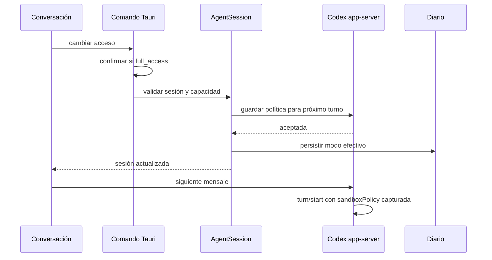

# Goal Capsule

Permitir que una conversación Codex cambie entre acceso al workspace y acceso completo desde la propia conversación. El cambio se aplica al próximo turno nuevo, nunca altera un turno activo ni reinicia el proceso del agente.

# Product Contract

## Summary

El acceso deja de elegirse al abrir una conversación. Toda conversación Codex comienza con acceso al workspace y muestra el acceso efectivo dentro de sus controles de ejecución. El usuario puede cambiarlo mientras conversa; elevar a acceso completo exige confirmación explícita y volver al workspace es inmediato.

## Problem Frame

Hoy `permission_mode` se fija al arrancar la sesión y el selector vive en `RepoCard`. Esto obliga a anticipar los permisos antes de conversar y hace imposible reducir o ampliar el sandbox sin abrir otra sesión. Codex app-server permite enviar `approvalPolicy` y `sandboxPolicy` en cada `turn/start`, pero no en `turn/steer`, por lo que el cambio debe modelarse como configuración persistente del próximo envío.

## Requirements

- **R1.** El inicio normal de una conversación Codex usa `workspace` sin mostrar un selector de acceso en la pantalla de arranque.
- **R2.** Una conversación Codex sobre app-server muestra un selector con el acceso efectivo (`workspace` o `full_access`).
- **R3.** Cambiar el selector actualiza la política del próximo `turn/start`; un turno activo y sus mensajes `turn/steer` conservan la política con la que comenzaron.
- **R4.** Elevar a `full_access` requiere la confirmación de seguridad existente. Si se cancela o falla el backend, la UI conserva el modo anterior.
- **R5.** Reducir a `workspace` no requiere confirmación y se aplica al próximo turno.
- **R6.** El backend valida proveedor, estado y capacidad antes de aceptar el cambio; nunca informa éxito si el transporte PTY no puede aplicar permisos por turno.
- **R7.** El último modo efectivo se guarda en el diario y se restaura tanto en resume nativo como en context bridge.
- **R8.** Kimi y OpenCode conservan su flujo ACP actual; esta función no cambia sus permisos.

## Scope Boundaries

Incluye contrato Rust/TypeScript, comando Tauri, estado de sesión, Codex app-server, persistencia SQLite, UI de conversación y pruebas. No incluye nuevos modos, perfiles nombrados de Codex, cambios dinámicos en PTY, reinicios implícitos, ni rediseño general de controles de ejecución.

## Acceptance Examples

- **AE1.** Al abrir Codex, la sesión nace en `workspace`; al elegir acceso completo y confirmar, el siguiente mensaje envía `sandboxPolicy.type = dangerFullAccess`.
- **AE2.** Si se cambia el acceso mientras Codex trabaja, el turno activo no cambia; el siguiente turno nuevo usa el nuevo modo.
- **AE3.** Si se cancela la confirmación o app-server rechaza el cambio, la sesión y el selector continúan mostrando el modo anterior.
- **AE4.** Tras cerrar y retomar una conversación que estaba en acceso completo, Tinto restaura ese modo y el próximo turno lo usa.
- **AE5.** En fallback PTY el control no permite prometer el cambio y el backend devuelve un error de capacidad sin mutar la sesión.

# Planning Contract

## Key Technical Decisions

- **KTD1 (governs R2, R4, R5, R6):** añadir un comando dedicado para cambiar el modo y una capacidad explícita en `AgentProcess`. La sesión solo actualiza su estado después de que el proceso acepte el cambio.
- **KTD2 (governs R3):** `CodexAppServerHandle` conserva el modo seleccionado y lo captura al encolar cada turno. `turn/start` traduce `workspace` a `sandboxPolicy: { type: "workspaceWrite" }` y `full_access` a `{ type: "dangerFullAccess" }`, con `approvalPolicy: "never"`. `turn/steer` no recibe overrides.
- **KTD3 (governs R7):** persistir `permission_mode` como columna nullable de `agent_sessions`, siguiendo las migraciones aditivas existentes. Los registros antiguos y proveedores no Codex usan `workspace`/`None` de forma compatible.
- **KTD4 (governs R6, R8):** app-server declara soporte dinámico; PTY y ACP no. No se reinicia ni reemplaza silenciosamente ningún proceso.
- **KTD5 (governs R1, R2):** mover el control al bloque existente de “configuración del próximo envío”; eliminar únicamente el selector de arranque, manteniendo el contrato de inicio compatible con callers existentes.

## Runtime Flow

## Risks and Dependencies

- El esquema de `thread/start` legado usa valores kebab-case, mientras `turn/start.sandboxPolicy.type` usa el tagged union camelCase documentado; las pruebas deben proteger ambos contratos.
- Una cola puede recibir un mensaje justo después del cambio. El modo se captura junto al turno al enviarlo para evitar que cambios posteriores reescriban retroactivamente la cola.
- La persistencia solo se actualiza tras éxito para no guardar estados que el proveedor no aceptó.

# Implementation Units

## U1 — Contrato backend y aplicación por turno

**Goal:** exponer un cambio de permiso autoritativo y aplicarlo correctamente en Codex app-server.

**Requirements:** R2, R3, R4, R5, R6, R8.

**Dependencies:** ninguna.

**Files:** `src-tauri/src/bus/contract.rs`, `src-tauri/src/agent_console/pty.rs`, `src-tauri/src/agent_console/app_server.rs`, `src-tauri/src/agent_console/session.rs`, `src-tauri/src/agent_console/mod.rs`, `src-tauri/src/agent_console/commands.rs`, `src-tauri/src/lib.rs`.

**Approach:** incorporar al contrato una bandera de capacidad; extender `AgentProcess` con soporte/cambio de permiso; implementar el estado en app-server; capturarlo en el turno pendiente y serializar las políticas correctas en `turn/start`; añadir el comando Tauri reutilizando la validación y confirmación existentes. Mantener PTY/ACP como no soportados.

**Test scenarios:** test rojo para ambos JSON de `sandboxPolicy`; turno encolado conserva el modo capturado; `turn/steer` no incluye política; cambio rechazado no muta sesión; PTY responde no soportado; full access conserva la confirmación obligatoria.

**Verification:** `cargo test --manifest-path src-tauri/Cargo.toml agent_console --lib`.

## U2 — Persistencia y resume

**Goal:** conservar el último acceso efectivo al archivar y retomar.

**Requirements:** R7.

**Dependencies:** U1.

**Files:** `src-tauri/src/agent_console/journal.rs`, `src-tauri/src/agent_console/commands.rs` y sus módulos de prueba.

**Approach:** añadir una columna migrada `permission_mode`, incluirla en upsert/reconstrucción y arrancar resume nativo/context bridge con el modo archivado. Mantener compatibilidad con filas antiguas.

**Test scenarios:** roundtrip de workspace/full access; fila antigua sin valor; resume nativo y context bridge propagan el modo; proveedor no Codex no expone permisos.

**Verification:** tests focalizados de journal/resume y luego la suite `agent_console`.

## U3 — Control de conversación y eliminación del selector de arranque

**Goal:** colocar la decisión donde se aplica: en la configuración del próximo envío.

**Requirements:** R1, R2, R4, R5, R6, R8.

**Dependencies:** U1, U2.

**Files:** `src/bus/client.ts`, contrato TypeScript generado, `src/panels/RepoCard.tsx`, `src/panels/RepoCard.test.tsx`, `src/panels/terminal/TerminalPanel.tsx`, `src/panels/terminal/TerminalPanel.test.tsx`, `src/panels/terminal/AgentRuntimeControls.tsx` y estilos existentes solo si son necesarios.

**Approach:** iniciar Codex en workspace; eliminar el selector del launcher; hidratar el control desde `AgentSession.permission_mode`; llamar al comando antes de reflejar el nuevo valor y restaurar el anterior en error/cancelación; mostrarlo solo cuando la sesión Codex declare capacidad dinámica.

**Test scenarios:** launcher sin selector y arranque workspace; selector visible en app-server; elevación, reducción y cancelación; error conserva valor; sesión PTY no ofrece cambio; resume hidrata el modo persistido.

**Verification:** Vitest focalizado para `RepoCard`, `TerminalPanel` y contrato; TypeScript y ESLint.

## U4 — Integración y compatibilidad Pumarejo

**Goal:** demostrar el flujo completo sin regresiones del fix previo de resume.

**Requirements:** R1–R8.

**Dependencies:** U1, U2, U3.

**Files:** documentación de contrato existente si cambia una superficie pública; sin nuevas abstracciones.

**Approach:** regenerar/verificar bindings, ejecutar suites completas relevantes y hacer smoke manual con Pumarejo: iniciar workspace, cambiar a full access, enviar, volver a workspace y retomar la conversación.

**Test scenarios:** inicio/resume local y WSL cuando esté disponible; app-server acepta los tagged unions actuales; el fallback sigue siendo honesto.

**Verification:** comandos del contrato siguiente y evidencia del smoke.

# Verification Contract

- `npm run contract:generate` y `npm run contract:check` con el runtime Node configurado del workspace.
- `cargo fmt --manifest-path src-tauri/Cargo.toml --check`.
- `cargo test --manifest-path src-tauri/Cargo.toml agent_console --lib`.
- `cargo check --manifest-path src-tauri/Cargo.toml --features pumarejo`.
- Vitest focalizado sobre `src/panels/RepoCard.test.tsx`, `src/panels/terminal/TerminalPanel.test.tsx` y `src/bus/contract.test.ts`.
- `npm run typecheck`, `npm run lint` y el chequeo de formato configurado por el repositorio.
- Smoke con el CLI Pumarejo compatible instalado: validar inicio workspace, confirmación full access, siguiente turno, reducción a workspace y resume.

# Definition of Done

- Cada requisito R1–R8 tiene implementación y prueba o evidencia explícita.
- El acceso se cambia sin reiniciar la sesión y únicamente afecta turnos nuevos.
- El backend nunca muta/persiste el modo tras cancelación, error o transporte no compatible.
- Resume conserva el último modo efectivo y no regresa el error de variante `workspaceWrite` del handshake inicial.
- Bindings, Rust, frontend y feature `pumarejo` pasan sus verificaciones.
- El diff preserva los cambios previos del usuario y no contiene artefactos accidentales ni refactors ajenos.
