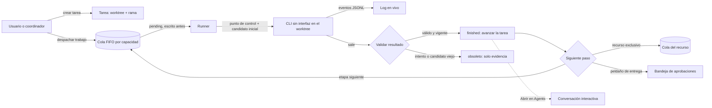

# Goal Capsule

Añadir a Tinto un **modo Delivery**: una forma de trabajar en la que varias tareas (issues) avanzan a la vez, cada una en su propio worktree y rama, ejecutadas por agentes en segundo plano. El estado, los cerrojos y las aprobaciones los lleva Tinto, no el modelo. El modo convive con Agents (la conversación interactiva): no lo sustituye ni depende de su mecánica de turnos.

# Product Contract

## Summary

Delivery es un modo propio, con su vista y su módulo de backend. Su unidad visible es la **tarea**: un issue o etiqueta, un worktree y una rama con nombre. Sobre cada tarea se despachan **trabajos**: un agente sin interfaz que recibe un encargo, trabaja en el worktree y termina con un resultado. Tinto encola los trabajos según la capacidad, guarda un punto de control antes de cada uno, calcula la identidad del candidato, valida el resultado y descarta lo obsoleto. Encima, en fases posteriores, vienen las ejecuciones (*runs*), los recursos exclusivos como el slot de QA, la bandeja de aprobaciones y una API para que un coordinador (la skill backlog-delivery) dirija todo desde un agente.

Cualquier trabajo puede abrirse como conversación en Agents para tomar el control a mano. Es el único punto de contacto con el flujo interactivo.

## Problem Frame

**La skill ya es un sistema, pero el estado lo lleva el modelo.** `backlog-delivery` (unas 3.200 líneas) implementa cerrojos con generaciones, reclamos por issue, una cola FIFO para QA, identidad de candidato y una escalera de aprobaciones. Todo eso lo opera el LLM coordinador escribiendo markdown: el `run.md` de batch6 llegó a 304 líneas. En batch7, tres resultados de tests terminaron después del fence de la generación 10 y hubo que marcarlos obsoletos a mano. Las ejecuciones reales usan 3 o 4 agentes de edición en paralelo, con worktrees en `agentos-wt/<KEY>`.

**Tinto hoy está pensado para una conversación a la vez.** Agents mantiene un proceso vivo por sesión y detecta el final de cada turno de forma distinta según el proveedor (ver *Relación con la mecánica de turnos*). Admite una sesión por repo y cinco en total. Los worktrees solo existen para bifurcar sesiones: se crean sin rama (HEAD separado), bajo `~/.tinto`, y se añaden al workbench como repos sueltos.

**Por qué un modo aparte.** Un trabajo de Delivery es una tarea acotada con un resultado. No necesita conversación, necesita un final definitivo: que el proceso termine y deje un artefacto válido. Construirlo sobre los turnos de Agents heredaría su fragilidad y obligaría a cambiar un flujo que hoy funciona.

## Relationship with the turn mechanics

Así funciona hoy Agents (`src-tauri/src/agent_console/`):

| Proveedor | Transporte | Cómo termina un turno |
|---|---|---|
| Codex | app-server JSON-RPC (`codex app-server --stdio`); terminal de reserva si falla el arranque | Evento estructurado `turn/completed` |
| Kimi y OpenCode en Windows | ACP; terminal de reserva si falla el handshake | Respuesta de `session/prompt`, recogida en el siguiente refresco de estado |
| Claude Code | Siempre una terminal con `claude` sin argumentos; Tinto no sabe reanudarlo | Solo si el agente imprime el marcador `::tinto-turn-done::` |
| Kimi y OpenCode en WSL | Terminal de compatibilidad | Solo el marcador |

Otros hechos que condicionan el diseño:

- El host decide cuándo empieza un turno: cualquier salida lo abre. Los temporizadores de silencio solo alternan entre "trabajando" y "recopilando cambios"; nunca cierran un turno.
- La instrucción del marcador vive en un bloque de AGENTS.md que solo escribe `/init`, y nada escribe CLAUDE.md. Si el agente no imprime el marcador, el turno no se cierra y bloquea la cola, la compactación y el reintento ACP.
- Los puntos de control por turno dependen de ese cierre: la base de cada turno es el punto de control "después" del turno anterior.
- No existe ninguna ejecución de una sola vez: todas las sesiones son interactivas.
- Los worktrees de bifurcación van a `~/.tinto/worktrees/…` con HEAD separado y sin los cambios sin confirmar. Se añaden al workbench como un repo "fork <id>" y no se eliminan cuando termina la sesión.
- Límites de Agents: 5 sesiones, 1 por repo y 4 h de vida por sesión.

Consecuencias para Delivery:

1. Un trabajo termina cuando sale su proceso. No hay marcador ni refresco de estado de por medio, y así se evita justo la parte más frágil: Claude Code y las terminales dependen del marcador.
2. Delivery llama directamente a las funciones de punto de control (crear, comparar, revertir), que no dependen de los turnos. No usa la lógica de cierre de turno.
3. Los worktrees de tarea no reutilizan los de bifurcación: necesitan rama con nombre, ubicación configurable y limpieza explícita.
4. Cada etapa tiene su propio tiempo máximo, en lugar de la vida de 4 h de las sesiones.
5. "Abrir en Agents" funciona con Codex, que reanuda con `thread/resume`. Con Claude Code no, porque Agents no sabe reanudarlo: el botón se oculta hasta que exista.

## Requirements

- **R1.** Delivery es un modo propio, con vista y módulo de backend propios. Ninguna sesión de Agents cambia de comportamiento cuando Delivery está activo.
- **R2.** Una tarea es un issue o etiqueta más un worktree y una rama con nombre, creados desde una base verificada. Se lista bajo su repo con su estado git, ejecuta un bootstrap configurable (instalar dependencias, archivos generados) y se elimina de forma segura. Nunca se cambia la rama del checkout principal.
- **R3.** Un trabajo ejecuta un agente sin interfaz en el worktree de su tarea, con un encargo, y termina de forma definitiva: el proceso sale y deja un resultado. Estados: `pending`, `started`, `finished`, `failed`, `cancelled`, `interrupted`.
- **R4.** La capacidad es configurable y los trabajos esperan en cola FIFO. Las tareas avanzan de forma independiente: ninguna espera a las demás salvo por una dependencia declarada o un recurso exclusivo.
- **R5.** Antes de cada trabajo hay un punto de control que permite deshacerlo. Al inicio y al final se registra la identidad del candidato (`HEAD:tree`, incluidos los archivos no rastreados y no ignorados).
- **R6.** El resultado es estructurado y se valida. Un resultado de un intento anterior, de otra versión del contrato o de un candidato distinto se marca obsoleto: se conserva como evidencia, pero no avanza la tarea.
- **R7.** Los recursos exclusivos (por ejemplo `qa`) tienen cola FIFO y estados libre, activo y en cuarentena. Salir de la cuarentena exige que el usuario confirme los pasos.
- **R8.** Las aprobaciones van por peldaños (commit → push → PR → Jira), uno a la vez, mostrando el contenido exacto que se aprueba. Aprobar un peldaño nunca aprueba el siguiente.
- **R9.** El estado es durable. Al reabrir Tinto, un trabajo que estaba en marcha aparece como `interrupted` y se reconcilia; nunca se relanza solo.
- **R10.** Tomar el control: un trabajo terminado o detenido se puede abrir como conversación en Agents, reanudando su sesión del proveedor cuando este lo permite. Hoy solo Codex lo permite.
- **R11.** Un coordinador (la skill u otro agente) puede dirigir Delivery mediante una API MCP. Fuera de Tinto, la skill sigue funcionando como hoy.

## Scope Boundaries

Incluye: módulo y vista de Delivery, tareas con worktree, trabajos sin interfaz para Codex y Claude Code, capacidad y cola, identidad de candidato, validación de resultados, recursos exclusivos, bandeja de aprobaciones, persistencia y reconciliación, apertura en Agents y una API MCP para el coordinador.

No incluye: el cliente de Jira, los contratos y plantillas de la skill, el entorno de QA como código, la vigilancia de revisiones de PR, ni la programación de tareas. Esas piezas siguen en la skill o en el proyecto. Tampoco cambia ni reemplaza la mecánica de turnos de Agents. Kimi y OpenCode como trabajadores quedan para después de validar Codex y Claude Code.

## Acceptance Examples

- **AE1.** En agentos, crear la tarea AGOS-501 crea `agentos-wt/AGOS-501` con una rama `fix/…` desde un `develop` verificado. La tarea aparece bajo agentos con su estado git y el checkout principal no cambia de rama.
- **AE2.** Al despachar un trabajo de tests con Codex en esa tarea, Tinto lo registra como `pending` antes de lanzarlo y muestra el log en vivo. Al terminar con código 0 y un resultado válido pasa a `finished`. El punto de control previo permite deshacer el trabajo.
- **AE3.** Con capacidad 3 y cinco trabajos pedidos, corren tres. Cuando uno termina, arranca el siguiente en orden FIFO.
- **AE4.** Si se cierra Tinto con dos trabajos en marcha, al reabrir aparecen como `interrupted` con su worktree y su último candidato. Relanzar crea un intento nuevo y requiere confirmación.
- **AE5.** Un resultado del intento 1 que llega después de despachar el intento 2 queda marcado como obsoleto y no avanza la tarea.
- **AE6.** Dos tareas listas piden el recurso `qa`: la segunda queda en la posición 1 de la cola. Si el trabajo de QA muere, el recurso queda en cuarentena hasta que el usuario confirma los pasos de liberación.
- **AE7.** Aprobar el push de AGOS-501 no aprueba el PR. El PR muestra el título y el cuerpo exactos antes de aprobarlo.
- **AE8.** "Abrir en Agents" sobre un trabajo de Codex terminado abre una conversación que continúa ese mismo hilo.
- **AE9.** Con trabajos de Delivery en marcha, las conversaciones de Agents abiertas siguen funcionando igual y no consumen capacidad de Delivery.

# Planning Contract

## Key Technical Decisions

- **KTD1 (R1, R9, AE9). Separación de capas.** Backend en `src-tauri/src/delivery/` y vista en `src/panels/delivery/`. Delivery reutiliza las capas estables: `git::git_program`, la resolución e instalación de CLIs, las funciones de punto de control (crear, comparar, revertir) y el helper de WSL. No usa el registro de sesiones interactivas, la detección de turnos (marcador, eventos ni refrescos), el compositor, la cola de mensajes ni el aprovisionamiento de worktrees de las bifurcaciones.
- **KTD2 (R3, R10). Trabajos de una sola ejecución en lugar de turnos.** Cada trabajo lanza la CLI en modo sin interfaz y el final lo marca la salida del proceso.
  - Codex: `codex exec --json -C <worktree> -s workspace-write -m <modelo> -o <último-mensaje> --output-schema <esquema>`, con el encargo por stdin. Verificado en codex-cli 0.158: existen `--json`, `-o`, `--output-schema`, `-C`, `-s`, `-m` y `resume`. `--output-schema` permite que la respuesta final ya cumpla el contrato de resultado.
  - Claude Code: `claude -p --output-format stream-json --session-id <uuid>`. En esta máquina solo está instalado en WSL.
  - Cada CLI tiene su adaptador, probado con eventos grabados de cada versión; `cli_update` ya conoce las versiones instaladas.
- **KTD3 (R3, R6, R9). Estado en SQLite propio.** `delivery.sqlite`, separado del diario de Agents para no acoplar migraciones. Tablas: `runs`, `tasks`, `jobs` (un intento por fila), `leases` con su cola, `approvals` y `events` (solo se añaden filas). Escritura anticipada: el trabajo queda `pending` antes de lanzar el proceso. Vistas como el `run.md` se generan, no se escriben a mano.
- **KTD4 (R5). Un punto de control por trabajo, no por turno.** Delivery no tiene turnos. Cada trabajo hace una instantánea al empezar y otra al terminar, con el almacén de puntos de control y sin tocar el índice del usuario. Esa misma instantánea es la identidad del candidato (`<HEAD>:<tree>`, el mismo formato que `run_state.py candidate`), el punto para deshacer y, comparando las dos, la lista de archivos que cambió el trabajo. Deshacer un trabajo restaura solo esos archivos. No hay escaneos contra una base mientras el trabajo corre.
- **KTD5 (R2–R8). Primitivas genéricas, política fuera.** Tinto conoce tareas, trabajos, recursos y aprobaciones. Los nombres de etapas (`tests`, `implementation`, `review`, `qa`…), los estados y las plantillas de encargo vienen de un **perfil de flujo** por repo (archivo JSON). El primer perfil replica backlog-delivery.
- **KTD6 (R2). Worktrees con nombre y ubicación configurable.** Por defecto `<repo>-wt/<TAREA>`, la convención que ya usa agentos, y no `~/.tinto` como los forks. Siempre con rama con nombre. Nunca se limpian solos si tienen cambios sin integrar.
- **KTD7 (R11). Coordinador por MCP.** Más adelante, Tinto expone herramientas `create_task`, `dispatch_job`, `wait_job`, `read_result`, `lease_acquire`/`lease_release`, `request_approval` y `set_task_state`. Dentro de Tinto, la skill las usa en lugar de `run_state.py`; fuera, nada cambia.
- **KTD8 (R4, AE9). Límites separados.** Delivery tiene su propia capacidad (3 por defecto), independiente del límite de sesiones de Agents (5 en total y 1 por repo). Abrir una tarea en Agents cuenta como sesión de Agents sobre el worktree, que es un repo distinto.
- **KTD9 (R9). Los trabajos mueren con Tinto en v1.** Se lanzan con el mismo job object de Windows que hoy cierra los procesos de agentes al salir. Al reabrir quedan `interrupted`. Sobrevivir al cierre exigiría un proceso supervisor aparte y se decide después.
- **KTD10 (R3). Tiempo máximo por etapa.** Cada etapa del perfil declara su tiempo máximo. Al vencer, el trabajo se cancela y queda `failed` con su log; el punto de control previo sigue disponible. Sustituye, para Delivery, a la vida de 4 h de las sesiones de Agents.

## Runtime Flow

## Risks and Dependencies

- **Formatos sin interfaz que cambian.** Codex pasó de 0.158 a 0.160 en una semana. Mitigación: un adaptador por CLI con eventos grabados y detección de versión.
- **Los worktrees no aíslan servicios.** Puertos, bases de datos y proyectos de Docker siguen compartidos, como ya advierte la skill. El perfil asigna el entorno a cada trabajo y la QA se serializa con el recurso exclusivo.
- **Tinto tiene que estar abierto.** En v1 los trabajos mueren con la app (KTD9). Las ejecuciones largas se recuperan por reconciliación, no por supervivencia.
- **Coste.** Varios agentes en paralelo consumen cuota. La capacidad es conservadora y siempre visible.
- **Dependencia de la skill.** Los encargos y el contrato de resultado vienen de la skill. El perfil de flujo se versiona junto a ella.
- **Abrir en Agents** es la única pieza que depende del flujo interactivo. Hoy solo funciona con Codex; con Claude Code el botón se oculta y el resto de Delivery no se ve afectado.

# Implementation Units

## U0 — Prueba de trabajos sin interfaz

**Goal:** confirmar que Codex y Claude Code se pueden ejecutar como trabajos fiables antes de construir nada encima.

**Requirements:** R3, R10.

**Dependencies:** ninguna.

**Approach:** en Windows y en WSL, lanzar cada CLI sin interfaz sobre un worktree de prueba. Registrar los eventos, el código de salida, el identificador de sesión, el comportamiento del sandbox, `--output-schema` y la reanudación desde Agents. Guardar los eventos como fixtures.

**Verification:** notas con los comandos exactos, los fixtures y una decisión explícita de seguir o no con KTD2.

## U1 — Tareas con worktree (útil sola)

**Goal:** crear, listar, abrir y eliminar tareas con worktree y rama, sin agentes de fondo todavía.

**Requirements:** R1, R2, KTD6, KTD8.

**Dependencies:** U0 solo para la ubicación de los fixtures; puede empezar en paralelo.

**Files:** `src-tauri/src/delivery/{mod.rs,tasks.rs,store.rs}`, extensión de `create_git_worktree` en `src-tauri/src/agent_console/commands.rs` para crear la rama, `src-tauri/src/lib.rs`, contrato del bus, `src/panels/delivery/` y el registro de la vista en el workbench.

**Approach:** crear la tarea con `git worktree add -b <rama> <ruta> <base>` tras verificar la base, sin reutilizar el aprovisionamiento de las bifurcaciones (HEAD separado, `~/.tinto`, sin limpieza). Ejecutar el bootstrap del perfil. Mostrar las tareas agrupadas bajo su repo. "Abrir en Agents" inicia una conversación normal sobre el worktree. Eliminar exige que no haya cambios sin integrar o una confirmación explícita.

**Test scenarios:** la rama se crea desde la base pedida; un nombre o ruta existente se rechaza sin tocar nada; el checkout principal no cambia; eliminar con cambios pide confirmación; el límite de Agents cuenta el worktree como repo propio.

**Verification:** tests del módulo, prueba manual con Pumarejo sobre el sandbox.

## U2 — Trabajos

**Goal:** ejecutar agentes sin interfaz sobre las tareas, con cola, puntos de control, identidad de candidato, resultados validados y reconciliación.

**Requirements:** R3, R4, R5, R6, R9, R10, KTD2, KTD3, KTD4, KTD9.

**Dependencies:** U0, U1.

**Files:** `src-tauri/src/delivery/{jobs.rs,runner.rs,adapters/codex.rs,adapters/claude.rs,results.rs}`, `src/panels/delivery/`.

**Approach:** escribir el trabajo como `pending`, lanzarlo, pasar a `started` con el pid. Leer los eventos a un log por trabajo y marcar el final por la salida del proceso. Validar el resultado contra el esquema y contra el intento, la versión del contrato y el candidato vigentes. Al arrancar Tinto, marcar como `interrupted` lo que quedó en marcha.

**Test scenarios:** el orden FIFO respeta la capacidad; un resultado tardío de un intento anterior queda obsoleto; un candidato que cambia durante el trabajo invalida el resultado; una salida distinta de cero sin resultado deja `failed`; un reinicio marca `interrupted` sin relanzar; deshacer un trabajo restaura el punto de control previo.

**Verification:** tests con los fixtures de U0 y una ejecución real de dos tareas en paralelo.

## U3 — Ejecuciones, recursos exclusivos y aprobaciones

**Goal:** las piezas de coordinación de la skill, hechas deterministas.

**Requirements:** R7, R8.

**Dependencies:** U2.

**Approach:** las ejecuciones con generación de cerrojo y los reclamos de tarea. Los recursos exclusivos con cola, cuarentena y el procedimiento de liberación guiado. La bandeja de aprobaciones: Tinto ejecuta el commit y el push al aprobarse; el PR y Jira se aprueban en Tinto pero los ejecuta el coordinador.

**Test scenarios:** el cerrojo rechaza escrituras de una generación vieja; la cola del recurso es FIFO entre ejecuciones; un trabajo de QA caído deja la cuarentena y no libera el recurso; aprobar un peldaño no aprueba el siguiente.

## U4 — API del coordinador

**Goal:** que la skill dirija Delivery desde un agente sin llevar el estado a mano.

**Requirements:** R11, KTD7.

**Dependencies:** U3.

**Approach:** un servidor MCP local con las herramientas de KTD7. Una sección "Dentro de Tinto" en la skill que sustituye las llamadas a `run_state.py` cuando el servidor está disponible.

**Test scenarios:** una ejecución completa de una tarea dirigida por un coordinador de prueba; la skill sin el servidor sigue funcionando como hoy.

# Verification Contract

Cada unidad termina con sus tests, `cargo clippy --all-targets -- -D warnings`, la suite del frontend y una comprobación real en Tinto con Pumarejo. Desde U2 se añade una ejecución con dos tareas en paralelo sobre un repo de prueba.

# Definition of Done

U1 se puede usar sola para trabajar por tareas con worktree. U2 ejecuta y recupera trabajos sin intervención del modelo. U3 elimina el papeleo de cerrojos, colas y aprobaciones. U4 permite que backlog-delivery corra dentro de Tinto sin cambiar cómo funciona fuera.

# Implementation Status (2026-10-07)

Rama `feat/delivery-mode`. U0 a U4 implementadas.

- **U0.** Verificado con las CLIs reales fuera de la app: `codex exec` 0.158 (resultado con esquema, código de salida 1 y `turn.failed` al rechazar el modelo) y `claude -p` 2.1.285 en WSL (resultado en `structured_output`). Las salidas, ya saneadas, quedan como fixtures de los tests.
- **Backend.** `src-tauri/src/delivery/`: almacén SQLite propio, tareas con worktree, trabajos de una sola ejecución, instantáneas al empezar y al terminar (`snapshot_worktree`, también por el helper de WSL con `WorktreeSnapshot`), recursos exclusivos, aprobaciones, ejecuciones con fencing y el servidor MCP en `127.0.0.1:47920`.
- **Vista.** `src/panels/delivery/` (Ver → Abrir Delivery, o el botón del resumen).
- **Skill.** `references/tinto.md` en backlog-delivery, enlazada desde su `SKILL.md`.

Comprobado en la app con Pumarejo sobre el repo de pruebas: un coordinador por MCP creó la ejecución y la tarea (worktree y rama desde `main`) y su escritura con una generación vieja se rechazó; despachó un trabajo real de Codex, que terminó en 53 s con resultado aceptado y los dos archivos que tocó detectados por las instantáneas; la vista mostró resultado, comprobaciones, archivos y candidato; el commit aprobado desde la vista se ejecutó en la rama de la tarea sin tocar `main`; y "Continuar en Agents" retomó el hilo de Codex, que respondió qué había hecho.

Segunda ronda (2026-10-08), también en la app, por la API del coordinador:

- **Claude Code real.** En el repo de pruebas de Windows (Claude corre en WSL): resultado aceptado y archivo creado detectado. Un trabajo de solo lectura no pudo escribir con `touch`, `rm`, Python ni la herramienta Write, y sí ejecutó su comprobación.
- **Repo WSL.** Tarea en `/home/teb/tinto-e2e-wsl` con worktree y rama en Linux, trabajo de Claude con `./check.sh` y cambio detectado por las instantáneas del helper.
- **Cancelar en WSL.** Cada proceso del trabajo lleva `TINTO_DELIVERY_JOB=<id>` en su entorno; al cancelar o agotar el tiempo, Tinto manda `TERM` a todos ellos, y `KILL` a los 5 s. Cancelado en 2 s sin procesos sobrantes, incluido el `sleep` que Claude lanzó en su propio grupo de procesos. Antes del cambio, cerrar `wsl.exe` dejaba vivos los procesos. Si Tinto se cierra, al abrirse marca el trabajo como interrumpido y termina lo que quede.
- **Comandos de Claude sin acceso completo.** Cada repo guarda sus comandos de verificación (se editan en "Nuevo trabajo"); los trabajos de Claude con acceso de workspace reciben `--allowedTools` con ellos y los de solo lectura usan el modo `default`, que deniega ediciones. Claude Code también permite por su cuenta los comandos de solo lectura (`ls`, `grep`); los demás se deniegan.
- **Modelo por defecto de Codex.** Agents y la vista Delivery informan el modelo por defecto del catálogo, y los trabajos de Codex sin modelo lo usan. Un trabajo despachado sin modelo terminó con `gpt-6-astra`; con el modelo de `config.toml` habría fallado.
- **Abrir en Agents.** Al eliminar una tarea, su worktree sale también de los workbenches.

Tercera ronda (2026-10-08), por la interfaz con Pumarejo, que ya maneja los `<select>` nativos:

- Tarea creada desde el formulario, eligiendo el repositorio en la lista; trabajo de Claude despachado desde "Nuevo trabajo", con los comandos del repo precargados y guardados al ponerlo en cola.
- **Ruta del repo.** La vista pasa rutas `\\?\C:\…` y el coordinador `C:\…`; la misma tarea salía en dos grupos y no veía los comandos guardados. Ahora las tareas guardan la ruta sin prefijo y los ajustes por repo usan la misma clave.
- **Git dentro de WSL en worktrees de Windows.** Claude corre en WSL para los repos de Windows y no podía usar git: el `.git` del worktree apuntaba a `C:/…`. Ahora el enlace es relativo (si está en la misma unidad) y el trabajo recibe el `core.autocrlf` del repo, para que los finales de línea CRLF no parezcan cambios. Comprobado: `git status` limpio desde el trabajo.
- **Modelo por defecto.** Abrir una conversación de Codex en Agents lo informó sin abrir Delivery.
- **Eliminar con una conversación abierta.** Windows no deja borrar la carpeta en uso y la eliminación quedaba a medias. Ahora Tinto lo rechaza con un mensaje claro, y una tarea que quedó a medias se puede eliminar.

**Coordinador desde Agents (2026-10-08).** Las conversaciones de Codex y Claude Code que se abren en Agents reciben el servidor `tinto-delivery` con sus herramientas preaprobadas (`--mcp-config` y `--allowedTools` en Claude; `-c mcp_servers.tinto-delivery.*` con `default_tools_approval_mode = "approve"` en Codex, porque Agents corre Codex sin aprobaciones y las rechazaría). Dentro de WSL, con la red NAT por defecto, `127.0.0.1` no es Windows: allí el CLI arranca `tinto.exe --delivery-mcp-proxy`, que reenvía cada mensaje al servidor. Comprobado: Codex desde Agents y Claude en WSL con los mismos argumentos llamaron a `delivery_overview` sin pedir permiso. Una conversación de Claude abierta en Agents no llega a aceptar mensajes, por el problema de turnos de Claude ya conocido; el conector no influye.

**Vista reorganizada (2026-10-08).** La vista parte de dos preguntas: qué necesita al usuario y en qué punto está cada tarea. Todo se deriva del `DeliveryOverview` en `src/panels/delivery/taskStatus.ts`; no cambia el backend ni la API del coordinador.

- La lista agrupa las tareas en *Te necesitan*, *En marcha*, *En espera* y *Sin actividad*, con una línea de estado por tarea (icono y texto). La cabecera muestra el lote activo y quién lo coordina, la carga de agentes, el recurso QA y cuántas tareas te necesitan.
- Cada tarea muestra un recorrido único: las etapas de agentes (tests, implementación, revisión, QA) y los peldaños de entrega (commit, push, PR, Jira). Las aprobaciones y los fallos aparecen arriba como avisos con su acción.
- El botón principal lanza la etapa siguiente con las instrucciones de «Para la siguiente etapa» del resultado anterior. La entrega solo ofrece el siguiente peldaño.
- Ya no se cambia el estado de la tarea a mano: lo fija el coordinador y la vista solo lo muestra. Eliminar la tarea y subir la versión del contrato pasan al menú ⋯.
- Vocabulario de la interfaz: *ejecución* → **lote**, *trabajo* → **etapa** (lo que se lanza) e **intento** (cada ejecución de un agente), *encargo* → **instrucciones**, *rol* → **etapa**, *candidato* → **instantánea** (en «Detalles técnicos»). Los nombres de las herramientas MCP y los valores guardados no cambian.

**Herramientas de QA (2026-10-09).** Un trabajo de QA (`role: "qa"`) sigue siendo de solo lectura en el worktree y ahora recibe:

- Red: Codex con `sandbox_workspace_write.network_access=true`. Claude Code no tiene sandbox de red.
- Lectura del checkout principal (para la configuración local de QA, como `.agent/env/qa.env`) y de su carpeta de capturas: `--add-dir` en Claude; Codex ya puede leer fuera del worktree.
- Los comandos de QA del repo, además de los de verificación: `--allowedTools` en Claude, como los checks.
- Si el repo lo activa, un navegador: Playwright MCP (`@playwright/mcp@0.0.82`, sin interfaz y con perfil aislado) preaprobado. Corre siempre en Windows, también cuando el agente está en WSL, porque ahí están Chrome y los puertos que publica Docker Desktop, y WSL puede no tener Node. Lo arranca `qa_browser.mjs`, que lo ejecuta en la carpeta `qa` del trabajo y le oculta las *roots* del cliente: Claude Code las manda como rutas de WSL y Playwright guardaba las capturas con nombre en `C:\mnt\c\…` (o, con Claude nativo, en el worktree).
- Se configura en "Lanzar etapa…" al elegir QA y se guarda por repo (`qa_browser`, `qa_commands`).

Comprobado en la app con Pumarejo sobre el repo de pruebas. Claude Code en WSL: navegó, guardó una captura con nombre en la carpeta del trabajo y la abrió, listó el checkout principal y escribió fuera del worktree con un comando de QA (`python3 -c`). Codex en Windows: navegó y guardó la captura, y leyó el checkout principal. El worktree quedó limpio en todas las pruebas. Dos límites: Claude Code bloquea sus comandos de archivos (`cat`, `touch`…) fuera de sus carpetas aunque estén permitidos, y en el sandbox de Codex en Windows el HTTPS desde la shell falla (`SEC_E_NO_CREDENTIALS`), aunque el navegador y el HTTP plano funcionan.

**Decisiones (2026-10-09).** Lo que el usuario tiene que decidir antes de que corran las etapas ya no va por el chat. El coordinador lo pide con `request_decisions` y el usuario lo contesta en la tarea. Hay tres clases:

- **Elección:** una pregunta en lenguaje llano, de 2 a 4 opciones con su consecuencia y como mucho una recomendada.
- **Texto:** el texto que verá el usuario final, para aprobarlo o editarlo tal cual.
- **Permiso:** algo fuera del worktree, con cómo se deshace y, si la QA lo necesita, el comando.

El detalle técnico va plegado. Mientras haya decisiones pendientes, la tarea aparece en "Te necesitan" con su contador, "Lanzar…" está desactivado con el motivo y `dispatch_job` responde `decisions_pending`. "Aceptar recomendadas" resuelve elecciones y textos, nunca permisos. Las respuestas son definitivas, quedan en un registro de la tarea (qué, quién y cuándo) y entran en las instrucciones de cada trabajo posterior. El comando de un permiso concedido se suma a los comandos de la QA de esa tarea. Comprobado en la app con Pumarejo y un coordinador de prueba: la API rechazó el despacho con tres decisiones pendientes; en la interfaz, aceptar las recomendadas dejó solo el permiso; al permitirlo se habilitó "Lanzar tests", y el coordinador leyó las tres respuestas.

**Configuración del arnés fuera de las decisiones (2026-10-09).** En AGOS-455, 6 de las 15 decisiones eran configuración que no cambia de un issue a otro: si la QA lleva navegador, si su resultado se publica en Jira, en qué plataformas se prueba y tres permisos de QA. Ahora Tinto las guarda una vez:

- Por repositorio, en Ajustes → "QA del repositorio": entorno de QA, comandos de QA y navegador.
- Por lote: "Resultado de QA en Jira", que se elige al crearlo y se cambia en la lista. `null` mientras el usuario no lo decide, como en los lotes que crea un coordinador.

El coordinador lo lee con `read_settings` y no lo pregunta; si falta algo, pide al usuario que lo configure en Tinto. Los trabajos de QA reciben el entorno en sus instrucciones. Además, `request_decisions` rechaza un permiso cuyo comando ejecute archivos que los agentes pueden editar: el repositorio, sus worktrees, `.agent` o un script con ruta relativa. En AGOS-455 los permisos pedían `bash …/.agent/…/qa/*.sh`, y el agente podía cambiar esos scripts después de que el usuario los aprobara.

Límites conocidos:

- Si el worktree se abrió como pestaña de repo, la pestaña sigue abierta después de eliminar la tarea.
- El perfil de flujo es el integrado (roles `tests`, `implementation`, `review` y `qa` con sus valores por defecto); todavía no hay un archivo de perfil por repo. Se añade cuando una ejecución real necesite otra etapa.
- "Abrir en Agents" sigue añadiendo el worktree al workbench mientras la tarea existe.
- La limpieza al reabrir Tinto tras un cierre brusco no se pudo provocar: en la prueba, Claude terminó solo al cerrarse `wsl.exe`.

# Resolved Decisions (2026-10-07)

Aceptadas todas las recomendaciones:

- **D1.** Despacho manual desde la vista hasta U4; desde U4 también puede despachar un coordinador por MCP.
- **D2.** Worktrees por defecto en `<repo>-wt/<TAREA>`, configurable por repo.
- **D3.** Trabajadores iniciales: Codex en Windows y Claude Code en WSL.
- **D4.** Los trabajos no sobreviven al cierre de Tinto en v1 (KTD9).
- **D5.** No se importan las ejecuciones existentes de `.agent/backlog-delivery/`.
- **D6.** Repos WSL a partir de U2.
- **D7.** Delivery no usa turnos y sus puntos de control son por trabajo (KTD4). Agents conserva su mecánica de turnos; quitarla de Agents sería una decisión aparte.
