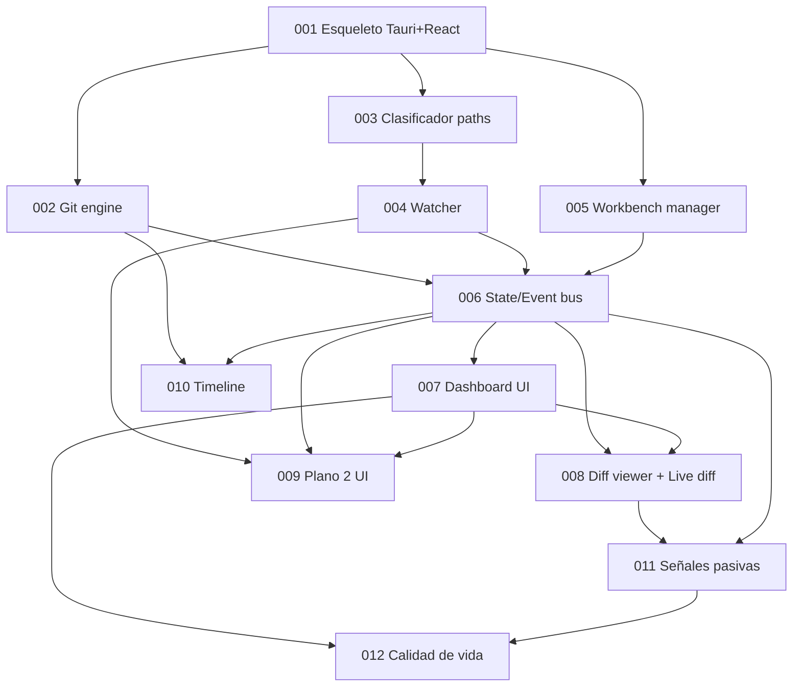

# Tinto — Roadmap de entrega

## Context Sufficiency Summary
- `tinto-design.md` es un diseño a nivel arquitectura inusualmente completo: define intención de producto y no-goals (§1, §9), forma del sistema y flujos núcleo (§6 arquitectura, §7 flujo de live diff), stack técnico con justificación (§5), forma de la config/persistencia (§8) y una lista explícita de pasos siguientes (§10) más el set completo de funcionalidades (§4).
- El único fork abierto del diseño (framework de frontend) fue resuelto por el usuario: **React**.
- Es suficiente para mapear items source-backed en orden de dependencias sin inventar comportamiento de producto. Las únicas zonas débiles son convenciones de entrega/CI (greenfield, sin convenciones aún) y comandos exactos de run/test/build, que son defaults estándar de Tauri/Cargo/npm. Se registran como riesgos/decisiones, no como blockers.

## Source Inventory
| Source | Contribution | Confidence |
|---|---|---|
| `tinto-design.md` §1 | Intención de producto, principios (read-only, pasivo, liviano, local, sin interpretación), plataformas (Windows/Linux) | High |
| `tinto-design.md` §2 | Concepto de Workbench: conjunto nombrado de repos, multi-workbench, autodetección de `.git`, persistencia | High |
| `tinto-design.md` §3 | Dos planos de monitoreo (Plano 1 git-tracked con diffs, Plano 2 FS-tracked opt-in por patrones) + árbol de clasificación de eventos | High |
| `tinto-design.md` §4 | Set completo de funcionalidades: dashboard, visualización de cambios, timeline, señales pasivas, calidad de vida | High |
| `tinto-design.md` §5 | Stack: Tauri 2, frontend (React fijado), git2-rs, notify, ignore, tokio, dirs; matiz sobre git2-rs y escape hatch a CLI | High |
| `tinto-design.md` §6 | Arquitectura: frontend webview ↔ backend Rust (Workbench manager, Git engine, Watcher, State/Event bus) | High |
| `tinto-design.md` §7 | Flujo de Live Diff (núcleo): watch → canal → debounce → git status del repo afectado → emit delta; detalles anti-dolor | High |
| `tinto-design.md` §8 | Persistencia: config TOML/JSON en config dir (dirs), estado en vivo en memoria, SQLite como paso futuro | High |
| `tinto-design.md` §9 | Fuera de alcance explícito (no edición, no ops git, no aprobación, no NL, no remoto, no acople a CLIs) | High |
| `tinto-design.md` §10 | Pasos siguientes sugeridos (esqueleto, trait git, clasificador, watcher, comando de workbench) | High |
| Decisión de usuario (preflight) | Frontend = React; mode:full; git init en `main` | High |

## Roadmap Items

- RDM-001. **Esqueleto Tauri 2 + React + tooling base**
  - Outcome: App arranca con ventana vacía y se compila en Windows y Linux. Estructura de carpetas backend (Rust) / frontend (React), comandos `tauri dev` / `tauri build` funcionando, tokio configurado, baseline de lint/format y `.gitignore`.
  - Why now: Todo lo demás (§10 primer paso) depende del esqueleto. Sin él no hay dónde colgar git engine, watcher ni UI.
  - Scope boundary: Incluye scaffolding, dependencias base del workspace, un comando `invoke` de humo y un evento `emit` de humo para validar el puente. Excluye lógica de git, watcher y UI real.
  - Hard depends on: None
  - Soft sequencing preference: None
  - Blocks/enables: RDM-002, RDM-003, RDM-005
  - Risk: low — scaffolding estándar de Tauri 2. Riesgo menor: toolchain Rust+Node en Windows/Linux.
  - Expected brainstorm: `docs/brainstorms/RDM-001-esqueleto-tauri.md`
  - Expected plan: `docs/plans/RDM-001-esqueleto-tauri.md`
  - Suggested package: roadmap-item (1 review unit)

- RDM-002. **Capa de Git: trait GitEngine + impl git2-rs**
  - Outcome: Trait `GitEngine` que abstrae `status` (modificados/staged/untracked), branch actual, ahead/behind vs remote, `log` navegable y lectura de blobs. Implementación con git2-rs detrás del trait, con escape hatch documentado a shellear `git` (§5 matiz).
  - Why now: Es el insumo del Plano 1 y del dashboard; el trait permite cambiar a CLI si aparece lentitud sin reescribir consumidores.
  - Scope boundary: Incluye operaciones de lectura listadas. Excluye cualquier escritura (commit/stage/branch — §9 fuera de alcance) y el cálculo de diffs renderizables (eso es consumido por RDM-008 pero el trait expone el material crudo).
  - Hard depends on: RDM-001
  - Soft sequencing preference: None
  - Blocks/enables: RDM-006, RDM-008, RDM-010
  - Risk: medium — performance de git2-rs en repos grandes (§5); se mitiga con el trait + escape hatch, no se cierra ahora.
  - Expected brainstorm: `docs/brainstorms/RDM-002-git-engine.md`
  - Expected plan: `docs/plans/RDM-002-git-engine.md`
  - Suggested package: roadmap-item (1 review unit)

- RDM-003. **Clasificador de paths (tres buckets)**
  - Outcome: Función que clasifica cada path/evento en: descartar (en `.git/` salvo HEAD/index) → Plano 1 (git-tracked/trackeable) → Plano 2 (gitignored pero en watchlist FS) → descartar (gitignored y no vigilado). Usa el crate `ignore` para respetar `.gitignore` al clasificar, no solo filtrar.
  - Why now: Es el filtro que evita barrer `node_modules`/`target` y el que enruta eventos del watcher. Núcleo del §3 y §7.
  - Scope boundary: Incluye la lógica pura de clasificación y su test. Excluye el watcher en sí (RDM-004) y el recálculo de git (RDM-002).
  - Hard depends on: RDM-001
  - Soft sequencing preference: RDM-002 (comparte contexto de repo)
  - Blocks/enables: RDM-004, RDM-006
  - Risk: low/medium — correctness de la clasificación; alto valor en tests de tabla.
  - Expected brainstorm: `docs/brainstorms/RDM-003-clasificador-paths.md`
  - Expected plan: `docs/plans/RDM-003-clasificador-paths.md`
  - Suggested package: roadmap-item (1 review unit)

- RDM-004. **Watcher con debounce y throttling por repo**
  - Outcome: `notify` observa los working dirs del workbench activo; los eventos entran a un canal, pasan por debounce (~200–400 ms) para agrupar ráfagas y throttling por repo; ignora `.git/` salvo HEAD/index. Emite eventos clasificados hacia el bus.
  - Why now: Los agentes escriben en ráfagas; sin coalescing/throttling la UI se satura (§7). Es el productor de eventos del sistema.
  - Scope boundary: Incluye watcher, debounce, throttling, selección de scope (workbench activo vs todos, configurable). Excluye el recálculo de git (RDM-002) y el render (frontend).
  - Hard depends on: RDM-001, RDM-003
  - Soft sequencing preference: None
  - Blocks/enables: RDM-006, RDM-009
  - Risk: medium — manejo de handles del SO, edge cases multiplataforma de notify, tuning de debounce.
  - Expected brainstorm: `docs/brainstorms/RDM-004-watcher.md`
  - Expected plan: `docs/plans/RDM-004-watcher.md`
  - Suggested package: roadmap-item (1 review unit)

- RDM-005. **Workbench manager + persistencia de config**
  - Outcome: Modelo de workbench (repos con path/alias/orden, agrupación, lista `fs_watch` del Plano 2); persistencia TOML/JSON en el config dir del SO (crate `dirs`); comandos `invoke` para listar/crear/cargar/conmutar workbenches y para autodetectar `.git` bajo una carpeta raíz.
  - Why now: Define qué repos observa el sistema; es el input de configuración del watcher y el dashboard (§2, §8).
  - Scope boundary: Incluye CRUD de config en disco y autodetección. Excluye base de datos (SQLite es paso futuro §8) y el estado de monitoreo en vivo (memoria, RDM-006).
  - Hard depends on: RDM-001
  - Soft sequencing preference: RDM-002 (autodetección valida que sea repo git)
  - Blocks/enables: RDM-006
  - Risk: low/medium — diferencias de config dir Windows/Linux, forma del esquema persistido.
  - Expected brainstorm: `docs/brainstorms/RDM-005-workbench-manager.md`
  - Expected plan: `docs/plans/RDM-005-workbench-manager.md`
  - Suggested package: roadmap-item (1 review unit)

- RDM-006. **State / Event bus (integración backend → frontend)**
  - Outcome: Bus de estado en memoria que orquesta el flujo del §7: recibe eventos clasificados del watcher (RDM-004), dispara recálculo de git solo del repo afectado (RDM-002), mantiene el estado de diffs/conteos del workbench activo (RDM-005) y hace `emit` de deltas al frontend; expone comandos `invoke` de lectura de estado.
  - Why now: Es el corazón que conecta watcher + git engine + workbench y alimenta toda la UI. Sin él la UI no tiene datos en vivo.
  - Scope boundary: Incluye coalescing de deltas, el contrato de eventos/comandos backend↔frontend y el throttling de emisión. Excluye los componentes visuales (RDM-007+).
  - Hard depends on: RDM-002, RDM-004, RDM-005
  - Soft sequencing preference: None
  - Blocks/enables: RDM-007, RDM-008, RDM-009, RDM-010, RDM-011
  - Risk: medium/high — es el punto de integración; el contrato de eventos define todo el frontend. Conviene congelar el contrato temprano.
  - Expected brainstorm: `docs/brainstorms/RDM-006-state-event-bus.md`
  - Expected plan: `docs/plans/RDM-006-state-event-bus.md`
  - Suggested package: roadmap-item (posible split por U-ID: contrato de eventos vs orquestación)

- RDM-007. **Dashboard UI (cards por repo)**
  - Outcome: Frontend React que consume los eventos/estado del bus y renderiza una card por repo (branch, conteo modificados/staged/untracked, ahead/behind, último commit), indicador de actividad en vivo, y vista compacta vs expandida por card. Selector/conmutador de workbench. Incluye el flujo de primer arranque: empty state con creación de workbench inline (nombre + selección de carpeta puntual o raíz con autodetección, vía comandos de RDM-005) [decisión usuario 2026-06-10].
  - Why now: Es la primera superficie visible de valor; convierte el estado del bus en supervisión de un vistazo (§4 Dashboard).
  - Scope boundary: Incluye layout de dashboard, cards, live activity indicator, switch de workbench. Excluye diff viewer (RDM-008) y secciones especializadas.
  - Hard depends on: RDM-006
  - Soft sequencing preference: RDM-005 (necesita conmutar workbenches)
  - Blocks/enables: RDM-008, RDM-009, RDM-012
  - Risk: low/medium — manejo de updates frecuentes en React sin re-render excesivo (alinea con elección de stack).
  - Expected brainstorm: `docs/brainstorms/RDM-007-dashboard-ui.md`
  - Expected plan: `docs/plans/RDM-007-dashboard-ui.md`
  - Suggested package: roadmap-item (1 review unit)

- RDM-008. **Diff viewer + Live diff**
  - Outcome: Visor de diffs cómodo (syntax highlighting, modos inline y side-by-side), live diff que se actualiza solo mientras el agente escribe (vía el bus/watcher), y vista de archivo completo con cambios resaltados (no solo el hunk) para contexto (§4 Visualización de cambios).
  - Why now: Es el corazón del valor de Tinto: ver el cambio mientras ocurre. Depende de tener estado en vivo (RDM-006) y una superficie donde abrirlo (RDM-007).
  - Scope boundary: Incluye render de diffs Plano 1, live update y vista de archivo completo. Excluye lista del Plano 2 (RDM-009) y métricas (RDM-011).
  - Hard depends on: RDM-006, RDM-007
  - Soft sequencing preference: RDM-002 (material de diff)
  - Blocks/enables: RDM-011
  - Risk: medium — rendimiento del live update y del highlighting en archivos grandes.
  - Expected brainstorm: `docs/brainstorms/RDM-008-diff-viewer.md`
  - Expected plan: `docs/plans/RDM-008-diff-viewer.md`
  - Suggested package: roadmap-item (1 review unit)

- RDM-009. **Sección Plano 2 (archivos vigilados) UI**
  - Outcome: Por repo, una sección separada con lista plana de archivos vigilados (Plano 2): icono de evento (creado/modificado/borrado), timestamp y tamaño/delta de tamaño. Sin pretensión de diff (§3, §4). Incluye la UI para agregar/quitar/editar los patrones `fs_watch` por repo (persistidos vía RDM-005), de modo que el opt-in del Plano 2 no exija editar el TOML a mano [decisión usuario 2026-06-10].
  - Why now: Es donde más valor tienen las alertas de archivos sensibles (`.env`, secrets gitignoreados). Cierra el segundo plano de monitoreo.
  - Scope boundary: Incluye la lista de eventos FS con su metadata y el editor de patrones `fs_watch`. Excluye los highlights/alertas automáticas (RDM-011).
  - Hard depends on: RDM-004, RDM-006, RDM-007
  - Soft sequencing preference: None
  - Blocks/enables: RDM-011
  - Risk: low.
  - Expected brainstorm: `docs/brainstorms/RDM-009-plano2-ui.md`
  - Expected plan: `docs/plans/RDM-009-plano2-ui.md`
  - Suggested package: roadmap-item (1 review unit)

- RDM-010. **Timeline / historial**
  - Outcome: Feed cronológico de actividad cruzando todos los repos del workbench, navegación por commits con sus diffs sin terminal, y detección de cambios huérfanos (working tree sucio hace rato sin commit) (§4 Timeline).
  - Why now: Da la dimensión temporal de la supervisión y el historial de commits navegable.
  - Scope boundary: Incluye feed, navegación por commits y detección de huérfanos. Excluye persistencia histórica en SQLite (paso futuro §8): el timeline inicial vive sobre estado en memoria + `git log`.
  - Hard depends on: RDM-006, RDM-002
  - Soft sequencing preference: RDM-007
  - Blocks/enables: None
  - Risk: medium — definir el alcance temporal sin persistencia (cuánto historial en memoria).
  - Expected brainstorm: `docs/brainstorms/RDM-010-timeline.md`
  - Expected plan: `docs/plans/RDM-010-timeline.md`
  - Suggested package: roadmap-item (1 review unit)

- RDM-011. **Señales pasivas (highlights + métricas)**
  - Outcome: Highlights automáticos que marcan visualmente cambios a mirar (deletes grandes, archivos sensibles `.env`/CI/configs, posibles secrets, cambios en tests) y métricas livianas (líneas +/- por repo, archivos tocados por sesión, frecuencia de cambios) (§4 Señales pasivas).
  - Why now: Convierte los hechos crudos en señales accionables sin interpretarlos en lenguaje natural (respeta el principio "sin interpretación" §1).
  - Scope boundary: Incluye reglas de detección heurística y métricas agregadas (cómputo en backend, expuesto vía el bus RDM-006). La integración visual la rinden las vistas dueñas de cada superficie — RDM-008 resalta en el diff, RDM-009 muestra iconografía de alerta en la lista Plano 2 — consumiendo las señales de este item. Excluye resúmenes en lenguaje natural (§9 fuera de alcance).
  - Hard depends on: RDM-006, RDM-008
  - Soft sequencing preference: RDM-009
  - Blocks/enables: RDM-012
  - Risk: low/medium — detección de "posibles secrets" acotada a patrones simples conocidos (nombres de archivo tipo `.env`/credenciales, prefijos de tokens conocidos, llaves PEM); sin entropy analysis ni scoring [decisión usuario 2026-06-10]. Falsos positivos manejables por diseño.
  - Expected brainstorm: `docs/brainstorms/RDM-011-senales-pasivas.md`
  - Expected plan: `docs/plans/RDM-011-senales-pasivas.md`
  - Suggested package: roadmap-item (posible split: highlights vs métricas)

- RDM-012. **Calidad de vida (notificaciones, filtros/búsqueda, modo glance)**
  - Outcome: Notificaciones nativas del SO ante eventos relevantes, filtros y búsqueda por repo/extensión/rango temporal, y modo "glance" (ventana compacta / item de barra con estado resumido) (§4 Calidad de vida).
  - Why now: Hace a Tinto usable "todo el día abierto mirando" (principio liviano), capa final de UX.
  - Scope boundary: Incluye notificaciones, filtros/búsqueda y modo glance. Sin alcance nuevo de monitoreo.
  - Hard depends on: RDM-007, RDM-011
  - Soft sequencing preference: RDM-008, RDM-009, RDM-010 (filtra/busca sobre esas vistas)
  - Blocks/enables: None
  - Risk: low/medium — API de notificaciones nativas y modo barra difieren entre Windows/Linux.
  - Expected brainstorm: `docs/brainstorms/RDM-012-calidad-de-vida.md`
  - Expected plan: `docs/plans/RDM-012-calidad-de-vida.md`
  - Suggested package: roadmap-item (1 review unit)

## Dependency Graph

## Parallelization Waves
- **Wave 1:** RDM-001 (fundación, bloquea todo).
- **Wave 2 (paralelizable tras 001):** RDM-002, RDM-003, RDM-005.
- **Wave 3:** RDM-004 (necesita 003).
- **Wave 4:** RDM-006 (necesita 002, 004, 005) — punto de integración; congelar contrato de eventos aquí.
- **Wave 5:** RDM-007 (necesita 006).
- **Wave 6 (paralelizable tras 006/007):** RDM-008, RDM-009, RDM-010.
- **Wave 7:** RDM-011 (necesita 008).
- **Wave 8:** RDM-012 (necesita 007, 011).

> Nota: aunque las waves permiten paralelismo, el run actual es `parallel:false` / `worktree-policy:avoid`. Se ejecutará serialmente en orden de dependencias salvo cambio explícito.

## Branch and PR Strategy
| Package candidate | Base branch | PR type | Dependency | Notes |
|---|---|---|---|---|
| RDM-001 | `main` | base/foundation | — | Primer PR del repo. Establece baseline; aún no existe `develop`. |
| RDM-002 | `develop`* | feature | RDM-001 | *Tras RDM-001 conviene crear `develop` para gitflow (decisión abajo). |
| RDM-003 | `develop`* | feature | RDM-001 | Paralelizable con 002/005. |
| RDM-004 | `develop`* | feature | RDM-003 | |
| RDM-005 | `develop`* | feature | RDM-001 | Paralelizable. |
| RDM-006 | `develop`* | feature | RDM-002,004,005 | Stack/merge tras sus prerequisitos. |
| RDM-007 | `develop`* | feature | RDM-006 | |
| RDM-008..012 | `develop`* | feature | ver grafo | UI incremental sobre el bus. |

\* La estrategia gitflow (`develop` como base) es la convención de las skills KRT de shipping, pero el repo se inició solo con `main` y sin commits. Ver decisión D1.

## Blockers and User Decisions
- **D1 — Estrategia de branches (gitflow `develop` vs trunk en `main`).** Las skills de shipping KRT (gitflow-knight, rebase-smith) asumen gitflow con base `develop`. El repo se inició en `main` sin commits. *Recomendación:* tras mergear RDM-001 a `main`, crear `develop` y basar las features siguientes ahí. No bloquea brainstorm/plan; debe resolverse antes del primer handoff a release-marshal. Confianza: media (inferido de convención KRT, no de doc del proyecto).
- **D2 — Comandos de run/test/build y CI. RESUELTA (2026-06-10):** baseline local en RDM-001 (`cargo test`, `npm test`/Vitest, `cargo clippy`, `npm run lint`, `tauri build`); repo GitHub creado en RDM-001 pero el **workflow de CI se difiere a un item posterior** por decisión de usuario. Hasta que exista CI, la evidencia de break-prevention del flujo de entrega es verificación local documentada.
- **D3 — Confirmar elección de React frente a la filosofía "liviana".** El diseño marcaba React como opcional y prefería Svelte/SolidJS por reactividad eficiente en updates frecuentes (live diff). El usuario fijó React explícitamente; se asume aceptado el trade-off de overhead. Sin acción salvo que el usuario reconsidere. Confianza: alta (decisión explícita de usuario).
- Fuera de estas decisiones: **No blockers** para iniciar el brainstorm de RDM-001.

## Deferred / Open Questions

### From 2026-06-10 review (ce-doc-review: coherence, feasibility, design-lens, scope-guardian)

Ruteadas al brainstorm del item correspondiente:

- **RDM-007/008 (brainstorm) — dirección de usuario (2026-06-10):** layout imaginado: tabs arriba para conmutar entre los proyectos del workbench cargado, árbol de archivos a la izquierda como visualizador, área principal para contenido/diffs. Queda abierto cómo manejar varios archivos abiertos (tab strip secundario, lista MRU, split). El brainstorm de RDM-007 debe reconciliar esto con las "cards por repo" del diseño §4 (p. ej. dashboard como vista resumen + vista detalle por repo con árbol, o tabs como navegación primaria).
- **RDM-007 (brainstorm):** Especificar estados vacíos y de error de las cards — workbench sin repos, path inválido, fallo de git status, permiso denegado del watcher — con contenido de fallback y retry. (design-lens, P2)
- **RDM-007/008 (brainstorm):** Nombrar la interacción de drill-through de card → diff viewer (click de card, ruta, transición de estado) y reflejarla en el contrato de eventos de RDM-006. (design-lens, FYI)
- **RDM-010 (brainstorm):** Definir punto de entrada y layout del timeline (tab, panel lateral, etc.) y cuánto historial se mantiene en memoria sin SQLite. (design-lens + feasibility, FYI)
- **RDM-007..012 (transversal):** Estrategia mínima de accesibilidad (navegación por teclado, labels de screen reader) como requisito cross-cutting de las vistas. (design-lens, FYI)
- **RDM-002 (plan):** Baseline de performance de git2-rs y criterio de cuándo usar el escape hatch a CLI git. (coherence/scope-guardian, deferred)
- **RDM-005 (plan):** Aclarar si la autodetección valida repos con check liviano de `.git/` o vía git2-rs (afecta orden con RDM-002). (feasibility, deferred)
- **RDM-004/006 (plan):** Confirmar que debounce (004) y coalescing de deltas (006) no dupliquen trabajo. (scope-guardian, residual)
