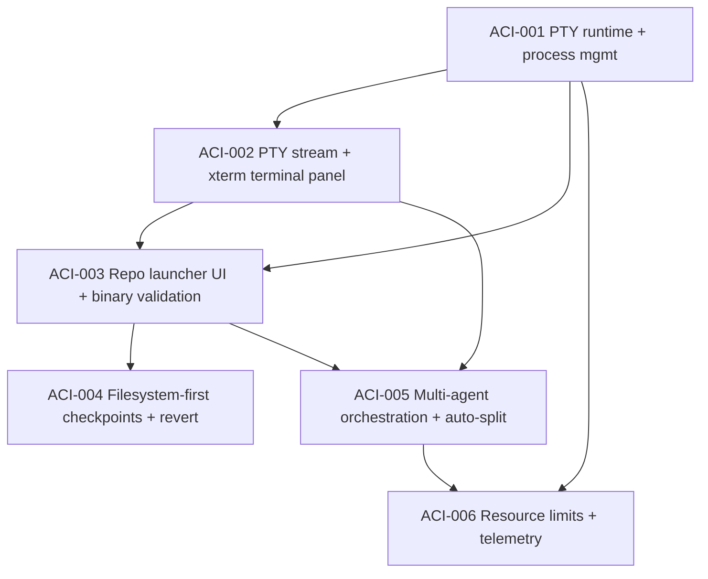

# Tinto — Agent Console Integration (auto-splitting)

## Scope Fit and Constraints
- The product remains prototype-first and local; no compatibility guarantees are required beyond current desktop target behavior.
- This roadmap builds on the already-delivered dockview workspace and bus/watch system from `2026-06-10-001-tinto-roadmap.md`.
- **Design exception**: This initiative introduces **opt-in session revert** capability, which is a controlled departure from Tinto's read-only principle. Revert requires explicit user consent, creates an audit trail, and operates on a **filesystem-first** basis (works with or without git). Git is used as an optimization when available, but the core mechanism relies on pre-session snapshots and watcher-tracked changes.
- Contract evolution: This roadmap extends the frozen bus contract with new agent session commands, events, and types. Each roadmap item includes explicit contract update tasks.
- Platform support: The roadmap explicitly addresses PTY resize propagation, process-tree termination, and WSL/Windows kill semantics.

## Roadmap Items

### ACI-001 — Backend PTY runtime + agent process lifecycle
- **Outcome:** Introduce a Rust PTY service for launching and managing per-session console processes.
  - Integrate `portable-pty` in `src-tauri/Cargo.toml` and add a `src-tauri/src/agent_console` module.
  - `start_agent_session(repo, agent_type, args)` creates a PTY-backed child process for the selected binary in the repo working directory.
  - Track session lifecycle (`starting`, `running`, `exited`, `error`) in a Rust in-memory registry keyed by session id.
  - Expose lifecycle-safe cleanup on exit, explicit stop, app shutdown, and stale session timeout.
  - Surface structured start/stop errors (`not_found`, `spawn_failed`, `terminated`, `io_error`) to callers.
  - **Binary resolution and security**: Define an explicit allowlist of supported agent types with canonical binary names (`claude`, `codex`, `opencode`). Resolution uses PATH lookup only (no shell expansion, no aliases). Arguments are passed as a typed schema per agent type. Environment inheritance is sanitized (no secret leakage). Unknown `agent_type` values are rejected with deterministic error category `unsupported_agent`.
  - **Platform-specific process management**: Implement process-tree termination (not just parent kill) using platform-appropriate APIs: `killpg` on Unix, `TerminateProcess` + child enumeration on Windows, and WSL-aware cleanup when running under WSL. Zombie prevention via `waitpid` on Unix, explicit handle closure on Windows.
  - **Contract updates**: Add `AgentSession` struct to `src-tauri/src/bus/contract.rs` with session id, status enum, and error types. Add Tauri commands: `start_agent_session`, `stop_agent_session`, `list_agent_sessions`.
- **Dependencies:** none inside this initiative (requires completed base stack from prior roadmap).
- **Verification criteria:**
  - Unit tests verify unique session IDs, status transitions (`starting` → `running` → `exited`/`error`), and cleanup of terminated sessions.
  - Integration test: launching `echo hello` via `start_agent_session` returns a live session id, emits "hello" output, and tears down without zombie process residue (verified via `ps` or process handle check).
  - Contract test: backend reports `not_found` for missing binaries, `unsupported_agent` for unknown agent types, and `repo_not_found` for missing repos.
  - Platform test: process-tree termination kills all child processes (verified by spawning a child that spawns a grandchild, stopping the session, and confirming all three are gone).

### ACI-002 — PTY I/O streaming contract and xterm terminal panel
- **Outcome:** Implement full PTY stream bridging from Rust to React and render active sessions in a terminal panel.
  - Add Tauri event channels in Rust for session output/error stream chunks and resize/write acknowledgements.
  - Add `src/panels/terminal/TerminalPanel.tsx` with `xterm.js` and session attachment by session id.
  - Register a new dockable panel type `PANEL_AGENT_TERMINAL` in `src/workspace/panels.ts` and wire panel creation/reuse through existing `DockWorkspace` actions.
  - Persist terminal open panels through existing layout persistence flow so restored sessions can reopen with last-used panel focus.
  - **Terminal viability**: Implement xterm fit addon with debounced resize (100ms) that propagates cols/rows to the backend PTY via Tauri command. Panel attach/detach triggers a resize event. Closing a terminal panel detaches the stream but does not kill the session (session continues in background).
  - **Contract updates**: Add `AgentSessionOutput` event to `src-tauri/src/bus/contract.rs` with session id and output chunk. Add `AgentSessionResize` command. Mirror in `src/bus/contract.ts` with typed event listeners and command wrappers in `src/bus/client.ts`.
- **Dependencies:** ACI-001.
- **Verification criteria:**
  - Integration test: given a running backend session, output appears in the xterm panel within 100ms (measured via test event emission).
  - Integration test: keystroke input in xterm is written through PTY and echoed by the process (verified by typing "test" and asserting output contains "test").
  - Unit test: closing the terminal panel detaches without crashing the panel registry and does not break layout restore (verified by reopening the panel and confirming it reattaches to the same session).
  - Unit test: resizing the terminal panel propagates cols/rows to the backend (verified by mocking xterm dimensions and asserting backend receives resize command).
  - `npm test` includes at least one panel-level mount/unmount + stream bridge test.

### ACI-003 — Repo context launcher UI with agent type selection and binary validation
- **Outcome:** Add session launch affordances on `RepoCard` without introducing global side effects.
  - Add right-click context menu action set on `src/panels/RepoCard.tsx`.
  - Support agent selection: `Claude Code`, `Codex`, `OpenCode` and build launch arguments for each.
  - Add backend validation command (`agent_binary_available(agent_type)`) and disable launch actions when binary is missing.
  - Add a launch action that creates a new session and opens/activates an `PANEL_AGENT_TERMINAL` panel.
  - **Contract updates**: Add `AgentBinaryAvailable` command to `src-tauri/src/bus/contract.rs` returning `boolean`. Mirror in `src/bus/contract.ts` with typed wrapper in `src/bus/client.ts`.
- **Dependencies:** ACI-001, ACI-002.
- **Verification criteria:**
  - Integration test: context menu on a repo card offers all three agent types (verified by rendering RepoCard, right-clicking, and asserting menu items exist).
  - Integration test: missing binary for a selected type shows a clear, non-blocking validation message ("Claude Code not found in PATH") and no session is started (verified by mocking `agent_binary_available` to return false and asserting no `start_agent_session` call).
  - Integration test: selecting a valid binary launches exactly one session with the selected repo path (verified by clicking launch and asserting one session created with correct repo).
  - Unit test: launch action idempotently focuses existing terminal panel for same session target (verified by launching twice and asserting only one panel exists and is focused).

### ACI-004 — Filesystem-first session checkpoints and opt-in revert
- **Outcome:** Add per-session state and reversible execution boundaries that work with or without git, leveraging Tinto's existing watcher infrastructure.
  - **Filesystem-first checkpoint strategy**:
    - Before launch, create a pre-session checkpoint in `src-tauri/src/agent_console/checkpoint.rs`:
      - If git is available: record current HEAD commit hash and `git status --porcelain` output (fast, space-efficient).
      - If git is not available or working tree is dirty: create a filesystem snapshot by copying modified/new files (tracked via watcher Plane1/Plane2 classification) to a temporary checkpoint directory. Use the existing `PathClassifier` to identify which files to snapshot.
      - Store checkpoint metadata: repo path, session id, timestamp, checkpoint type (git-ref or fs-snapshot), and list of snapshot files.
    - Checkpoint retention: keep only the last 5 checkpoints per repo (configurable). Older checkpoints are deleted.
    - Checkpoint storage: use `~/.tinto/checkpoints/<repo-hash>/<session-id>/` with bounded size (max 100MB per checkpoint, max 500MB total per repo). If limits are exceeded, reject the launch with a clear error.
  - **Watcher-based change tracking**:
    - During the session, use the existing watcher to track all Plane1 and Plane2 changes (Created/Modified/Removed) attributed to the session.
    - Store the change log in the session record: list of (path, event type, timestamp) tuples.
  - **Opt-in revert**:
    - Expose a `revert_session(session_id)` action that restores the repository to pre-session state.
    - Revert requires explicit user consent via a confirmation dialog ("This will undo all changes made by this session. Continue?").
    - Revert logic:
      - If checkpoint is git-ref: run `git checkout <hash> -- .` and `git clean -fd` to restore tracked files and remove untracked files.
      - If checkpoint is fs-snapshot: restore snapshotted files from the checkpoint directory, delete files created during the session (from the change log), and restore modified files to their snapshotted content.
    - Revert runs only for sessions in `completed` or `failed` state (not `running`). Running sessions must be stopped first.
    - Revert is idempotent: running it twice has the same effect as running it once.
    - If revert fails (e.g., file locked, permission denied), report the error and leave the repo in its current state (no partial revert).
  - **Session state tracking**:
    - Track all active sessions in frontend state (`src/agent/sessionStore.ts`) with current status, pid/session id, binary, timestamps, checkpoint type, and change log.
    - Mark sessions as `starting`, `running`, `completed`, `failed`, or `reverted`.
    - Keep an audit trail: session start time, end time, checkpoint type, list of changed files, revert timestamp (if reverted).
  - **Contract updates**: Add `AgentSessionCheckpoint` struct to `src-tauri/src/bus/contract.rs` with checkpoint type, git hash (if applicable), and snapshot file list. Add `RevertSession` command. Add `AgentSessionChangeLog` event with list of (path, event type) tuples. Mirror in `src/bus/contract.ts` with typed wrappers in `src/bus/client.ts`.
- **Dependencies:** ACI-001, ACI-003.
- **Verification criteria:**
  - Unit test: checkpoint creation records git HEAD when git is available (verified by mocking git command and asserting checkpoint contains commit hash).
  - Unit test: checkpoint creation creates filesystem snapshot when git is not available (verified by mocking git failure and asserting snapshot directory contains copied files).
  - Unit test: checkpoint retention deletes old checkpoints beyond the limit (verified by creating 6 checkpoints and asserting only 5 remain).
  - Integration test: revert with git-ref checkpoint restores files to pre-session state (verified by modifying a file, reverting, and asserting file content matches pre-session).
  - Integration test: revert with fs-snapshot checkpoint restores files and deletes created files (verified by creating a new file, reverting, and asserting the file is gone).
  - Integration test: revert requires user consent (verified by calling revert without consent and asserting it is rejected with `consent_required` error).
  - Integration test: revert on a running session is rejected (verified by calling revert on a `running` session and asserting it is rejected with `session_still_running` error).
  - Unit test: revert is idempotent (verified by reverting twice and asserting the second revert has no effect).
  - Unit test: failed revert reports error and does not partially revert (verified by mocking file lock and asserting revert fails with `file_locked` error and repo is unchanged).

### ACI-005 — Multi-agent orchestration with auto-splitting layout
- **Outcome:** Support parallel per-project agent sessions with deterministic panel placement.
  - Add a simple orchestrator in `src-tauri/src/agent_console/orchestrator.rs` and frontend launch coordinator.
  - Implement auto-split layout algorithm:
    1) place new terminal panel to the right when possible,
    2) else below,
    3) else insert into a new grid region.
  - The algorithm queries the current dock layout via `DockviewApi` and computes the optimal split direction based on available space and existing panel positions.
  - **Contract updates**: Add `AgentSessionLayout` command to `src-tauri/src/bus/contract.rs` that returns the recommended split direction for a new panel. Mirror in `src/bus/contract.ts`.
- **Dependencies:** ACI-002, ACI-003.
- **Verification criteria:**
  - Integration test: launching sessions across multiple repos auto-allocates terminal panels according to the right/below/grid ordering (verified by launching 3 sessions and asserting panel positions match expected layout).
  - Unit test: auto-split algorithm computes correct split direction for various existing layouts (verified by mocking dock layout and asserting split direction).
  - Integration test: parallel launches keep at least one active session per repo without corrupting dock layout state (verified by launching 2 sessions in parallel and asserting both are active and layout is valid).

### ACI-006 — Resource limits and session telemetry
- **Outcome:** Add per-workbench execution limits and optional resource telemetry to support cap enforcement and triage.
  - Add per-workbench execution limits:
    - Max concurrent sessions per workbench (default: 5, configurable).
    - Max concurrent sessions per repo (default: 1, configurable).
    - Max session lifetime (default: 4 hours, configurable). Sessions exceeding this limit are automatically stopped with a warning.
  - When limits are reached, launch is blocked with deterministic error (`max_sessions_reached`, `max_sessions_per_repo_reached`, `session_lifetime_exceeded`) and a clear user-facing message.
  - Add optional resource telemetry fields to session state:
    - `active_sessions`: current count of active sessions.
    - Session age: time since session start.
    - Output rate: bytes/second of PTY output (sampled every 5 seconds).
    - Exit code: process exit code when session ends.
    - Memory/CPU: sampled if available via platform APIs (optional, best-effort).
  - Telemetry is exposed via a `list_agent_sessions` command that returns session metadata including telemetry fields.
  - **Contract updates**: Add `AgentSessionLimits` config to `src-tauri/src/bus/contract.rs` with max sessions, max per repo, max lifetime. Add telemetry fields to `AgentSession` struct. Mirror in `src/bus/contract.ts`.
- **Dependencies:** ACI-001, ACI-005.
- **Verification criteria:**
  - Unit test: launching a session when max sessions is reached is rejected with `max_sessions_reached` error (verified by mocking session count and asserting launch fails).
  - Unit test: launching a session when max sessions per repo is reached is rejected with `max_sessions_per_repo_reached` error (verified by mocking session count for a repo and asserting launch fails).
  - Integration test: session exceeding max lifetime is automatically stopped (verified by mocking session age and asserting session is stopped with warning).
  - Unit test: `list_agent_sessions` returns telemetry fields (verified by creating a session and asserting telemetry fields are present).
  - Integration test: session completion and failure immediately release capacity counters (verified by stopping a session and asserting active session count decreases).

## Dependency Graph

## Wave Ordering
- **Wave 1:** ACI-001
- **Wave 2:** ACI-002
- **Wave 3:** ACI-003
- **Wave 4:** ACI-004, ACI-005 (parallel, independent)
- **Wave 5:** ACI-006

## Non-goals for this roadmap
- Remote execution or multi-machine agent coordination.
- Any UI behavior beyond session launch, terminal view, and session management.
- New CI/branching changes or external API integrations.
- Automatic conflict resolution during revert (user must resolve conflicts manually if git reports them).
- Persistent session history across app restarts (sessions are ephemeral; only checkpoints persist for revert).
