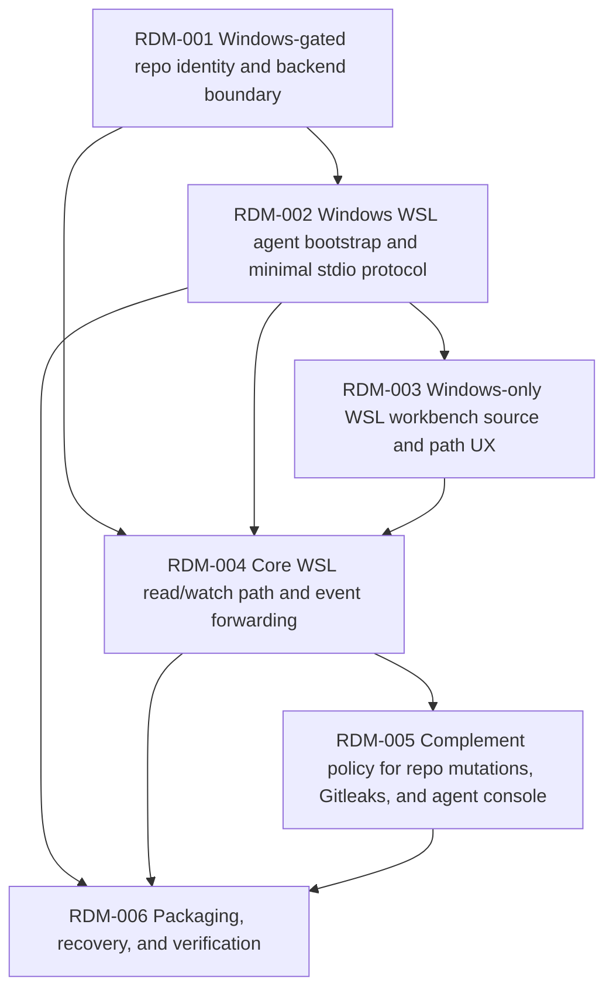

# Tinto - Complemento Windows-only para repos WSL

## Context Sufficiency Summary

- Product intent is sufficiently covered: Tinto is a lightweight local desktop supervisor for git repos, originally read-only/passive/local, with later explicit exceptions for agent sessions, Gitleaks config creation, and scoped file operations.
- Current system shape is sufficiently covered: a Windows/Linux Tauri app owns an in-process Rust backend with workbench persistence, git/status reads, watcher/bus state, Tauri invoke commands, event emission, agent console sessions, and frontend bus wrappers.
- Technical context is sufficient for a roadmap: React/TypeScript/Vite frontend, Tauri 2 Rust backend, `git2`, `notify`, `ignore`, `portable-pty`, existing tests via Vitest and Cargo, and a frozen additive-first bus contract.
- Interface context is sufficient if the roadmap treats the existing bus contract as the compatibility boundary. Repo paths are already canonical opaque identities; read commands already enforce active-workbench allowlist, containment, `.git` exclusion, and read bounds.
- Delivery context is sufficient for planning: current branch is `develop`, production posture is prototype, Jira is optional/degraded, and the standing project preference is local fast-forward delivery without PR unless explicitly requested.
- User clarification after initial generation: this is a **Windows-only complement/add-on**. When Tinto runs on Linux, no WSL complement UI, settings, commands, empty states, or degraded notices should appear. Existing Linux local-repo behavior must remain unchanged.
- Remaining uncertainties do not block roadmap generation because they can be recorded as user decisions before brainstorm/plan/execution: WSL distro support level on Windows, Linux-side agent install/update policy inside the selected WSL distro, whether repo-writing commands are enabled for WSL repos, and the exact trust boundary for the spawned agent process.

## Source Inventory

| Source | Contribution | Confidence |
|---|---|---|
| `README.md` | Defines Tinto as Windows/Linux Tauri desktop monitoring app and lists dev/test commands. | High |
| `tinto-design.md` | Defines read-only, passive, local principles, workbenches, watcher flow, git/FS planes, and architecture. | High |
| `docs/contracts/bus-contract.md` | Freezes backend/frontend event and command contract, opaque canonical repo paths, allowlist rules, read guards, agent session contract, and additive-first evolution. | High |
| `docs/orchestration/compound-master-state.md` | Records prototype posture, `develop` base, no-PR local delivery preference, prior WSL watcher fix, Gitleaks/file-operation deviations, and current dirty RU1 work. | High |
| `docs/roadmaps/2026-06-19-002-agent-console-integration.md` | Shows precedent for controlled design exceptions, PTY agent lifecycle, WSL-aware process cleanup concerns, and agent console contract extensions. | Medium |
| `src-tauri/src/lib.rs` | Shows the current backend is wired directly into Tauri `invoke_handler`, managed state, and `AppHandle` event emission. | High |
| `src-tauri/src/bus/commands.rs` | Shows command surface and security guards currently run in-process and open git/FS directly. | High |
| `src-tauri/src/bus/contract.rs` / `src/bus/contract.ts` | Shows serializable Rust/TS contract types, additive fields, secret findings, agent session events, and path shapes. | High |
| `src-tauri/src/watcher/mod.rs` | Shows native `notify` watcher plus polling fallback already exists, including the prior WSL2 filesystem-change workaround. | High |
| `src-tauri/src/workbench/mod.rs` | Shows workbench config stores canonical repo paths, aliases, and Plane 2 watch patterns. | High |
| `src-tauri/src/agent_console/mod.rs` and `commands.rs` | Shows agent sessions already launch local PTY processes in a repo after active-workbench validation. | High |
| `src-tauri/src/file_ops/commands.rs` | Shows scoped repo write/export/delete commands exist despite the original read-only principle, so WSL routing needs an explicit policy. | High |
| `src/bus/client.ts` | Shows the frontend currently calls Tauri commands/listens to Tauri events directly through a thin client. | High |

## Roadmap Items

- RDM-001. **Windows-gated repo identity and backend boundary**
  - Outcome: Introduce an opaque repo identity model and the smallest backend routing seam needed for a Windows-only WSL complement, while preserving the current local in-process backend as the default path.
  - Why now: `src-tauri/src/lib.rs` wires every command directly to local Rust modules, `src-tauri/src/bus/commands.rs` opens git/FS directly, and current repo state is path-keyed (`RepoEntry.path`, `RepoDelta.repo`, and frontend store keys). A WSL repo needs `{distro, linux_path}` identity without forcing Windows path translation into the user-facing repo key or leaking WSL affordances into Linux builds.
  - Scope boundary: Include an opaque `RepoId`/repo-source concept, local-repo adapter compatibility, command routing only where needed for later WSL repos, shared error shape, Windows-only capability gate, and tests proving Linux desktop builds expose no WSL UI, commands, settings, empty states, degraded notices, runtime entry points, or inert WSL surfaces. Exclude WSL process launch and frontend WSL UX changes.
  - Hard depends on: None.
  - Soft sequencing preference: None.
  - Blocks/enables: RDM-002, RDM-004, RDM-005.
  - Risk: medium; it touches the core backend boundary but should preserve behavior through the in-process adapter first.
  - Expected brainstorm: `docs/brainstorms/2026-06-23-001-windows-gated-repo-identity.md`
  - Expected plan: `docs/plans/2026-06-23-001-windows-gated-repo-identity-plan.md`
  - Suggested package: roadmap-item, split into repo identity/store contract and backend routing seam review units if the diff grows.

- RDM-002. **Windows WSL agent bootstrap and minimal stdio protocol**
  - Outcome: Define and launch the Linux-side `tinto-agent` binary from the Windows app inside a selected WSL distro via `wsl.exe -d <distro> -- <agent>`, then communicate over a bounded stdio request/response protocol.
  - Why now: The user wants the Windows app to operate on WSL repos the way VS Code Remote WSL does. The safer model is to run git, watcher, path, and process operations inside Linux instead of traversing `\\wsl$` from Windows.
  - Scope boundary: Include an explicit agent binary/crate target, shared DTO module for the first requests, dev launch path, line-delimited JSON framing or equivalent minimal stdio framing, version handshake, basic health/error categories, process lifetime cleanup, mocked launcher tests, compile/runtime `cfg(target_os = "windows")` gating for the host launcher, and a manual Windows/WSL smoke checklist. Exclude full JSON-RPC framework behavior, broad capability negotiation, auto-install/update, and frontend browse UX until later decisions. The Linux `tinto-agent` exists only as a child process inside WSL; the Linux desktop app must still expose no WSL feature surface.
  - Hard depends on: RDM-001.
  - Soft sequencing preference: None.
  - Blocks/enables: RDM-003, RDM-004, RDM-005.
  - Risk: high; Windows/WSL process management and packaging are environment-sensitive and cannot be fully verified from this Linux workspace.
  - Expected brainstorm: `docs/brainstorms/2026-06-23-002-wsl-agent-bootstrap-protocol.md`
  - Expected plan: `docs/plans/2026-06-23-002-wsl-agent-bootstrap-protocol-plan.md`
  - Suggested package: split by agent binary/protocol DTOs first, launcher/health second.

- RDM-003. **Windows-only WSL workbench source and path UX**
  - Outcome: On Windows only, let users add/select WSL repos as Linux paths scoped to a distro, while keeping repo identities opaque and stable in the existing bus/store model.
  - Why now: `WorkbenchStore` persists canonical local paths today. WSL needs `{distro, linux_path}` semantics from RDM-001 without forcing Windows path translation into repo identity.
  - Scope boundary: Include Windows-only WSL source metadata, distro selector, Linux path text entry, additive active-workbench persistence migration, display labels, and local-vs-WSL repo differentiation. Exclude arbitrary remote hosts and agent-assisted browse/list flow until the core path is validated.
  - Hard depends on: RDM-002.
  - Soft sequencing preference: None; coordinate protocol assumptions with RDM-004 planning.
  - Blocks/enables: RDM-004, RDM-005.
  - Risk: medium; persistence changes must be additive and avoid breaking existing local workbenches.
  - Expected brainstorm: `docs/brainstorms/2026-06-23-003-wsl-workbench-path-ux.md`
  - Expected plan: `docs/plans/2026-06-23-003-wsl-workbench-path-ux-plan.md`
  - Suggested package: split frontend/store migration from WSL browse UX if needed.

- RDM-004. **Core WSL read/watch path and event forwarding**
  - Outcome: On Windows only, route the minimum WSL repo monitoring workflow through the WSL agent while preserving the existing frontend contract: workbench snapshot, repo tree, worktree diff, file/blob reads needed by the current file viewer, subscribed diff refresh, watcher deltas, fs-events, and repo error state.
  - Why now: The frozen bus contract already carries the user-facing data. The complement should add a Windows WSL backend path without creating a second frontend data model or forcing full parity before the core repo-monitoring workflow is proven.
  - Scope boundary: Include per-repo backend selection gated to Windows WSL repos, minimal protocol request/response mapping, event stream forwarding into the existing Tauri event names, active-workbench allowlist enforcement inside the agent, parity tests with local fixtures, and an explicit health mapping: WSL agent/distro failures become per-repo `RepoErrorState` for affected WSL repos, while the global `WatchingState` remains reserved for workbench-wide local watcher degradation. Exclude media preview, secret findings/Gitleaks outputs, file mutations, and agent-console PTY routing unless a later policy item explicitly enables them.
  - Hard depends on: RDM-001, RDM-002, RDM-003.
  - Soft sequencing preference: None.
  - Blocks/enables: RDM-005.
  - Risk: high; this is the main contract-preservation slice and must catch drift between local and WSL behavior.
  - Expected brainstorm: `docs/brainstorms/2026-06-23-004-core-wsl-read-watch-path.md`
  - Expected plan: `docs/plans/2026-06-23-004-core-wsl-read-watch-path-plan.md`
  - Suggested package: split read command path and watcher/subscription event path if the combined slice is too broad.

- RDM-005. **Complement policy for repo mutations, Gitleaks, and agent console**
  - Outcome: Decide the policy and implement disabled/hidden states for non-read-only or extended capabilities on Windows WSL repos: file operations, `.gitleaks.toml` creation, Gitleaks managed install/status, media preview, secret findings, and agent console sessions.
  - Why now: The current product already has controlled write surfaces (`file_ops`, `create_repo_gitleaks_config`, session revert) and local PTY sessions. WSL support must not accidentally route these across a new trust boundary.
  - Scope boundary: Include an explicit Windows-only capability matrix, disabled states/error categories for unsupported WSL operations, UI copy that distinguishes Windows host vs WSL distro execution, and no visible Linux affordances. Stop at policy and disabled/hidden states unless the user separately approves a specific remote implementation. Exclude new agent types, cloud/SSH remotes, and optional remote mutation/session implementations.
  - Hard depends on: RDM-004.
  - Soft sequencing preference: None.
  - Blocks/enables: RDM-006.
  - Risk: high; this touches product behavior and security expectations, so unresolved choices must block implementation.
  - Expected brainstorm: `docs/brainstorms/2026-06-23-005-wsl-capability-policy.md`
  - Expected plan: `docs/plans/2026-06-23-005-wsl-capability-policy-plan.md`
  - Suggested package: policy and disabled-state work only; any approved remote mutation/session implementation becomes a later roadmap/package.

- RDM-006. **Packaging, recovery, and verification for Windows plus WSL only**
  - Outcome: Make WSL support operable outside developer machines: version checks, agent binary placement strategy, recovery UX, logs, and a Windows/WSL verification ladder.
  - Why now: WSL process launch, distro availability, agent version mismatch, and missing Linux dependencies will be common failure modes for a desktop app.
  - Scope boundary: Include only the hardening needed for the first Windows/WSL complement path: diagnostics for missing WSL/distro/agent, protocol version mismatch handling, secret-safe agent log capture, manual smoke docs, mocked CI tests, Windows package behavior for the chosen dev/install model, and Linux absence/no-regression checks. Exclude a full auto-updater and mature release infrastructure unless the user chooses that install model.
  - Hard depends on: RDM-002, RDM-004, RDM-005.
  - Soft sequencing preference: None.
  - Blocks/enables: release handoff for the full WSL initiative.
  - Risk: medium; much of the highest-confidence verification requires a real Windows host with WSL installed.
  - Expected brainstorm: `docs/brainstorms/2026-06-23-006-wsl-packaging-recovery-verification.md`
  - Expected plan: `docs/plans/2026-06-23-006-wsl-packaging-recovery-verification-plan.md`
  - Suggested package: roadmap-item, with manual smoke evidence accepted for Windows-only gaps.

## Dependency Graph

## Parallelization Waves

- Wave 1: RDM-001.
- Wave 2: RDM-002.
- Wave 3: RDM-003 and the non-UI parts of RDM-004 can be planned in parallel after the protocol shape is stable, but implementation should stay serial unless isolated worktrees are explicitly approved.
- Wave 4: RDM-004 completion, then RDM-005.
- Wave 5: RDM-006 release hardening and manual Windows/WSL smoke.

## Branch and PR Strategy

| Package candidate | Base branch | PR type | Dependency | Notes |
|---|---|---|---|---|
| RDM-001 Windows-gated repo identity and backend boundary | `develop` | review-unit or local fast-forward | None | Preserve current local behavior first; Linux must have no WSL runtime, commands, UI, settings, empty states, or inert surfaces. |
| RDM-002 Windows WSL agent bootstrap/protocol | `develop` after RDM-001 | review-unit or local fast-forward | RDM-001 | Use mocked launcher tests in Linux; require manual Windows/WSL smoke before release handoff. Linux desktop builds must have no WSL feature surface. |
| RDM-003 Windows-only WSL workbench path UX | `develop` after RDM-002 | review-unit or local fast-forward | RDM-002 | Additive persistence migration only; no WSL source controls in Linux UI. |
| RDM-004 core WSL read/watch path | `develop` after RDM-003 | split review units | RDM-001, RDM-002, RDM-003 | Likely split by read commands and watcher/subscription events. |
| RDM-005 capability policy | `develop` after RDM-004 | review-unit or local fast-forward | RDM-004 | Product/security decisions gate implementation. |
| RDM-006 packaging/recovery/verification | `develop` after RDM-004/RDM-005 | review-unit or local fast-forward | RDM-002, RDM-004, RDM-005 | Package/update strategy depends on user decision. |

Current project delivery preference from state: local fast-forward into `develop` and push, no PR unless explicitly requested. If PRs are requested later, keep review units coarser than micro-PRs and cap stacked open PRs at target <=2, max 3.

## Blockers and User Decisions

- No blockers for roadmap review or the first brainstorm gate.
- User decision captured on 2026-06-23: this is a Windows-only complement/add-on. On Linux, no WSL complement UI, settings, commands, runtime paths, degraded notices, empty states, or behavior should be visible or reachable.
- User decision before RDM-002 planning: supported Windows WSL baseline (`WSL 2 only` vs `WSL 1 best effort`) and whether multi-distro support is required in the first release.
- User decision before RDM-002/RDM-006 implementation: install/update model for `tinto-agent` inside WSL (manual binary, app-managed copy per distro, or build-from-source/dev-only first).
- User decision before RDM-005 implementation: whether repo-writing commands (`copy_to_repo`, `move_within_repo`, `delete_from_repo`, `.gitleaks.toml` creation, session revert) should be disabled for WSL repos initially or routed through the Linux agent with explicit confirmations.
- User decision before RDM-005 implementation: whether agent console sessions launched from a Windows app should run inside WSL for WSL repos, and whether that is limited to the selected distro.
- Verification caveat: this Linux workspace can cover protocol/unit tests and mocked launch behavior, but final confidence requires manual smoke on Windows with a real WSL distro.
