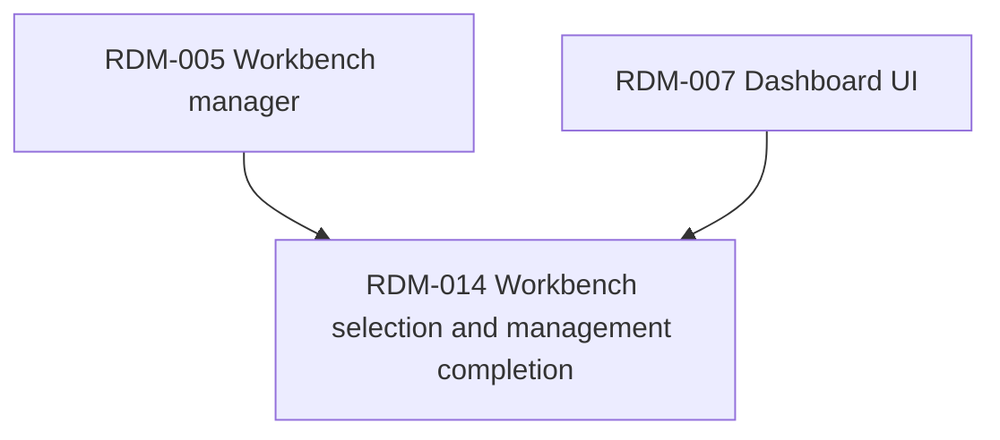

# Workbench management completion roadmap

## Context Sufficiency Summary

- Product intent is sufficiently covered by the original workbench manager requirements and Dashboard UI requirements: Tinto needs named workbenches, active-workbench switching, first-run setup, and ongoing curation without editing the config file.
- Current system shape is sufficiently covered by the landed backend workbench manager and frontend menu/workbench modules. Rename/delete commands already exist in Rust and are registered in Tauri; the missing work is a coherent frontend management surface and MRU selection flow.
- Technical execution context is sufficient: React/Vitest frontend, Tauri invoke wrappers, existing bus config shape, localStorage UI preferences, and direct-push-to-`develop` delivery precedent are established in current docs and commits.
- Interface context is sufficient because this completion uses existing commands (`create_workbench`, `set_active_workbench`, `rename_workbench`, `delete_workbench`, `list_workbenches`) and the existing `WorkbenchConfig` frontend contract.

## Source Inventory

| Source | Contribution | Confidence |
|---|---|---|
| `docs/brainstorms/2026-06-11-rdm-005-workbench-manager-requirements.md` | Defines workbench CRUD, active persistence, config behavior, and frontend command exposure. | High |
| `docs/work-packages/RDM-005-workbench-manager/2026-06-11-001-workbench-manager-work-package.md` | Confirms backend rename/delete/create/list behavior is delivered and reviewed. | High |
| `docs/brainstorms/2026-06-15-rdm-007-dashboard-ui-requirements.md` | Defines UI curation scope and explicitly defers full manage-workbenches/rename/delete. | High |
| `docs/plans/2026-06-15-001-feat-dashboard-ui-plan.md` | Establishes menu, active-workbench switching, and bus reload patterns. | High |
| `src-tauri/src/workbench/mod.rs`, `src-tauri/src/workbench/commands.rs` | Shows backend rename/delete semantics and command registration. | High |
| `src/workbench/MenuBar.tsx`, `src/workbench/operations.ts` | Shows current frontend workbench action entrypoints and reload/reset behavior. | High |

## Roadmap Items

- RDM-014. **Workbench selection and management completion**
  - Outcome: Users can quickly switch to recent workbenches, create a new one, inspect configured workbenches and repos, activate any workbench, rename workbenches, and delete workbenches without editing TOML.
  - Why now: The backend already supports full CRUD, while the prior UI only covered first-run/basic curation and explicitly deferred rename/delete/manage-workbenches.
  - Scope boundary: Include MRU ordering, Workbench menu replacement for the old selector, manage-workbenches modal, create/activate/rename/delete flows, defensive partial-config handling, and focused tests. Exclude backend schema changes, new persistence formats, per-workbench layouts, repo alias editing, and Jira/PR mutation.
  - Hard depends on: RDM-005, RDM-007.
  - Soft sequencing preference: None.
  - Blocks/enables: Enables cleaner multi-workbench workflows and later per-workbench UX without TOML edits.
  - Risk: medium; this touches destructive config actions and active-workbench reseed behavior, but uses existing backend commands and focused frontend wrappers.
  - Expected brainstorm: `docs/brainstorms/2026-06-26-014-workbench-management-completion.md`
  - Expected plan: `docs/plans/2026-06-26-014-workbench-management-completion-plan.md`
  - Suggested package: roadmap-item as one reviewable frontend capability slice.

## Dependency Graph

## Parallelization Waves

- Wave 1: RDM-014 as a single integrated capability. The MRU helper, Workbench menu, operations wrappers, and modal are tightly connected and should be reviewed together.

## Branch and PR Strategy

| Package candidate | Base branch | PR type | Dependency | Notes |
|---|---|---|---|---|
| Workbench selection and management completion | `develop` | review-unit or local amend | RDM-005, RDM-007 | User requested `amend`; keep documentation and the small review fix with the landed workbench-management commits. |

## Blockers and User Decisions

- No blockers. User explicitly requested handling the already-landed commits with amend.
