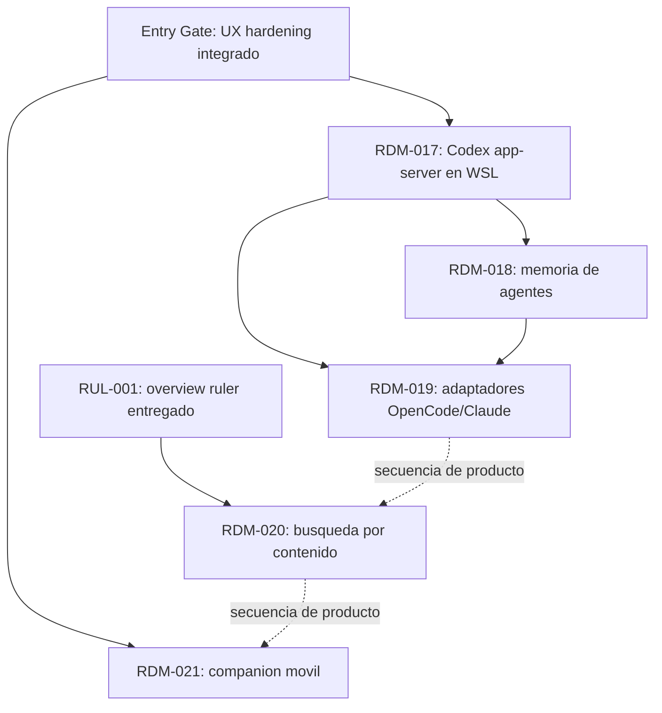

# Tinto - Plataforma de agentes post-UX y companion movil

## Context Sufficiency Summary

- La intención de producto está suficientemente definida para ordenar el trabajo: Tinto es una aplicación local de escritorio que supervisa repositorios y sesiones de agentes, y la decisión de esta iniciativa es priorizar Codex app-server nativo dentro de WSL; después, memoria de agentes, adaptadores nativos para OpenCode/Claude, búsqueda por contenido y, por último, un companion móvil conectado al desktop.
- La forma actual del sistema está documentada y comprobable en el repositorio: React/TypeScript consume comandos y eventos Tauri; Rust conserva la autoridad sobre repositorios, sesiones, checkpoints y procesos; `tinto-agent` cubre operaciones WSL; Codex local ya prefiere app-server, mientras que Codex dentro de WSL todavía usa PTY.
- El contexto de interfaces es suficiente para proteger compatibilidad: el bus evoluciona de forma aditiva, tiene espejo TypeScript generado y mantiene allowlists, revisiones monotónicas, límites de lectura y semántica explícita para repos locales/WSL.
- El contexto de entrega también es suficiente: Node 24, Rust estable, Vitest, Clippy, builds Tauri Linux/Windows y el artefacto Linux de `tinto-agent` forman la línea base de CI. La rama actual `codex/feature/ux-hardening-completion` es el gate de entrada y debe integrarse antes de abrir la primera ola post-UX.
- La definición no tiene la misma madurez en todas las olas. RDM-017 y RDM-020 cuentan con límites técnicos concretos; memoria, adaptadores de terceros y mobile aún necesitan decisiones de producto. Este roadmap no decide esas cuestiones: las registra como gates obligatorios antes de planificar o implementar cada item.
- `tinto-design.md` conserva principios fundacionales útiles, pero su exclusión de integraciones directas con agentes fue superada por el producto actual. Se usa con confianza media y nunca para contradecir contratos, código o artefactos entregados más recientes.

## Source Inventory

| Source | Contribution | Confidence |
|---|---|---|
| Instrucción del usuario, 2026-07-13 | Fija el orden de prioridad de las cinco iniciativas y autoriza preparar el trabajo post-UX. | High |
| `README.md` | Define el producto actual, usuarios, flujos, límites local/desktop y soporte Windows/Linux/WSL. | High |
| `tinto-design.md` | Aporta principios de supervisión, workbenches, bus y watchers; algunas exclusiones de agentes quedaron históricas. | Medium |
| `docs/contracts/bus-contract.md` | Fuente canónica para comandos, eventos, sesiones, app-server local, PTY WSL, checkpoints, journal y evolución aditiva. | High |
| `src-tauri/src/agent_console/app_server.rs` | Prueba que el runtime Codex estructurado actual lanza un proceso local por stdio, inicia thread/watch y traduce eventos. | High |
| `src-tauri/src/agent_console/pty.rs` y `src-tauri/src/agent_console/mod.rs` | Prueban la bifurcación actual: Codex local intenta app-server; las sesiones WSL se lanzan por PTY mediante `wsl.exe`. | High |
| `src-tauri/src/agent_console/commands.rs` y `src/bus/contract.ts` | Prueban el estado host ya persistido (goal, personality, feedback, plan y compact) y que `memory`/`memories` continúa diferido. | High |
| `docs/roadmaps/2026-06-30-007-codex-app-server-runtime-roadmap.md` | Registra la frontera reemplazable de runtimes y la intención de futuros adaptadores OpenCode/Claude. | High |
| `docs/brainstorms/2026-06-30-016-codex-app-server-runtime.md` | Define app-server como runtime preferido de Codex, Tinto como autoridad de checkpoints y PTY como fallback. | High |
| `docs/plans/2026-06-30-016-codex-app-server-runtime-plan.md` | Deja WSL app-server fuera del primer corte hasta demostrar una estrategia segura y verificable. | High |
| `docs/work-packages/RDM-016-codex-app-server-runtime/2026-06-30-016-codex-app-server-runtime-work-package.md` | Aporta evidencia de implementación/revisión, límites del paquete y el aplazamiento deliberado de memoria y adaptadores nativos. | High |
| `docs/roadmaps/2026-06-22-003-post-closeout-ux.md` y artefactos RUL-001 | Reservan una iniciativa separada de búsqueda por contenido y ya proporcionan el overview ruler donde integrar resultados. | High |
| `docs/brainstorms/2026-07-10-tinto-mobile-companion-feasibility.md` | Delimita una dirección móvil viable: desktop autoritativo, cliente read-mostly, transporte separado, pairing local primero y sin replicar Dockview en teléfono. No es una decisión arquitectónica. | Medium |
| `docs/build-guide.md`, `.github/workflows/ci.yml` y `package.json` | Definen toolchain, gates, bundles multiplataforma y empaquetado del agente WSL. | High |
| `docs/orchestration/compound-master-state.md` y su archivo enlazado | El estado compacto curado conserva el handoff operativo actual; el snapshot enlazado mantiene el historial completo sin gobernar el alcance de este roadmap. | High para el estado actual; Low para decisiones históricas |

## Entry Gate

Antes de iniciar RDM-017 debe cerrarse e integrarse la rama `codex/feature/ux-hardening-completion` sobre `develop`, con sus pruebas, contrato generado, documentación y smoke Tauri/WSL. Este gate evita construir las nuevas olas sobre una base UX o contractual todavía móvil; no añade otro roadmap item ni reabre el diagnóstico ya implementado.

## Roadmap Items

- RDM-017. **Codex app-server nativo dentro de WSL**
  - Outcome: una sesión Codex sobre un repo WSL prefiere un runtime app-server que corre dentro de la distro, entrega conversación y lifecycle estructurados a la superficie Agents y conserva los checkpoints verificados por Tinto; si no está disponible, la sesión continúa por PTY con una degradación visible y segura.
  - Why now: el runtime local ya obtiene `turn/started`, `turn/completed`, cambios y salida estructurada, pero la rama WSL pierde esa fidelidad y además ignora las opciones de runtime; cerrar esa asimetría es la prioridad explícita de esta iniciativa.
  - Scope boundary: incluir capability probe dentro de la distro, lanzamiento/terminación del proceso app-server por stdio, `cwd` Linux, input y opciones compatibles, traducción de lifecycle/cambios, journal/checkpoints existentes, fallback PTY, errores categorizados y smoke real Windows + Ubuntu. Excluir quitar el fallback, abrir listeners de red, ejecutar app-server de Windows contra un `cwd` Linux, rediseñar Agents o implementar otros agentes. La elección entre proceso directo por `wsl.exe` y proxy persistente mediante `tinto-agent` queda para el brainstorm con una prueba de capacidad; este roadmap no la presupone.
  - Hard depends on: Entry Gate; RDM-015/RDM-016 ya entregados.
  - Soft sequencing preference: None; es la primera ola por decisión del usuario.
  - Blocks/enables: estabiliza la frontera de procesos estructurados local/WSL y reduce el riesgo de RDM-018 y RDM-019.
  - Risk: high; combina proceso experimental, stdin/stdout bidireccional, PATH dentro de WSL, kill semantics, fallback y timing de checkpoints.
  - Expected brainstorm: `docs/brainstorms/2026-07-13-017-wsl-codex-app-server-requirements.md`
  - Expected plan: `docs/plans/2026-07-13-017-wsl-codex-app-server-plan.md`
  - Suggested package: un roadmap item y un review unit integrado. Transporte, lifecycle y cierre de checkpoint deben probarse juntos para demostrar valor; los capability probes pueden aterrizar dentro del mismo paquete detrás del fallback.
  - Exit evidence: suite de conformidad local/WSL, ausencia de interpolación insegura, app-server y fallback cubiertos, y smoke nativo en repo temporal WSL que demuestre turn start/completion, cambio de archivo, checkpoint y restore explícitamente consentido.

- RDM-018. **Memoria de agentes controlada por el usuario**
  - Outcome: Tinto puede conservar, inspeccionar, aplicar y eliminar memoria útil para futuras sesiones bajo un alcance y una política que el usuario comprende; la inyección de contexto es visible y auditable, no memoria oculta del proveedor.
  - Why now: Tinto ya persiste goal, personality, plan, feedback y context summary en el journal, pero contrato, código y pruebas declaran expresamente que esos campos no son memoria. Implementarla sobre esa base sin definir alcance o consentimiento mezclaría conceptos y crearía deuda antes de los adaptadores.
  - Scope boundary: el brainstorm debe decidir alcance (sesión/repo/workbench/global), autoría (manual, sugerida o automática), ciclo revisar/editar/borrar, retención, tratamiento de contenido sensible y forma de inyección por runtime. Reutilizar journal y host-context solo cuando la decisión lo justifique. Excluir cloud sync, aprendizaje silencioso, extracción indiscriminada de conversaciones y memoria compartida con mobile hasta una decisión posterior.
  - Hard depends on: RDM-017 para que la política de contexto se pruebe con paridad Codex local/WSL antes de ampliarla a otros runtimes.
  - Soft sequencing preference: completar primero un modelo/ADR y pruebas de amenazas; la implementación no comienza solo porque exista el comando diferido `/memory`.
  - Blocks/enables: congela el contrato host-context que RDM-019 deberá respetar.
  - Risk: high; las decisiones de alcance, privacidad, borrado y prompt injection cambian el producto y el modelo de datos.
  - Expected brainstorm: `docs/brainstorms/2026-07-13-018-agent-memory-requirements.md`
  - Expected plan: `docs/plans/2026-07-13-018-agent-memory-plan.md`
  - Suggested package: dividir después del brainstorm en (1) contrato/modelo y migración local, (2) gestión UX y (3) selección/inyección por runtime. No apilar implementación antes de aprobar el modelo.
  - Exit evidence: CRUD y alcance probados, migraciones reversibles, indicación visible del contexto aplicado, límites y redacción/borrado verificables, y ninguna memoria enviada o creada sin la política consentida.

- RDM-019. **Adaptadores nativos para OpenCode y Claude**
  - Outcome: OpenCode y Claude usan la misma semántica Tinto de conversación, lifecycle, actividad, contexto y checkpoints cuando cada CLI ofrezca una interfaz programática estable; el PTY sigue siendo el fallback compatible cuando esa interfaz no exista o falle.
  - Why now: ambos agentes ya están allowlisted y se pueden lanzar por PTY, y RDM-016 dejó una frontera de runtime reemplazable precisamente para no filtrar conceptos de Codex. El siguiente paso debe validar las capacidades reales de cada herramienta antes de imitar app-server.
  - Scope boundary: comenzar con un inventario versionado de protocolos/capabilities por agente; definir un contrato de conformidad común; implementar cada adaptador por separado; mantener timeline, host context, checkpoint scanner y errores comunes. Excluir parsear ANSI como eventos semánticos, asumir que existe un equivalente de Codex app-server, eliminar PTY o prometer paridad donde el proveedor no exponga lifecycle/cambios.
  - Hard depends on: RDM-017 y el contrato de memoria/contexto estabilizado en RDM-018.
  - Soft sequencing preference: el orden OpenCode vs Claude se decide con la matriz de capacidades, no por el orden de esta lista.
  - Blocks/enables: agentes estructurados interoperables y una futura UI que no dependa de Codex.
  - Risk: high; interfaces externas, versiones y garantías pueden diferir y cambiar. La existencia de un adaptador nativo es una hipótesis que debe confirmarse por agente.
  - Expected brainstorm: `docs/brainstorms/2026-07-13-019-native-agent-adapters-requirements.md`
  - Expected plan: `docs/plans/2026-07-13-019-native-agent-adapters-plan.md`
  - Suggested package: (1) capability matrix + contrato de conformidad, (2) un review unit OpenCode y (3) un review unit Claude. Cada adaptador debe ser mergeable y revertible sin afectar al otro.
  - Exit evidence: tests de conformidad comunes, fixture/protocolo por agente, smoke local y WSL cuando esté soportado, fallback PTY verificado y documentación explícita de cualquier diferencia funcional.

- RDM-020. **Búsqueda acotada por contenido de archivos**
  - Outcome: el usuario busca texto dentro del alcance permitido de un repo, abre cada resultado en archivo y línea, y ve marcadores de resultados en el overview ruler sin bloquear la UI ni ampliar silenciosamente el acceso a archivos sensibles.
  - Why now: RUL-001 reservó `source: "search"` y dejó los marcadores bloqueados por una iniciativa de búsqueda separada. El árbol, la lectura acotada, las rutas locales/WSL y la navegación de archivo ya existen.
  - Scope boundary: el brainstorm debe decidir fixed text/regex/case, archivos tracked/untracked/ignored, límites de tamaño y resultados, cancelación, binarios, symlinks y paridad local/WSL. Incluir contrato backend acotado, resultados progresivos o paginados según evidencia, navegación archivo/línea y marcadores del ruler. Excluir indexación persistente, búsqueda remota/cloud y lectura fuera del repo activo salvo decisión posterior.
  - Hard depends on: la base RUL-001 ya entregada y las allowlists/lecturas del bus actual.
  - Soft sequencing preference: RDM-019 por prioridad del usuario; técnicamente puede diseñarse en paralelo una vez cerrada RDM-017, pero no debe desplazar la ola de adaptadores.
  - Blocks/enables: completa la capacidad reservada del ruler y mejora inspección desktop; puede aportar lectura útil al mobile sin ser requisito técnico de su primer prototipo.
  - Risk: medium-high; rendimiento en monorepos, cancelación, exposición de gitignored/secrets y equivalencia local/WSL.
  - Expected brainstorm: `docs/brainstorms/2026-07-13-020-file-content-search-requirements.md`
  - Expected plan: `docs/plans/2026-07-13-020-file-content-search-plan.md`
  - Suggested package: (1) comando/protocolo de búsqueda acotada local + WSL y (2) UX de consulta/resultados/navegación/ruler. Mantener el contrato backend revisable antes de conectar la UI.
  - Exit evidence: límites/cancelación probados, contención local/WSL, no lectura accidental de `.git` o binarios, resultados navegables por teclado y smoke de archivos grandes/sin resultados/error.

- RDM-021. **Companion móvil con Tinto Desktop como autoridad**
  - Outcome: un cliente móvil read-mostly puede emparejarse con un Tinto Desktop en una red local, recuperar estado tras suspensión/reconexión y observar los trabajos móviles priorizados sin acceder directamente al filesystem o a una shell del PC.
  - Why now: la nota de viabilidad encuentra una dirección razonable y el lote UX actual mejora la adaptación por contenedor, pero identifica correctamente que el reto principal es transporte, identidad y seguridad, no comprimir Dockview. Mantenerlo al final evita convertir una exploración en una segunda línea de producto antes de estabilizar desktop.
  - Scope boundary: primero separar dominio de transporte Tauri, después definir pairing/revocación/cifrado/permisos/auditoría, y solo entonces validar un cliente de lectura en LAN. Incluir estado de workbenches/repos/agentes, timeline/diffs/conversaciones según el brainstorm y reconexión idempotente. Acciones remotas son una fase separada y limitada. Excluir relay de Internet, shell arbitraria, operaciones destructivas offline, docking de escritorio, terminal completa y paridad funcional total en teléfono.
  - Hard depends on: Entry Gate y, dentro del item, una frontera dominio/transporte más un diseño de seguridad aprobados antes del prototipo móvil.
  - Soft sequencing preference: RDM-020 y las olas de agentes completas por prioridad del usuario; no existe una dependencia técnica obligatoria de búsqueda, memoria o adaptadores para un MVP read-only.
  - Blocks/enables: observación segura fuera del escritorio y, solo después de evidencia de uso, unas pocas intenciones remotas auditables.
  - Risk: very high; identidad del dispositivo, secretos del repositorio, versionado de protocolo, suspensión móvil, presencia del desktop y acciones remotas amplían mucho la superficie de ataque y operación.
  - Expected brainstorm: `docs/brainstorms/2026-07-13-021-mobile-companion-requirements.md`
  - Expected plan: `docs/plans/2026-07-13-021-mobile-companion-plan.md`
  - Suggested package: (1) frontera de transporte sin cambiar conducta desktop, (2) ADR/protocolo de pairing y seguridad, (3) cliente LAN read-only y (4) acciones explícitas auditables solo si el MVP aporta evidencia. No agrupar relay o acceso por Internet en este item.
  - Exit evidence: reconnect/resume e idempotencia probados, revocación de dispositivo, cifrado/autenticación, compatibilidad de versiones, caché offline solo lectura, desktop como fuente de verdad y security review antes de habilitar cualquier acción.

## Dependency Graph

- Flecha continua: dependencia dura de entrega o de contrato.
- Flecha discontinua: preferencia de secuencia decidida por producto, no bloqueo técnico.
- RDM-021 contiene dependencias internas obligatorias: frontera de transporte -> seguridad/pairing -> cliente read-only -> acciones limitadas.

## Parallelization Waves

- Wave 0 - cierre de base: integrar `codex/feature/ux-hardening-completion` y verificar `develop`.
- Wave 1 - runtime prioritario: RDM-017 solamente. No abrir memoria ni adaptadores sobre una estrategia WSL todavía cambiante.
- Wave 2 - contexto persistente: RDM-018. El brainstorm/ADR puede comenzar al cerrar RDM-017; la implementación espera el gate de decisiones de memoria.
- Wave 3 - interoperabilidad de agentes: RDM-019. La matriz OpenCode/Claude puede producir dos paquetes independientes después del contrato común; ambos pueden ejecutarse en paralelo solo si no comparten el mismo módulo de runtime durante la ola.
- Wave 4 - inspección de repos: RDM-020. Backend/protocolo primero, UX/ruler después.
- Wave 5 - acceso móvil: RDM-021 en subolas seriales. El companion no se usa para absorber deuda desktop ni para introducir un relay antes de validar LAN read-only.

La búsqueda es técnicamente independiente de memoria/adaptadores y podría adelantarse si cambia la prioridad. El orden anterior conserva la instrucción actual del usuario y evita una falsa dependencia arquitectónica.

## Branch and PR Strategy

Los nombres de ramas futuras son una inferencia de confianza media basada en la rama actual y el prefijo requerido por el entorno Codex; deben confirmarse al abrir cada paquete. Todas parten del `develop` ya actualizado por la ola anterior. El review unit sigue siendo válido aunque el usuario elija integración local en vez de publicar PR.

| Package candidate | Base branch | PR type | Dependency | Notes |
|---|---|---|---|---|
| Cierre UX actual | `develop` | current delivery batch | None | Terminar `codex/feature/ux-hardening-completion` antes de la Wave 1. |
| RDM-017 WSL Codex app-server | `develop` | single integrated review unit | Entry Gate | Rama sugerida: `codex/feature/rdm-017-wsl-codex-app-server`; transporte + lifecycle + checkpoints juntos. |
| RDM-018 memory model/storage | `develop` | docs gate, then review unit | RDM-017 | Rama sugerida: `codex/feature/rdm-018-agent-memory-foundation`; no mezclar todavía toda la UX. |
| RDM-018 memory UX/runtime injection | `develop` after prior merge | dependent review unit | memory model/storage | Un paquete por frontera: gestión visible y selección/inyección. |
| RDM-019 adapter contract | `develop` | discovery/contract review unit | RDM-017, RDM-018 contract | Rama sugerida: `codex/feature/rdm-019-agent-adapter-contract`; no incluir una CLI aún no investigada. |
| RDM-019 OpenCode adapter | `develop` after contract merge | independent adapter review unit | adapter contract | Puede correr en paralelo con Claude si los archivos compartidos ya quedaron estables. |
| RDM-019 Claude adapter | `develop` after contract merge | independent adapter review unit | adapter contract | Mismo conformance suite; fallback PTY obligatorio. |
| RDM-020 bounded search backend | `develop` | contract/backend review unit | RUL-001 delivered | Rama sugerida: `codex/feature/rdm-020-file-content-search`; contrato local/WSL antes de UI. |
| RDM-020 search UX/ruler | `develop` after backend merge | dependent UI review unit | search backend | Resultados, navegación, a11y y marcadores `search`. |
| RDM-021 transport boundary | `develop` | architecture/refactor review unit | Entry Gate | Rama sugerida: `codex/feature/rdm-021-remote-transport-boundary`; cero comportamiento remoto todavía. |
| RDM-021 pairing/security | `develop` after transport merge | protocol/security review unit | transport boundary | ADR y threat model antes de cliente móvil. |
| RDM-021 LAN read-only client | `develop` after security merge | vertical MVP review unit | pairing/security | No apilar acciones remotas. |
| RDM-021 audited actions | `develop` after MVP evidence | optional follow-up | read-only MVP accepted | Solo acciones decididas y con confirmación proporcional. |

- Mantener como máximo dos PR/review units abiertos cuando exista un stack real; preferir mergear la dependencia antes de abrir el consumidor.
- No basar una rama nueva en otra feature salvo que el stack sea explícito y corto; la base normal es `develop` actualizado.
- Cada PR/review unit debe actualizar contrato generado, tests, docs canónicas y evidencia de smoke proporcional a su superficie.
- Publicar PR frente a integración local fast-forward sigue siendo una decisión de entrega del usuario; no cambia los límites de los paquetes.

## Blockers and User Decisions

- No blocker para revisar este roadmap ni para iniciar el brainstorm de RDM-017.
- RDM-017, antes del plan: demostrar `codex app-server --stdio` dentro de la distro objetivo y decidir con evidencia entre proceso `wsl.exe` directo o proxy long-lived de `tinto-agent`; documentar PATH, shutdown y fallback.
- RDM-018, antes de implementación: decidir alcance de memoria, quién puede crearla, qué se guarda, cómo se revisa/borra, retención, tratamiento de secretos y cuándo se inyecta.
- RDM-019, antes del plan por adaptador: confirmar la interfaz programática y estabilidad real de OpenCode y Claude; decidir el primer adaptador usando esa matriz. Si un agente no ofrece lifecycle estructurado seguro, conservar PTY no se considera un fallo del roadmap.
- RDM-020, antes del plan: decidir sintaxis de consulta, alcance tracked/untracked/gitignored, límites/cancelación y si el primer incremento exige paridad local/WSL o la entrega en dos pasos.
- RDM-021, antes del plan: decidir si el primer usuario solo observa o también interviene, LAN-only frente a Internet, ciclo de vida del host desktop, primera plataforma móvil y lista cerrada de acciones remotas permitidas. La nota exploratoria no resuelve estas decisiones.
- Entrega: confirmar por ola si se publicará PR o se mantendrá el flujo local; nunca inferir Jira, firma, relay, credenciales o infraestructura externa desde este roadmap.
