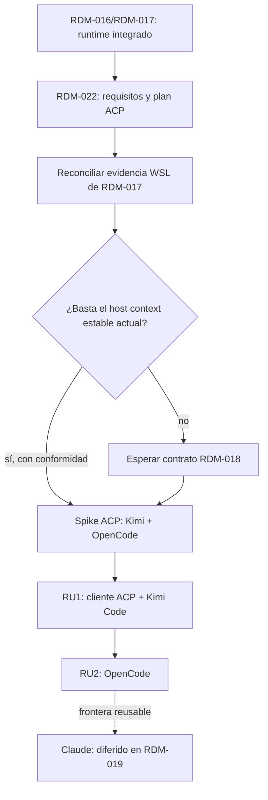

# Tinto - Soporte de Kimi Code y OpenCode mediante ACP

## Context Sufficiency Summary

- La intención de producto es suficiente para preparar la entrega: el usuario quiere añadir soporte para Kimi Code y OpenCode dentro de la superficie Agents de Tinto.
- El punto de partida es verificable. OpenCode ya está allowlisted, aparece en el selector y puede ejecutarse por PTY; Kimi todavía no está allowlisted ni aparece en la UI. Ninguno de los dos cuenta con el lifecycle estructurado que Codex obtiene de app-server.
- Ambos proveedores publican ahora un punto de entrada ACP sobre JSON-RPC por `stdio`: `opencode acp` y `kimi acp`. ACP v1 ofrece una frontera común para negociar capacidades, crear/cargar sesiones, enviar prompts, recibir actualizaciones, solicitar permisos y cancelar turnos. Esta evidencia vuelve innecesario diseñar dos protocolos propietarios.
- La arquitectura actual ya ofrece los límites que debe consumir un adaptador: proceso reemplazable, timeline provider-neutral, journal, `provider_session_id`, checkpoints de Tinto, host context, adjuntos, opciones de runtime y fallback PTY. La implementación WSL estructurada está presente en `develop`, pero su evidencia de cierre no está completa; RDM-022 debe reconciliarla antes de construir encima.
- El contexto técnico y de entrega también es suficiente: React/TypeScript consume comandos y eventos Tauri; Rust conserva autoridad sobre procesos, sesiones y checkpoints; la integración parte de `develop`; CI y verificación local están documentados.
- El gate de secuencia de RDM-018 quedó resuelto: RDM-022 consume sólo campos de host context ya estables y cubiertos por conformidad. Memoria continúa fuera de alcance.

## Relationship To The Active Roadmap

- Este roadmap es un refinamiento focalizado de RDM-019 en `docs/roadmaps/2026-07-13-008-post-ux-agent-platform-roadmap.md`.
- Sustituye de forma canónica la parte OpenCode de RDM-019 por una dirección confirmada por fuentes actuales: ACP v1 como runtime preferido y PTY como fallback. RDM-019 conserva únicamente la futura entrega de Claude; no debe originar un segundo paquete OpenCode.
- Añade Kimi Code al alcance solicitado sin retirar Claude. El adaptador de Claude continúa diferido bajo el roadmap anterior.
- No reabre ni sustituye el alcance de RDM-016/RDM-017. Reutiliza su frontera de runtime ya integrada; la evidencia WSL no ejecutada queda confinada a la limitación R18/AE8 y no se usa para declarar soporte estructurado.

## Source Inventory

| Source | Contribution | Confidence |
|---|---|---|
| Instrucción del usuario, 2026-07-18 | Prioriza la documentación necesaria para soportar Kimi Code y OpenCode. | High |
| `AGENTS.md` | Exige simplicidad, cambios acotados y notificación de fin de turno. | High |
| `README.md` | Define Tinto como IADE local para Windows/Linux/WSL y presenta Agents como superficie de lanzamiento y supervisión. | High |
| `docs/contracts/bus-contract.md` | Fuente canónica de sesiones, timeline, journal, adjuntos, runtime options, checkpoints, resume y fallback PTY. | High |
| `docs/roadmaps/2026-07-13-008-post-ux-agent-platform-roadmap.md` | Reserva RDM-019 para adaptadores provider-neutral y exige inventario de capabilities, conformance suite y fallback. | High |
| Artefactos RDM-016 | Prueban la frontera reemplazable de procesos y el runtime estructurado Codex sin convertir conceptos del proveedor en contrato público. | High |
| `src-tauri/src/agent_console/validation.rs` | Prueba que el allowlist actual es `claude`, `codex`, `opencode`; Kimi aún se rechaza. | High |
| `src-tauri/src/agent_console/pty.rs` y `mod.rs` | Prueban el proceso provider-neutral, app-server solo para Codex y PTY local/WSL como fallback general. | High |
| `src-tauri/src/agent_console/commands.rs`, `session.rs` y `src-tauri/src/bus/contract.rs` | Prueban los límites de lifecycle, input, resume, timeline, host context, journal y checkpoints que el runtime ACP debe conservar. | High |
| `src/panels/RepoCard.tsx` y superficies Agents | Prueban selector, availability, etiquetas/logos, tabs y transcript que deben reconocer Kimi y mantener OpenCode. | High |
| [Kimi Code: `kimi` command](https://www.kimi.com/code/docs/en/kimi-code-cli/reference/kimi-command) | Confirma binario `kimi`, TUI, sesiones, salida JSONL, servidor local y subcomando ACP. | High; fuente oficial consultada 2026-07-18 |
| [Kimi Code: `kimi acp`](https://www.kimi.com/code/docs/en/kimi-code-cli/reference/kimi-acp.html) | Confirma JSON-RPC/stdio limpio, negociación, new/load/resume/prompt/cancel, updates, permisos y matriz de capabilities. | High; fuente oficial consultada 2026-07-18 |
| [OpenCode CLI](https://dev.opencode.ai/docs/cli/) | Confirma binario `opencode`, PTY/TUI, session resume, run, attachments y `opencode acp --cwd`. | High; fuente oficial consultada 2026-07-18 |
| [OpenCode ACP](https://dev.opencode.ai/docs/acp/) | Confirma el subprocess ACP por JSON-RPC/stdio. | High; fuente oficial consultada 2026-07-18 |
| [OpenCode server](https://opencode.ai/docs/server/) | Confirma que HTTP/OpenAPI/SSE existe, pero requiere listener y auth propios; se conserva como alternativa no elegida para este corte. | High; fuente oficial consultada 2026-07-18 |
| [ACP v1 overview](https://agentclientprotocol.com/protocol/v1/overview) y [schema repository](https://github.com/agentclientprotocol/agent-client-protocol) | Define protocolo estable v1, capability negotiation, sesiones, prompt/update, permisos, cancelación, errores y versionado. | High; especificación oficial consultada 2026-07-18 |

## Roadmap Items

- RDM-022. **Runtime ACP común para Kimi Code y OpenCode**
  - Outcome: el usuario puede iniciar Kimi Code u OpenCode desde cualquier repo compatible de Tinto; Tinto prefiere una conversación estructurada ACP cuando el CLI la anuncia, refleja mensajes, actividad, planes, permisos y final de turno en Agents, conserva journal/checkpoints y reanuda sesiones cuando la capability exista. La experiencia distingue proveedor no disponible, autenticación requerida, conexión ACP en curso, ACP listo y fallback PTY. Si ACP no está disponible o falla antes de iniciar una sesión válida, el agente sigue funcionando por PTY, muestra la causa y las capacidades perdidas, y permite reintentar ACP sin que Tinto capture credenciales.
  - Why now: OpenCode ya figura como soportado pero solo obtiene bytes PTY, Kimi no figura en absoluto y ambos proveedores exponen hoy el mismo protocolo de integración. Un runtime ACP común entrega los dos soportes solicitados con menos duplicación que dos adaptadores propietarios.
  - Scope boundary: incluir descriptor provider-neutral (`id`, binario, argumentos ACP, etiqueta y capabilities negociadas), allowlist y readiness local/WSL, proceso JSON-RPC/stdio, handshake/version negotiation, `session/new`, `session/load`/resume cuando se anuncie, `session/prompt`, `session/update`, `session/request_permission`, `session/cancel`, fin de turno, provider session id, adjuntos según capabilities, modos/modelos solo cuando se anuncien, timeline/journal/checkpoints existentes, categorización de errores, fallback PTY, estados y acciones accesibles, fixtures de protocolo y smoke por plataforma. Tratar stdout, stderr y reverse RPC como entrada no confiable: validar protocolo/esquema, acotar frames, payloads y crecimiento, aplicar backpressure y confinar accesos de archivos a la raíz autorizada. Minimizar el entorno heredado por cada subprocess y evitar que credenciales o secretos ajenos lleguen a eventos, errores, journal o checkpoints. Tinto no crea ni consume HTTP. La excepción KTD10 sólo permite el listener loopback interno de OpenCode si está autenticado, sin mDNS y pertenece al proceso supervisado; la decisión sustitutiva del 2026-07-19 acepta el puerto efectivo `4096` cuando Tinto solicita `--port 0`, por lo que la versión actual intenta ACP y reserva el PTY para fallos reales previos a sesión. Excluir credenciales gestionadas por Tinto, autoaprobación implícita, parseo ANSI semántico, quitar PTY, memoria RDM-018, adaptador Claude, cambios de revert/checkpoint y rediseño general de Agents.
  - Hard depends on: la frontera runtime de RDM-016/RDM-017; antes de ejecución, cerrar la evidencia WSL de RDM-017 y resolver con criterio verificable el gate de host context respecto a RDM-018.
  - Soft sequencing preference: ejecutar primero un spike acotado contra ambos CLIs para contrastar handshake, capabilities, updates, permisos y cancelación. Si las diferencias caben en negociación y descriptores, RU1 entrega el cliente común con Kimi —el proveedor todavía ausente— y RU2 habilita OpenCode sobre la misma frontera.
  - Blocks/enables: completa el soporte solicitado, convierte ACP en frontera reusable para otros agentes y deja Claude como extensión posterior sin hacerlo parte de este paquete.
  - Risk: high; combina subprocess bidireccional, negociación de protocolo, permisos humanos, capacidades distintas, resume, PATH local/WSL, shutdown/cancel y traducción de lifecycle sin perder checkpoints.
  - Brainstorm outcome: el Product Contract de CE Brainstorm quedó integrado en el plan unificado; no se creó un artefacto duplicado.
  - Plan: `docs/plans/2026-07-18-022-feat-kimi-opencode-agent-support-plan.md`
  - Suggested package: un work package con dos review units como máximo: RU1 spike de compatibilidad + cliente ACP común + alta de Kimi; RU2 OpenCode sobre esa frontera. RU1 debe aportar el nuevo proveedor de forma independiente y dejar PTY intacto. RU2 no duplica transporte y puede fusionarse con RU1 si el Reviewability Gate demuestra que separarlos obliga a mantener un stack mental no verificable.
  - Exit evidence: conformance tests ACP v1 con fake agent, fixtures versionadas por proveedor, readiness/allowlist/UI cubiertos, estados de autenticación y fallback recuperables, permisos ligados a provider/sesión/turno/request y deny-by-default accesible, new/prompt/cancel y load cuando se anuncie, límites/backpressure y contención de archivos probados, entorno de subprocess minimizado, checkpoints y journal sin secretos, ningún listener creado o consumido por Tinto, excepción interna OpenCode contenida o PTY fail-closed, y matriz de seis celdas con prerrequisito, evidencia o limitación explícita.

## Delivery Outcome

- U1-U7 quedaron implementadas y revisadas en una única entrega local, sin transporte ACP duplicado por proveedor.
- Kimi Code usa ACP v1 estructurado cuando el CLI puede crear una sesión; auth requerida queda en el flujo del proveedor y los fallos previos a sesión degradan a PTY recuperable.
- OpenCode 1.18.3 usa el mismo supervisor y descriptor seguro. La decisión aprobada el 2026-07-19 acepta que `--port 0` se materialice como `127.0.0.1:4096`, por lo que el runtime intenta ACP y reserva el PTY visible para fallos reales previos a sesión.
- RDM-017/RDM-018 dejaron de ser gates: WSL conserva una limitación R18 explícita y el host context estable actual pasa paridad sin introducir memoria.
- El ledger final R1-R23/AE1-AE11 está en `docs/orchestration/compound-master-state.md`; el detalle de plataforma permanece en el manual smoke.
- La implementación, su evidencia funcional y la verificación global están completas. El gate exacto `npm test` pasa 691/691, y los builds, contratos, formato, lint, Clippy y la suite Rust también pasan.

## Dependency Graph



## Parallelization Waves

- Wave A - artefactos: brainstorm, revisión, plan, revisión y work package de RDM-022; serial porque cada gate depende del anterior.
- Wave B - preflight de ejecución: reconciliar evidencia WSL, resolver el gate de host context y contrastar ambos CLIs sin congelar todavía la interfaz común.
- Wave C - ejecución: RU1 cliente ACP común + Kimi Code.
- Wave D - ejecución: RU2 OpenCode sobre RU1 revisado. No ejecutar RU1/RU2 en paralelo porque ambos tocan el registro de proveedores, el proceso ACP y los contratos de sesión.

## Branch And PR Strategy

| Package candidate | Base branch | PR type | Dependency | Notes |
|---|---|---|---|---|
| RDM-022 RU1 ACP + Kimi Code | `develop` actualizado | capability slice independiente | gates WSL/host context resueltos | Rama sugerida `codex/feature/rdm-022-acp-kimi`; lleva los artefactos relacionados, spike dual, runtime común, Kimi, tests y contrato. |
| RDM-022 RU2 OpenCode | `develop` tras integrar RU1, o base RU1 mientras solo haya un PR padre abierto | review unit dependiente | RU1 | Rama sugerida `codex/feature/rdm-022-opencode`; añade descriptor/UX/fixtures/smoke OpenCode sin duplicar ACP. Stack abierto objetivo 2, máximo 2 para este paquete. |

- No se crea ni se publica una rama solo para estos documentos. Los artefactos viajarán con la primera capability slice ejecutable si la iniciativa llega a entrega.
- Jira es opcional y se mantendrá a granularidad review-unit: una tarea/subtarea para RU1 y otra para RU2 si Release Marshal encuentra contexto válido.
- Si RU2 corrige una superficie señalada en la revisión de RU1 mientras el PR padre sigue abierto, el estado debe registrar un downstream-fix note.

## Blockers And User Decisions

- **RDM-017 evidence gate — resolved:** la ruta WSL permanece PTY y la ausencia de un runner/probe WSL autenticado se registra sólo como limitación R18/AE8; no se declara soporte estructurado allí.
- **RDM-018 decision rule — resolved:** ACP consume exclusivamente el host context estable y probado de Tinto; no añade ningún campo de memoria.
- **Support tier, settled for this documentation:** “soporte” significa launcher visible + readiness source-aware + ACP estructurado preferido + PTY fallback. Es la continuación verificable de RDM-019, no una promesa nueva inferida solo del nombre de los proveedores. Reducirlo a lanzamiento PTY requeriría cambiar explícitamente este alcance.
- **Current Kimi target:** soporte estructurado significa Kimi Code actual identificado por un handshake ACP v1 válido, no una versión mínima inventada. Una instalación heredada que comparta el ejecutable `kimi` puede usar PTY, pero debe mostrarse como fallback sin garantía estructurada.
- **Permission authority:** Tinto no autoaprueba ni captura secretos. La UX mínima liga cada petición a provider, sesión, turno y request vigentes; anuncia el estado pendiente; ofrece allow/deny/cancel por teclado y lector de pantalla; usa deny como salida segura; restaura foco; y deniega ante timeout, desconexión, vista ausente o petición expirada. El brainstorm decidirá su composición visual.
- **Capability baseline:** prompt, updates, permiso, cancelación, lifecycle y fallback son obligatorios para el corte ACP. Adjuntos, modelos, modos y load/resume se habilitan únicamente cuando `initialize` los anuncie y exista conformidad; su ausencia se comunica y no invalida el soporte base.
- **Platform truth:** el brainstorm debe cerrar la matriz Kimi/OpenCode para Windows nativo, Linux nativo y Ubuntu WSL, incluyendo prerrequisitos oficiales, nivel ACP, fallback y limitaciones. Ninguna celda se declara soportada por extrapolación.

## Roadmap Generator Closeout

```text
artifact_kind: roadmap
artifact_path: docs/roadmaps/2026-07-18-009-kimi-opencode-agent-support-roadmap.md
blockers: none.
recommended_next_action: none inside RDM-022. Commit, PR, Jira and release remain separate optional handoffs.
```
