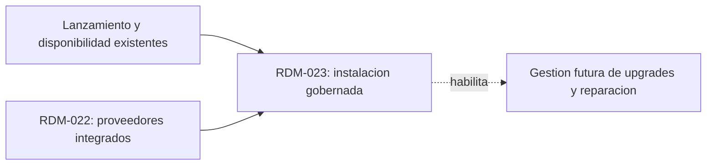

# Tinto - Instalacion gobernada de runtimes de agentes

## Context Sufficiency Summary

- La intencion de producto esta suficientemente definida: cuando falta un agente soportado en el runtime propietario del repositorio, Tinto debe ofrecer una instalacion global explicita, consentida y verificable, sin convertir el intento de lanzamiento en consentimiento implicito.
- El alcance y los no objetivos estan cerrados en el artefacto de requisitos: se incluyen host local y WSL, los cuatro proveedores permitidos y la continuacion exacta del lanzamiento; se excluyen upgrades, downgrade, uninstall, repair, credenciales, login e instalacion automatica de prerrequisitos.
- La forma actual del sistema es comprobable: Rust valida el proveedor y gobierna el lanzamiento; React consulta disponibilidad y deshabilita el inicio cuando falta el binario; el contrato Tauri/TypeScript y la cache de disponibilidad son superficies aditivas conocidas.
- El contexto de seguridad es suficiente para ordenar el trabajo: recetas inmutables controladas por Tinto, argumentos sin interpolacion de shell, autorizacion ligada a revision, elevacion separada, limites de procesos/salida y pruebas exclusivamente con instaladores falsos.
- El contexto de entrega esta cubierto por los gates actuales de contrato, formato, lint, Vitest, build, Rust fmt/Clippy/tests/build y bundles Linux/Windows. Las recetas oficiales concretas son un gate de planificacion, no una incertidumbre que cambie este roadmap de un solo item.

## Source Inventory

| Source | Contribution | Confidence |
|---|---|---|
| `docs/brainstorms/2026-07-20-023-agent-runtime-installation-protocol.md` | Contrato de producto, protocolo, requisitos, riesgos y criterios de aceptacion de RDM-023. | High |
| `README.md` | Producto, usuarios, separacion entre supervision pasiva y herramientas iniciadas por el usuario, plataformas y stack. | High |
| `docs/build-guide.md` y `.github/workflows/ci.yml` | Toolchain, plataformas, comandos de verificacion y empaquetado que gobiernan la entrega. | High |
| `docs/plans/2026-07-18-022-feat-kimi-opencode-agent-support-plan.md` | Contratos recientes para proveedores, runtimes local/WSL, compatibilidad PTY/ACP y limites de credenciales. | High |
| `docs/contracts/bus-contract.md` y `src-tauri/src/bus/contract.rs` | Autoridad del backend y evolucion aditiva del bus que debera transportar estados y decisiones de instalacion. | High |
| `src-tauri/src/agent_console/validation.rs` | Allowlist actual y resolucion de binarios de `claude`, `codex`, `kimi` y `opencode`. | High |
| `src-tauri/src/agent_console/commands.rs` | Punto autoritativo de lanzamiento y frontera de procesos/sesiones que no debe crear una sesion antes de verificar la instalacion. | High |
| `src/panels/agentAvailability.ts` y `src/panels/RepoCard.tsx` | Cache, recheck y launcher actuales donde se presenta la ausencia del proveedor. | High |
| Documentacion oficial de cada proveedor | Recetas npm y requisitos revalidados el 2026-07-21 antes del cierre: Anthropic Node 22+, OpenAI `@openai/codex`, Kimi Node 22.19+ y OpenCode `opencode-ai`. | High |

## Roadmap Items

- RDM-023. **Instalacion gobernada de runtimes de agentes**
  - Outcome: un usuario puede autorizar desde Tinto la instalacion global de un proveedor ausente en el runtime exacto del repositorio, observar un progreso acotado, verificar el binario y continuar una sola vez el lanzamiento original; cualquier rechazo o fallo deja el agente sin iniciar.
  - Why now: Tinto ya detecta los cuatro proveedores soportados y bloquea el launcher cuando falta el binario, pero no ofrece una via gobernada para resolver esa ausencia.
  - Scope boundary: incluir matriz versionada de recetas oficiales host/WSL, prerequisitos declarativos, autorizacion especifica, ejecucion sin interpolacion, elevacion nativa separada cuando sea imprescindible, progreso/cancelacion acotados, verificacion en el mismo runtime, invalidacion de cache, reanudacion exacta y UI accesible. Excluir instaladores arbitrarios, prerequisitos instalados automaticamente, credenciales/login, upgrades, downgrade, uninstall, repair, mirrors alternativos y cualquier instalacion real en pruebas automatizadas.
  - Hard depends on: soporte actual de lanzamiento/availability y RDM-022 ya integrado en `develop`.
  - Soft sequencing preference: None.
  - Blocks/enables: una futura gestion de upgrades o reparacion, que permanece fuera de esta iniciativa.
  - Risk: high; ejecuta mutaciones globales fuera del repositorio y cruza limites de consentimiento, privilegios, procesos, host/WSL, supply chain y continuacion idempotente.
  - Expected brainstorm: `docs/brainstorms/2026-07-20-023-agent-runtime-installation-protocol.md`.
  - Expected plan: `docs/plans/2026-07-21-023-feat-agent-runtime-installation-protocol-plan.md`.
  - Suggested package: un work package RDM-023 dividido en review units solo donde cada corte sea independientemente verificable y mergeable; la frontera concreta se decide tras el plan y el Reviewability Gate.

## Dependency Graph

## Parallelization Waves

- Wave 1: RDM-023. Es un unico corte de producto con contratos de consentimiento, proceso, UI y continuacion acoplados; la implementacion puede descomponerse en review units secuenciales despues del plan, no en iniciativas paralelas inventadas.

## Branch and PR Strategy

| Package candidate | Base branch | PR type | Dependency | Notes |
|---|---|---|---|---|
| RDM-023 instalacion gobernada | `develop` | Review-unit o paquete segun Reviewability Gate | RDM-022 integrado | Mantener como maximo 2 PR apiladas abiertas; preferir cortes verticales independientemente verificables y no separar contrato generado de sus consumidores. |

## Blockers and User Decisions

- No blockers abiertos; RDM-023 se implemento y verifico localmente el 2026-07-21.
- Las recetas, prerequisitos, plataformas y privilegios se revalidaron en fuentes oficiales actuales. Una combinacion futura sin receta oficial segura debe quedar como `unsupported`, no resolverse por inferencia.
- Cualquier instalacion real durante smoke manual requerira consentimiento explicito separado; las pruebas automatizadas quedan limitadas a fakes.

## Completion Evidence

- Backend: recetas compiladas, launcher sin shell, registro corto y single-use, cancelacion linearizada, limites de tiempo/salida, contencion de descendientes, entorno allowlisted y verificacion en el mismo runtime.
- Frontend: preview exacta, consentimiento, cancelacion durante ejecucion, estados accesibles, invalidacion dirigida de disponibilidad y continuacion backend-owned sin replay.
- Automatizacion: 14 tests Rust focales del protocolo, 55 tests frontend/contrato focales, 711 tests frontend completos y build/format/lint/contract gates verdes. Rust fmt, Clippy y build pasan; 408/412 tests pasaron juntos y los cuatro tests historicos flakies restantes pasaron aislados.
- Seguridad: `krt-security-sentinel` pass, sin P0-P2 abiertos. No se ejecuto ninguna instalacion real.
