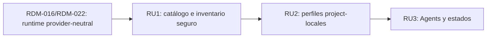

# Tinto - Capa MCP neutral al proveedor (RDM-024)

## Context Sufficiency Summary

- La intención de producto y el focused item contract son suficientes para la
  ejecución del primer slice: Tinto puede pasar de un `/mcp` informativo y
  específico de Codex a un inventario seguro, source-bound, con perfiles
  project-locales y actividad explícitamente atribuida.
- El sistema actual ofrece límites reutilizables: Rust mantiene la autoridad sobre procesos y sesiones; el bus Tauri publica contratos provider-neutral; Codex app-server y ACP ya traducen actividad de proveedores a timeline; React consume esas formas sin depender del protocolo interno.
- El punto de partida MCP es verificable pero estrecho. `/mcp` lee únicamente `config.toml` de Codex, enumera nombres y disponibilidad de comandos sin revelar argumentos o entorno, y no inicia servidores para probarlos.
- El repositorio documenta comandos de build, test, contrato y formato; la entrega parte de `develop`, conserva PTY y los adaptadores actuales, y mantiene Jira como trazabilidad opcional.
- Las decisiones de producto finas están cerradas en el focused requirements
  artifact de RDM-024. Synchronization, launcher application, active
  connectivity y targets sin evidencia permanecen fuera del primer slice.

## Source Inventory

| Source | Contribution | Confidence |
|---|---|---|
| Instrucción del usuario, 2026-07-21 | Solicita implementar la capa MCP en Tinto mediante Compound Master. | High |
| `AGENTS.md` | Exige KISS/YAGNI, cambios acotados y cierre de turno de Tinto. | High |
| `README.md` | Define Tinto como supervisor local, pasivo y no invasivo; las acciones mutantes deben ser explícitas del usuario. | High |
| `docs/contracts/bus-contract.md` | Documenta `/mcp`, las sesiones provider-neutral, el timeline estructurado y los límites backend↔frontend. | High |
| Artefactos RDM-016 y smoke ACP | Prueban los adaptadores Codex/ACP, el host command actual y las capacidades MCP anunciadas por proveedores. | High |
| `src-tauri/src/agent_console/commands.rs` | Implementa el inventario MCP actual de Codex con supresión de secretos y sin health checks ejecutables. | High |
| `app_server.rs`, `acp.rs`, `session.rs` | Proveen traducción estructurada de herramientas/actividad, sesiones y capacidades sin exponer conceptos internos como contrato público. | High |
| `src/bus/contract.ts` y `TerminalPanel.tsx` | Definen los consumidores y la superficie Agents que deberán mostrar estado y actividad MCP. | High |
| `src/workbench/AddonsManager.tsx` | Ofrece un patrón existente para estado, revalidación, errores y acciones explícitas de una integración local. | Medium; el brainstorm decidirá si se reutiliza esta ubicación. |
| Estado actual de `develop` | El checkout está cinco commits por delante de `origin/develop` y tiene cambios locales de sesiones/consola; obliga a una ejecución serial y cuidadosa. | High |

## Roadmap Items

- RDM-024. **Control plane MCP neutral al proveedor**
  - Outcome: el usuario puede inspeccionar desde Agents el inventario MCP
    no sensible que Tinto puede probar de forma segura, conservar la
    procedencia por provider/target, y elegir un perfil project-local de
    enablement. MCP activity se etiqueta sólo cuando el provider emite
    atribución explícita; en todos los demás casos permanece genérica.
  - Why now: Tinto ya presenta `/mcp`, pero el resultado sólo refleja Codex y
    no participa en un contrato de catálogo, perfil y actividad compartido.
    La implementación queda acotada al Codex Windows read-only path y a los
    seams existentes; no se justifica otra jerarquía de runtimes.
  - Scope boundary: incluir el modelo público mínimo y additive de MCP para el
    slice admitido; inventario Codex local Windows mediante el parser probado;
    estados empty/success/partial/error; source/target attribution;
    project-local profiles; explicit MCP activity projection; safe
    normalization/redaction before bus, UI, journal, or logs; bounded schema,
    size, and path checks; accessible Agents controls; consumer fixtures; and
    `/mcp` compatibility. Exclude provider-file writes, WSL/non-Codex imports,
    inferred attribution, active connectivity checks, automatic launch or
    approval, MCP client/proxy behavior, marketplace/cloud sync, credential
    storage, and generic provider abstractions unsupported by evidence.
  - Hard depends on: la frontera provider-neutral de RDM-016/RDM-022 y el bus
    Tauri actual.
  - Evidence gate: Codex Windows inventory/import, neutral project profiles,
    and explicit Codex `mcptoolcall` activity are GO for the first slice.
    Synchronization, launcher application, active connectivity, WSL and
    Claude/Kimi/OpenCode config import are NO-GO until target-specific
    parser/root/identity/rollback evidence exists.
  - Blocks/enables: habilita un catálogo y perfiles seguros; no habilita
    provider synchronization or a neutral adapter until the relevant evidence
    gate passes.
  - Risk: high; touches potentially sensitive configuration, provider/host/WSL
    trust boundaries, untrusted event metadata, additive contracts, and a UI
    that must not confuse configured, available, synced, and active.
  - Requirements: `docs/plans/tinto-gap-closure/rdm-024-provider-neutral-mcp-requirements.md`
  - Plan: `docs/plans/tinto-gap-closure/rdm-024-provider-neutral-mcp-plan.md`
  - Work package: `docs/work-packages/RDM-024-provider-neutral-mcp/2026-08-27-001-provider-neutral-mcp-work-package.md`
  - Review: `docs/review-findings/2026-08-27-rdm-024-artifact-review.md`
  - Exit evidence: accepted provider matrix; no args/env/headers/credentials
    leakage; generated contract without drift; explicit-vs-generic activity
    tests; bounded and inert metadata/errors; profile lifecycle tests; async
    and accessibility coverage; consumer tests; and root-owned build/lint/
    Rust/frontend/native evidence before release.

## Dependency Graph



## Parallelization Waves

- Wave A - artefactos: requirements, revisión, plan, revisión y work package;
  serial por dependencia de decisiones.
- Wave B - RU1: catálogo Codex local, contrato aditivo y actividad explícita;
  serial en el checkout actual.
- Wave C - RU2: perfiles project-locales y RU3: Agents; mantener serial porque
  comparten persistencia, contrato y `TerminalPanel`.
- Future evidence waves: WSL/non-Codex inventory, synchronization, launcher
  application, and active connectivity only after their explicit gates pass.

## Branch And PR Strategy

| Package candidate | Base branch | PR type | Dependency | Notes |
|---|---|---|---|---|
| RDM-024 control plane MCP | `develop` reconciliado | capability slice | RDM-016/RDM-022 integrados | RU1 starts from `develop`; RU2/RU3 refresh `develop` after the prior capability slice. Los artefactos viajan con implementación; no se crea una PR sólo documental. |

- Granularidad `auto`: dos capability slices porque parser/public contract risk
  and profile/UI risk are independently reviewable; a third micro-PR would not
  deliver independent value.
- Mantener un objetivo de una y máximo de dos PR abiertas, con base actualizada
  entre unidades y sin stack profundo.
- Jira permanece opcional. Si existe contexto durante Release Marshal, conservar una subtask por review unit incluso cuando una PR agrupe varias.

## Blockers And User Decisions

- No hay bloqueadores para el slice de RDM-024 admitido por la matriz.
- La matriz ya cierra fuentes, estados, lectura, ubicación, compatibilidad de
  `/mcp`, accesibilidad y confianza local/WSL para esta fase.
- Synchronization, launcher application, active connectivity, WSL and
  non-Codex import remain explicit NO-GO decisions until provider/target
  payloads, roots, identity, rollback, and attribution evidence are recorded.
- Cualquier decisión que implique escribir configuración de proveedor, lanzar
  procesos, gestionar credenciales o aprobar herramientas requiere autorización
  explícita y no se infiere de este roadmap.

## Roadmap Generator Closeout

## Delivery evidence — 2026-08-27

The evidence-admitted RDM-024 slice is implemented locally. It delivers a
bounded Codex Windows/local read-only inventory, source-bound project-local
profiles, explicit sanitized `mcptoolcall` attribution, additive generated
contracts, and an accessible Agents management surface. Provider-file writes,
credentials, active probes, launch overrides, synchronization, WSL import and
non-Codex import remain outside this slice.

Aggregate verification passed: 448 Rust tests, Rust format and Clippy, contract
generation/check, TypeScript, production build, root-only frontend tests, the
native Tauri IPC E2E, and bounded Pumarejo lifecycle observation. Detailed
evidence is recorded in the child Compound Master state and the 2026-08-27
Windows native audit. No commit, PR, Jira or release action was requested.

```text
artifact_kind: roadmap
artifact_path: docs/roadmaps/2026-07-21-010-provider-neutral-mcp-layer-roadmap.md
status: completed
blockers: No blockers for the evidence-admitted first slice; future target expansions remain gated.
recommended_next_action: Keep D1-D5 closed until new provider/target evidence justifies a separately reviewed increment.
```
