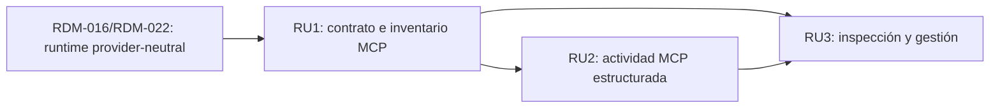

# Tinto - Capa MCP neutral al proveedor

## Context Sufficiency Summary

- La intención de producto es suficiente para abrir el ciclo de descubrimiento: Tinto debe pasar de un `/mcp` informativo y específico de la configuración de Codex a una capa MCP neutral al proveedor, con inventario/estado, adaptadores, actividad estructurada y una superficie de gestión utilizable.
- El sistema actual ofrece límites reutilizables: Rust mantiene la autoridad sobre procesos y sesiones; el bus Tauri publica contratos provider-neutral; Codex app-server y ACP ya traducen actividad de proveedores a timeline; React consume esas formas sin depender del protocolo interno.
- El punto de partida MCP es verificable pero estrecho. `/mcp` lee únicamente `config.toml` de Codex, enumera nombres y disponibilidad de comandos sin revelar argumentos o entorno, y no inicia servidores para probarlos.
- El repositorio documenta comandos de build, test, contrato y formato; la entrega parte de `develop`, conserva PTY y los adaptadores actuales, y mantiene Jira como trazabilidad opcional.
- Las decisiones de producto finas —qué se puede editar, qué estados operativos se prometen y dónde vive la gestión— pertenecen al brainstorm de RDM-023. El roadmap no las convierte en comportamiento asumido.

## Source Inventory

| Source | Contribution | Confidence |
|---|---|---|
| Instrucción del usuario, 2026-07-21 | Solicita implementar la capa MCP en Tinto mediante Compound Master. | High |
| `AGENTS.md` | Exige KISS/YAGNI, cambios acotados y cierre de turno de Tinto. | High |
| `README.md` | Define Tinto como supervisor local, pasivo y no invasivo; las acciones mutantes deben ser explícitas del usuario. | High |
| `docs/contracts/bus-contract.md` | Documenta `/mcp`, las sesiones provider-neutral, el timeline estructurado y los límites backend↔frontend. | High |
| Artefactos RDM-016 y smoke ACP | Prueban los adaptadores Codex/ACP, el host command actual y las capacidades MCP anunciadas por proveedores. | High |
| `src-tauri/src/agent_console/commands.rs` | Implementa el inventario MCP actual de Codex con supresión de secretos y sin health checks ejecutables. | High |
| `app_server.rs`, `acp.rs`, `session.rs` | Proveen traducción estructurada de herramientas/actividad, sesiones y capacidades sin exponer conceptos internos como contrato público. | High |
| `src/bus/contract.ts` y `TerminalPanel.tsx` | Definen los consumidores y la superficie Agents que deberán mostrar estado y actividad MCP. | High |
| `src/workbench/AddonsManager.tsx` | Ofrece un patrón existente para estado, revalidación, errores y acciones explícitas de una integración local. | Medium; el brainstorm decidirá si se reutiliza esta ubicación. |
| Estado actual de `develop` | El checkout está cinco commits por delante de `origin/develop` y tiene cambios locales de sesiones/consola; obliga a una ejecución serial y cuidadosa. | High |

## Roadmap Items

- RDM-023. **Control plane MCP neutral al proveedor**
  - Outcome: el usuario puede conocer qué servidores MCP están configurados para cada runtime compatible, distinguir su procedencia y estado seguro, y entender cuándo una sesión usa herramientas MCP sólo cuando el proveedor ofrece atribución explícita y verificable. Cuando esa procedencia no exista, Tinto muestra actividad de herramienta genérica con atribución MCP desconocida o no soportada, sin inferirla por nombres. Las únicas acciones de gestión disponibles son las explícitamente permitidas, sin que Tinto exponga secretos ni ejecute servidores arbitrarios en segundo plano.
  - Why now: Tinto ya presenta `/mcp` como comando disponible, pero el resultado sólo refleja Codex y no participa en el contrato de capacidades, actividad ni gestión compartido por Codex, Kimi y OpenCode. La infraestructura provider-neutral ya existe y evita justificar otra jerarquía de runtime paralela.
  - Scope boundary: incluir un modelo público MCP mínimo y provider-neutral; descubrimiento mediante adaptadores por runtime/fuente local o WSL; inventario y estados con errores recuperables; correlación con sesión/turno sólo cuando el adaptador obtenga procedencia MCP verificable; actividad de herramienta genérica cuando la procedencia sea desconocida; superficie accesible de inspección y revalidación; redacción de secretos; normalización de metadatos y errores no confiables antes de bus, UI, logs o persistencia; límites de esquema, tamaño y tiempo; contratos, fixtures y pruebas de consumidores. Conservar `/mcp` como entrada compatible. Excluir inferencia por nombres, un cliente MCP propio de Tinto, proxy de tráfico, marketplace, sincronización cloud, captura de credenciales, autoarranque o autoaprobación de servidores, edición genérica de archivos de terceros y promesas de health check que requieran ejecutar comandos arbitrarios.
  - Hard depends on: la frontera provider-neutral de RDM-016/RDM-022 y el bus Tauri actual.
  - Soft sequencing preference: ejecutar primero una matriz de evidencia local/WSL y por proveedor que identifique conceptos realmente comunes, capacidades opcionales y condiciones que obligarían a extender o abandonar el modelo neutral. Fijar el contrato e inventario seguro sólo después de pasar esa puerta; después proyectar actividad estructurada y cerrar con la superficie de gestión sobre límites ya probados.
  - Blocks/enables: habilita paridad MCP entre runtimes soportados y una futura administración más profunda sin comprometerla en este corte.
  - Risk: high; toca configuración potencialmente sensible, diferencias entre proveedores/host/WSL, eventos no confiables y una UI que no debe confundir “configurado”, “disponible” y “activo”.
  - Expected brainstorm: `docs/brainstorms/2026-07-21-023-provider-neutral-mcp-layer.md`
  - Expected plan: `docs/plans/2026-07-21-023-feat-provider-neutral-mcp-layer-plan.md`
  - Suggested package: un work package RDM-023 con hasta tres review units, que el Reviewability Gate puede coarsen: RU1 contrato + inventario/adaptadores; RU2 actividad estructurada; RU3 superficie de gestión y cierre de compatibilidad. Ninguna unidad debe abrirse como PR separada si no entrega valor y verificación independiente.
  - Exit evidence: puerta de evidencia provider/local/WSL cerrada antes de consolidar el contrato; parsers/adaptadores sin fuga de args/env/headers; matriz de capacidades que distingue atribución MCP verificable de actividad genérica; contrato generado sin drift; timeline correlacionado sin payloads sensibles; metadatos y errores acotados, sin caracteres de control, redactados y renderizados como texto; cobertura de los estados operativos definidos durante el brainstorm; nombres/estados accesibles, anuncios asíncronos, orden y restauración de foco, indicadores no dependientes sólo del color, navegación por teclado y uso con zoom o ventana reducida; pruebas de backend y consumidores; build y suites naturales afectadas.

## Dependency Graph



## Parallelization Waves

- Wave A - artefactos: brainstorm, revisión, plan, revisión y work package; serial por dependencia de decisiones.
- Wave B - RU1: contrato, descubrimiento seguro y adaptadores; serial en el checkout actual.
- Wave C - RU2 y RU3: mantener serial mientras compartan contratos y `TerminalPanel`; sólo separar si el Reviewability Gate demuestra independencia real.

## Branch And PR Strategy

| Package candidate | Base branch | PR type | Dependency | Notes |
|---|---|---|---|---|
| RDM-023 control plane MCP | `develop` reconciliado | capability slice | RDM-016/RDM-022 integrados | Rama sugerida al iniciar ejecución: `codex/feature/rdm-023-mcp-control-plane`. Los artefactos viajan con implementación; no se crea una PR sólo documental. |

- Granularidad inicial `auto`: preferir una sola capability slice si dividir contrato, actividad y UI fuerza un stack mental o rompe la verificabilidad independiente.
- Si el paquete justifica más de una PR, mantener objetivo de una y máximo de dos abiertas, con base actualizada entre unidades.
- Jira permanece opcional. Si existe contexto durante Release Marshal, conservar una subtask por review unit incluso cuando una PR agrupe varias.

## Blockers And User Decisions

- No hay bloqueadores para iniciar el brainstorm interactivo de RDM-023.
- El brainstorm debe cerrar: fuentes configurables por runtime; taxonomía exacta de estados; alcance de lectura frente a edición; ubicación/navegación de la superficie; granularidad y retención de actividad MCP; compatibilidad de `/mcp`; contrato de accesibilidad; y política de confianza local/WSL que delimite distribuciones, identidad de usuario, raíces permitidas y tratamiento de rutas o enlaces que escapen de ellas.
- Antes de fijar el contrato, el brainstorm/plan debe comprobar payloads y capacidades reales de Codex, Kimi y OpenCode, definir el estado degradado de actividad no atribuible y registrar qué evidencia falsaría la neutralidad propuesta. No se etiquetará actividad como MCP sin procedencia explícita del proveedor.
- Cualquier decisión que implique escribir configuración de proveedor, lanzar procesos, gestionar credenciales o aprobar herramientas requiere autorización explícita y no se infiere de este roadmap.

## Roadmap Generator Closeout

```text
artifact_kind: roadmap
artifact_path: docs/roadmaps/2026-07-21-010-provider-neutral-mcp-layer-roadmap.md
blockers: No blockers.
recommended_next_action: Review this roadmap with ce-doc-review, then continue to the interactive RDM-023 brainstorm gate.
```
